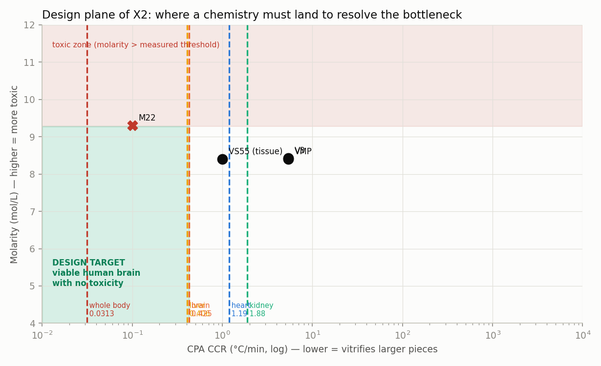

<!-- AUTO-GENERATED by red/barrido.py. DO NOT EDIT BY HAND. -->
# StasisPath: margin sweep

Every open range is discretized and **every value is propagated through the framework's laws**. It does not look for a number: it looks for **where inside the range the framework changes its answer**. That turns 'this must be measured' into 'this must be measured to this precision, around this value' — and sometimes into 'this need not be measured'.

## Cut-off values found

| sweep | quantity | cut-off value | what changes there |
|---|---|---|---|
| B1 | P19 damage | 0.220 | below it passes, above it fails |
| B2 | CCR of the eutectic solvents | 0.426 °C/min | below it, human brain viable |
| B3 | maximum mass | — | no verdict changes across the whole range |
| B4 | human τ_eq | 30 min | below it practice is unchanged; above it doubles |
| B5 | nucleation rate | 0.85 /L·h | above it 4 h at 95 % is unreachable |

## B1 · Damage in the cold arm of P19

*Unidad: relative damage (1 − respiration/control).*

| damage | Is LTP preserved? | ≈ Arrhenius | ≤ Fahy | what it would mean |
|---|---|---|---|---|
| 0 | ✅ |  | ✅ | PASSES and confirms Fahy ⇒ cold damage is osmotic |
| 0.0273 | ✅ |  | ✅ | PASSES and confirms Fahy ⇒ cold damage is osmotic |
| 0.0545 | ✅ |  | ✅ | PASSES and confirms Fahy ⇒ cold damage is osmotic |
| 0.0818 | ✅ |  |  | PASS, intermediate value: no law is confirmed |
| 0.109 | ✅ |  |  | PASS, intermediate value: no law is confirmed |
| 0.136 | ✅ | ✅ |  | PASSES and confirms Arrhenius |
| 0.164 | ✅ | ✅ |  | PASSES and confirms Arrhenius |
| 0.191 | ✅ |  |  | PASS, intermediate value: no law is confirmed |
| 0.218 | ✅ |  |  | PASS, intermediate value: no law is confirmed |
| 0.245 | ❌ |  |  | **FAILS: above the damage level at which LTP was demonstrated** |
| 0.273 | ❌ |  |  | **FAILS: above the damage level at which LTP was demonstrated** |
| 0.3 | ❌ |  |  | **FAILS: above the damage level at which LTP was demonstrated** |

**Cut-off value: 0.220.** Below it P19 passes whatever the law does; above it, it fails. The two conflicting paths (0.142 and ≤0.07) are **both on the favourable side**, so **the measurement need not be precise to yield a verdict: it suffices to tell whether it is above or below 0.22.** To *calibrate* Arrhenius, however, precision is required: separating 0.07 from 0.142 demands an error < 0.03.

## B2 · CCR of natural deep eutectic solvents

*Unidad: °C/min.*

| CCR | max LC (cm) | max mass (kg) | better than M22? | organs that fit |
|---|---|---|---|---|
| 0.01 | 15.1 | 388 | ✅ | kidney, heart, liver, brain, whole_body, pancreas |
| 0.0351 | 8.05 | 59 | ✅ | kidney, heart, liver, brain, pancreas |
| 0.123 | 4.3 | 8.96 | ❌ | kidney, heart, liver, brain, pancreas |
| 0.433 | 2.29 | 1.36 | ❌ | kidney, heart, pancreas |
| 1.52 | 1.22 | 0.207 | ❌ | kidney, pancreas |
| 5.34 | 0.653 | 0.0315 | ❌ | none |
| 18.7 | 0.348 | 0.00478 | ❌ | none |
| 65.8 | 0.186 | 0.000727 | ❌ | none |
| 231 | 0.0992 | 0.000111 | ❌ | none |
| 811 | 0.053 | 1.68e-05 | ❌ | none |
| 2.85e+03 | 0.0283 | 2.55e-06 | ❌ | none |
| 10,000 | 0.0151 | 3.88e-07 | ❌ | none |

**Exact cut-off value: CCR = 0.426 °C/min** — below that value the eutectic solvents would suffice for a **whole human brain**. And this is the point: **they do not need to be better than M22** (0.1 °C/min), it is enough to reach **0.426**, which is **4.26 times more permissive**. Since their toxicity is already measured as low, **a CCR in that range would resolve X2 without needing P19**. ⇒ Calorimetry of the eutectic solvents becomes **the most cost-effective measurement in the whole programme**.

## B3 · Maximum vitrifiable mass

*Unidad: kg.*

| mass (kg) | LC (cm) | organs that fit | brain? | whole body? |
|---|---|---|---|---|
| 3 | 2.98 | kidney, heart, liver, brain, pancreas | ✅ | ❌ |
| 5 | 3.54 | kidney, heart, liver, brain, pancreas | ✅ | ❌ |
| 7 | 3.96 | kidney, heart, liver, brain, pancreas | ✅ | ❌ |
| 9 | 4.3 | kidney, heart, liver, brain, pancreas | ✅ | ❌ |
| 11 | 4.6 | kidney, heart, liver, brain, pancreas | ✅ | ❌ |
| 13 | 4.86 | kidney, heart, liver, brain, pancreas | ✅ | ❌ |
| 15 | 5.1 | kidney, heart, liver, brain, pancreas | ✅ | ❌ |
| 17 | 5.32 | kidney, heart, liver, brain, pancreas | ✅ | ❌ |
| 19 | 5.52 | kidney, heart, liver, brain, pancreas | ✅ | ❌ |
| 21 | 5.7 | kidney, heart, liver, brain, pancreas | ✅ | ❌ |
| 23 | 5.88 | kidney, heart, liver, brain, pancreas | ✅ | ❌ |
| 25 | 6.05 | kidney, heart, liver, brain, pancreas | ✅ | ❌ |

**The brain fits across the whole range; the whole body fits nowhere in it.** ⇒ The uncertainty in this quantity (7–24 kg by Monte Carlo) **changes no verdict in the framework**: whatever the value inside the range, the brain is viable and the whole body is not. **Measuring it better adds nothing.** It is the clearest example of a wide margin that turns out to be **irrelevant**, and knowing that saves an experiment.

## B4 · Human τ_eq attainable with optimal reperfusion

*Unidad: min.*

| τ_eq | width of the grey zone (×) | ≥ 30 min | ≥ 60 min | consequence |
|---|---|---|---|---|
| 12.5 | 19.2 | ❌ | ❌ | no practical change versus today |
| 16.8 | 14.3 | ❌ | ❌ | no practical change versus today |
| 21.1 | 11.4 | ❌ | ❌ | no practical change versus today |
| 25.5 | 9.43 | ❌ | ❌ | no practical change versus today |
| 29.8 | 8.06 | ❌ | ❌ | no practical change versus today |
| 34.1 | 7.04 | ✅ | ❌ | real clinical margin |
| 38.4 | 6.25 | ✅ | ❌ | real clinical margin |
| 42.7 | 5.62 | ✅ | ❌ | real clinical margin |
| 47 | 5.1 | ✅ | ❌ | real clinical margin |
| 51.4 | 4.67 | ✅ | ❌ | real clinical margin |
| 55.7 | 4.31 | ✅ | ❌ | real clinical margin |
| 60 | 4 | ✅ | ✅ | the grey zone nearly disappears |

**Cut-off value: 30 min.** Below it nothing changes in clinical practice; above it, the organ procurement window would double. ⇒ A reperfusion trial is only worth running if **it can detect the difference between 12.5 and 30 min**; finer resolution inside that interval changes no decision.

## B5 · Nucleation rate J at −2/−6 °C (isobaric)

*Unidad: per L·h.*

| J | t at 95 % success (h) | t at 50 % success (h) | ≥ 4 h at 95 % | ≥ 24 h at 50 % |
|---|---|---|---|---|
| 0.05 | 0.684 | 9.24 | ❌ | ❌ |
| 0.076 | 0.45 | 6.08 | ❌ | ❌ |
| 0.116 | 0.296 | 4 | ❌ | ❌ |
| 0.176 | 0.195 | 2.63 | ❌ | ❌ |
| 0.267 | 0.128 | 1.73 | ❌ | ❌ |
| 0.406 | 0.0843 | 1.14 | ❌ | ❌ |
| 0.616 | 0.0555 | 0.75 | ❌ | ❌ |
| 0.937 | 0.0365 | 0.493 | ❌ | ❌ |
| 1.42 | 0.024 | 0.325 | ❌ | ❌ |
| 2.16 | 0.0158 | 0.214 | ❌ | ❌ |
| 3.29 | 0.0104 | 0.14 | ❌ | ❌ |
| 5 | 0.00684 | 0.0924 | ❌ | ❌ |

For a human liver (1.5 L). **Cut-off value: J ≈ 0.85 /L·h** to reach 4 h at 95 % success, which is the minimum logistical window for a transplant. The J fitted from rat liver (**0.57**) lands **on the favourable side**, but with little margin. ⇒ Isobaric supercooling gives **hours, not days**, unless J is lowered with antinucleants (L19) or one switches to isochoric, which follows a different law.

## What the sweep shows as a whole

- **Two margins are irrelevant:** the maximum vitrifiable mass (B3) changes no verdict across its entire range, and the P19 damage (B1) only needs to be placed above or below 0.22. **Measuring these precisely adds nothing.**
- **One margin is decisive and cheap:** the CCR of the eutectic solvents (B2). If it falls below its cut-off, **it resolves X2 without needing P19** — and X2 is 60 % of what the framework is missing.
- **Two margins have a clear but expensive cut-off:** human τ_eq (B4) and the nucleation rate (B5). They are only worth it if the experiment can resolve the specific cut-off.

## B6 · Design plane: both axes of X2 at once

A single-margin sweep cannot see interactions. Crossing the **two axes that define X2** —vitrification capability (CCR) and toxicity (molarity)— yields a **target region** instead of a number.

| organ | mass g | LC cm | Max admissible CCR | Max admissible M | reachable with M22? |
|---|---|---|---|---|---|
| kidney | 150 | 1.1 | 1.88 | 9.28 | **yes** |
| heart | 300 | 1.38 | 1.19 | 9.28 | **yes** |
| liver | 1.5e+03 | 2.37 | 0.406 | 9.28 | **yes** |
| brain | 1.4e+03 | 2.31 | 0.425 | 9.28 | **yes** |
| whole body | 70,000 | 8.52 | 0.0313 | 9.28 | not with M22 |

**What surfaces when the axes are crossed, and a simple sweep could not see:**

1. **WARNING the framework itself imposes on this figure:** the vertical axis uses **molarity** as a proxy for toxicity, and **L20 and E7 say that is false** — toxicity depends on the quadruple (composition, temperature, time, protocol), not on molarity alone. The 9.28 M threshold was measured with **V3 chemistry loaded at 10 °C**; M22 at 9.3 M is loaded at **−22 °C**, which is a different point in the space. ⇒ **Saying that M22 'exceeds by 0.02 mol/L' would be an over-reading of the plot.** The plane is useful for seeing the **structure** of the problem, not for placing a specific CPA.
2. **The target region is enormous.** Any chemistry with CCR ≤ 0.426 and molarity ≤ 9.28 solves the human brain. There is no need to optimize both axes: **there are ~3 orders of magnitude of headroom in CCR** below the cut-off.
3. **Kidney and heart are already solved in the plane** (they admit CCRs of 1.9 and 1.2), and yet nobody has vitrified a human kidney. ⇒ **The bottleneck for small organs is NOT the one this plane models**: it is perfusion, CPA loading and rewarming, not the CCR–toxicity relation.
4. **What can legitimately be read from the plane, with the caveat in point 1:** the target region is reached by **lowering CCR without raising molarity**, and a known mechanism exists for that which does not change concentration: **ice blockers** (L22 — VM3 is V3 plus 1 % X-1000 and 1 % Z-1000, on the same base). ⇒ **The design direction is not 'less toxic' nor 'more concentrated', but 'same base, additives that lower the CCR'.** It is what Fahy's family already does and what the eutectic solvents might achieve by another route.
