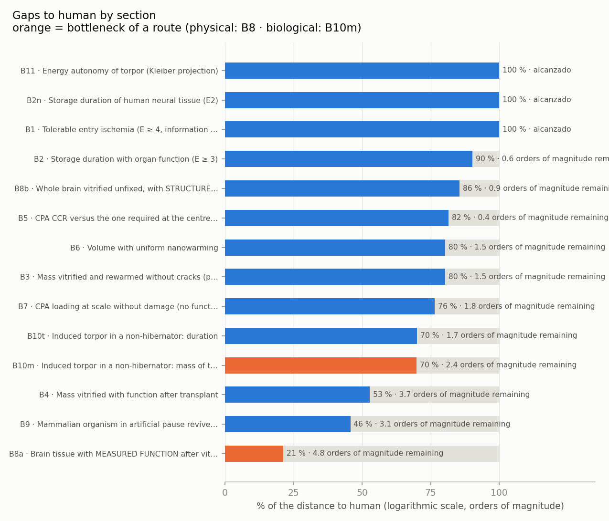

<!-- AUTO-GENERATED by red/brechas.py (called from red/motor.py). DO NOT EDIT BY HAND. -->
# StasisPath: gaps to human (triangulation + generalized rule of three)

**What this measures and what it does not:** the *framework's* grounding (knowledge) is in MARCO.md. Here we measure **how much technological distance remains to the human goal** in each section. The framework can reach 100 % (knowing exactly what is missing and why) with the technology still far away.

**Method:** each animal datum is projected to human with the section's scaling law, v_h = v·(M_h/M)^b: b = 0 invariant (τ_eq, time below Tg), b = 1 linear (energy, power), b = 0.25 Kleiber (reserve autonomy). The *linear* rule of three is used only where the physics is linear: scaling the cooling of a rat kidney (1.5 g) to 70 kg with a linear rule of three would give a rate ~36 times lower than the correct one (M^−2/3). % = orders achieved / (achieved + remaining), with the base declared on each row. **Triangulation:** n = independent species or systems (n < 3 ⇒ weak).

## Routes to the goal (law of the minimum: every section at once)

- **Physical route (vitrification → years):** bottleneck **B8a · Brain tissue with MEASURED FUNCTION after vitrification (LTP or electrophysiology)** at **21 %** (4.8 orders of magnitude remaining). Geometric mean of its sections: 69 %.
- **Biological route (torpor → months to 1 year):** bottleneck **B10m · Induced torpor in a non-hibernator: mass of the largest animal** at **70 %** (2.4 orders of magnitude remaining). Geometric mean of its sections: 84 %.

## Apartados

| id | section | human goal | triangulated projection | orders remaining | % of path | n | base |
|---|---|---|---|---|---|---|---|
| B8a | Brain tissue with MEASURED FUNCTION after vitrification (LTP or electrophysiology) | 1.4e+03 g of tissue with measured function | 0.02 (max) · with disputed: 30 → 73 % | 4.85 | **21 %** | 4 | 0.001 |
| B9 | Mammalian organism in artificial pause revived (E ≥ 4) | 525,600 min | 412 (max) | 3.11 | **46 %** | 4 | 1 |
| B4 | Mass vitrified with function after transplant | 70,000 g | 13.9 (max) | 3.70 | **53 %** | 2 ⚠ weak | 0.001 |
| B10m | Induced torpor in a non-hibernator: mass of the largest animal | 70,000 g | 300 (max) | 2.37 | **70 %** | 2 ⚠ weak | 0.001 |
| B10t | Induced torpor in a non-hibernator: duration | 525,600 min | 10,080 (max) | 1.72 | **70 %** | 2 ⚠ weak | 1 |
| B7 | CPA loading at scale without damage (no function test) | 70,000 g | 1e+03 (max) | 1.85 | **76 %** | 2 ⚠ weak | 0.001 |
| B3 | Mass vitrified and rewarmed without cracks (physics) | 70,000 g | 2e+03 (max) | 1.54 | **80 %** | 2 ⚠ weak | 0.001 |
| B6 | Volume with uniform nanowarming | 70,000 g | 2e+03 (max) | 1.54 | **80 %** | 3 | 0.001 |
| B5 | CPA CCR versus the one required at the centre of the trunk | 0.0404 °C/min | 0.1 (min) | 0.39 | **82 %** | 3 | 5.4 |
| B8b | Whole brain vitrified unfixed, with STRUCTURE preserved | 1.4e+03 g of whole brain | 180 (max) | 0.89 | **86 %** | 2 ⚠ weak | 0.001 |
| B2 | Storage duration with organ function (E ≥ 3) | 525,600 min | 144,000 (max) | 0.56 | **90 %** | 2 ⚠ weak | 1 |
| B1 | Tolerable entry ischemia (E ≥ 4, information intact) | 5 min τ_eq | 12.5 (mediana) | 0.00 | **100 %** | 2 ⚠ weak | 1 |
| B2n | Storage duration of human neural tissue (E2) | 525,600 min | 788,400 (max) | 0.00 | **100 %** | 2 ⚠ weak | 1 |
| B11 | Energy autonomy of torpor (Kleiber projection) | 525,600 min | 1,189,127 (mediana) | 0.00 | **100 %** | 3 | 1 |

## Projection detail (animal → human)

### B1 · Tolerable entry ischemia (E ≥ 4, information intact)
Goal = no-flow delay of an elective entry with extracorporeal circulation [P].

| observation | value (min τ_eq) | mass g | exponent b | projected to human | source |
|---|---|---|---|---|---|
| human (DHCA) | 5 | 70,000 | 0 | 5 | F4 |
| dog (37 °C) | 12.5 | 20,000 | 0 | 12.5 | F25b |
| dog (10 °C flush) | 12.7 | 20,000 | 0 | 12.7 | F30 |
Triangulation spread: ×2.54 between the largest and the smallest projection.

### B10m · Induced torpor in a non-hibernator: mass of the largest animal
In macaque, pig and sheep it was attempted without real torpor ⇒ they do not count. Adult rat mass ~300 g [P] (not in the abstracts).

| observation | value (g) | mass g | exponent b | projected to human | source |
|---|---|---|---|---|---|
| mouse (Q neurons) | 30 | 30 | 0 | 30 | F43 |
| rat (rostral ventromedial medulla, 6 h) | 300 | 300 | 0 | 300 | F44 |
| rat (ultrasound) | 300 | 300 | 0 | 300 | F45 |
Triangulation spread: ×10 between the largest and the smallest projection.

### B10t · Induced torpor in a non-hibernator: duration
| observation | value (min) | mass g | exponent b | projected to human | source |
|---|---|---|---|---|---|
| mouse (Q neurons, ~1 week) | 10,080 | 30 | 0 | 10,080 | F12 |
| mouse (ultrasound, > 24 h) | 1.44e+03 | 30 | 0 | 1.44e+03 | F45 |
| rat (6 h) | 360 | 300 | 0 | 360 | F44 |
Triangulation spread: ×28 between the largest and the smallest projection.

### B11 · Energy autonomy of torpor (Kleiber projection)
If it could be induced, the reserves suffice: autonomy ∝ M^0.25. Lemur mass ~0.2 kg [P].

| observation | value (min) | mass g | exponent b | projected to human | source |
|---|---|---|---|---|---|
| lemur Cheirogaleus (7 months) | 302,400 | 200 | 0.25 | 1,307,973 | F90 |
| arctic ground squirrel (9-month season) | 388,800 | 800 | 0.25 | 1,189,127 | F10 |
| human (C5: 20 kg of fat at 25 %) | 525,600 | 70,000 | 0 | 525,600 | F13 |
Triangulation spread: ×2.49 between the largest and the smallest projection.

### B2 · Storage duration with organ function (E ≥ 3)
F57 (pig and human kidney, partial freezing, 10 days) is NOT credited here: function is evaluated by simulated, not real, transplantation ⇒ it is not E3. It is reflected in V06 and in L5.

| observation | value (min) | mass g | exponent b | projected to human | source |
|---|---|---|---|---|---|
| rat (vitrified kidney) | 144,000 | 1.5 | 0 | 144,000 | F1 |
| pig (subzero kidney) | 2.88e+03 | 200 | 0 | 2.88e+03 | F20 |
| rat (liver, partial freezing; E2) | 14,400 | 12 | 0 | 14,400 | F21 |
Triangulation spread: ×50 between the largest and the smallest projection.

### B2n · Storage duration of human neural tissue (E2)
| observation | value (min) | mass g | exponent b | projected to human | source |
|---|---|---|---|---|---|
| human (MEDY organoids) | 788,400 | 0.014 | 0 | 788,400 | F35 |
| C. elegans (memory) | 30 | 1e-06 | 0 | 30 | F29 |
Triangulation spread: ×26,280 between the largest and the smallest projection.

### B3 · Mass vitrified and rewarmed without cracks (physics)
| observation | value (g) | mass g | exponent b | projected to human | source |
|---|---|---|---|---|---|
| M22 bag (rewarmed) | 2e+03 | 2e+03 | 0 | 2e+03 | F2 |
| pig liver (vitrified) | 1e+03 | 1e+03 | 0 | 1e+03 | F2 |
Triangulation spread: ×2 between the largest and the smallest projection.

### B4 · Mass vitrified with function after transplant
Wowk 2025 surpasses Fahy 2009 not in mass (13.9 versus 12.7 g) but in QUALITY: normal clinical function (creatinine < 2 mg/dL) and recipient alive 17 months, versus partial function 48 days.

| observation | value (g) | mass g | exponent b | projected to human | source |
|---|---|---|---|---|---|
| rabbit (kidney, dielectric, NORMAL function, 17 months) | 13.9 | 13.9 | 0 | 13.9 | F50 |
| rabbit (M22 kidney, partial) | 12.7 | 12.7 | 0 | 12.7 | F28 |
| rat (VMP kidney) | 1.5 | 1.5 | 0 | 1.5 | F1 |
Triangulation spread: ×9.27 between the largest and the smallest projection.

### B5 · CPA CCR versus the one required at the centre of the trunk
| observation | value (°C/min) | mass g | exponent b | projected to human | source |
|---|---|---|---|---|---|
| M22 | 0.1 | 1 | 0 | 0.1 | F2 |
| VS55 | 2.5 | 1 | 0 | 2.5 | F3 |
| VMP | 5.4 | 1 | 0 | 5.4 | F3 |
Triangulation spread: ×54 between the largest and the smallest projection.

### B6 · Volume with uniform nanowarming
Power (linear rule of three, P ∝ mass × rate): 120 kW × (70/2) × (CWR_M22/88) ≈ 19 kW for 70 kg ⇒ **power does not limit**; what limits is the volume with uniform field.

| observation | value (g) | mass g | exponent b | projected to human | source |
|---|---|---|---|---|---|
| M22 bag 2 L | 2e+03 | 2e+03 | 0 | 2e+03 | F2 |
| rat (kidney) | 1.5 | 1.5 | 0 | 1.5 | F1 |
| pig (arteries and valves, 50 mL, viability = control) | 50 | 50 | 0 | 50 | F41 |
Triangulation spread: ×1.33e+03 between the largest and the smallest projection.

### B7 · CPA loading at scale without damage (no function test)
| observation | value (g) | mass g | exponent b | projected to human | source |
|---|---|---|---|---|---|
| pig/human (kidney, 150–220 g) | 220 | 220 | 0 | 220 | F31 |
| pig (1 L liver) | 1e+03 | 1e+03 | 0 | 1e+03 | F2 |
Triangulation spread: ×4.55 between the largest and the smallest projection.

### B8a · Brain tissue with MEASURED FUNCTION after vitrification (LTP or electrophysiology)
Criterion: mass of the tissue in which function was MEASURED. **Suda 1966/1974 is marked DISPUTED**: it is freezing (not vitrification), the EEG recovery is partial and the field's criticism is that freezing loses synapses. The module computes the gap with and without it. German 2026 vitrifies the whole mouse brain in situ, but the electrophysiology is done in slices cut after rewarming ⇒ here the mass of the slice counts (350 µm, ~0.02 g [P]). The whole brain counts in B8b. No behavioural test in any case.

| observation | value (g of tissue with measured function) | mass g | exponent b | projected to human | source |
|---|---|---|---|---|---|
| mouse (slices, LTP 138 % vs 158 % control, n.s.) | 0.02 | 0.02 | 0 | 0.02 | F46 |
| cat (whole brain FROZEN, partial EEG) [DISPUTED] | 30 | 30 | 0 | 30 | F48 |
| rat (VM3 slices, K+/Na+) | 0.01 | 0.01 | 0 | 0.01 | F37b |
| human (MEDY tissue, partial network) | 0.02 | 0.02 | 0 | 0.02 | F35 |
Triangulation spread: ×2 between the largest and the smallest projection.

### B8b · Whole brain vitrified unfixed, with STRUCTURE preserved
ASC preserves whole brains (pig, 180 g) with traceable connectome, but FIXES the tissue ⇒ irreversible by design: it does not count here. Fahy 2026 is a preprint [P]: rabbit (~10 g) and pig (~180 g) with M22 without prior fixation, no function tests; osmotic damage (shrinkage).

| observation | value (g of whole brain) | mass g | exponent b | projected to human | source |
|---|---|---|---|---|---|
| mouse (whole brain in situ, 1 of 3 protocols) | 0.4 | 0.4 | 0 | 0.4 | F46 |
| pig (M22 unfixed, structure only) | 180 | 180 | 0 | 180 | F47 |
Triangulation spread: ×450 between the largest and the smallest projection.

### B9 · Mammalian organism in artificial pause revived (E ≥ 4)
| observation | value (min) | mass g | exponent b | projected to human | source |
|---|---|---|---|---|---|
| dog (10 °C flush) | 120 | 20,000 | 0 | 120 | F30 |
| human (13.7 °C, low flow) | 412 | 70,000 | 0 | 412 | F13 |
| cat (brain only) | 60 | 3e+03 | 0 | 60 | F38 |
| pig (10 °C, no cognitive deficit) | 60 | 40,000 | 0 | 60 | F42 |
Triangulation spread: ×6.87 between the largest and the smallest projection.

## How to attack the holes

Ordered by **orders of magnitude remaining** (the largest is the most limiting):

1. **B8a** (4.8 orders): Brain tissue with MEASURED FUNCTION after vitrification (LTP or electrophysiology)
2. **B4** (3.7 orders): Mass vitrified with function after transplant
3. **B9** (3.1 orders): Mammalian organism in artificial pause revived (E ≥ 4)
4. **B10m** (2.4 orders): Induced torpor in a non-hibernator: mass of the largest animal
5. **B7** (1.8 orders): CPA loading at scale without damage (no function test)
6. **B10t** (1.7 orders): Induced torpor in a non-hibernator: duration
7. **B3** (1.5 orders): Mass vitrified and rewarmed without cracks (physics)
8. **B6** (1.5 orders): Volume with uniform nanowarming
9. **B8b** (0.9 orders): Whole brain vitrified unfixed, with STRUCTURE preserved
10. **B2** (0.6 orders): Storage duration with organ function (E ≥ 3)
11. **B5** (0.4 orders): CPA CCR versus the one required at the centre of the trunk
