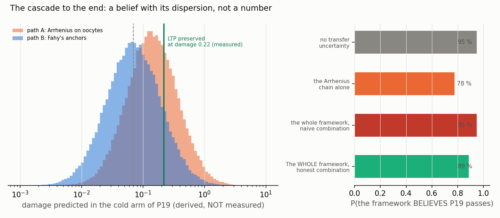

<!-- AUTO-GENERATED by red/cascada.py. DO NOT EDIT BY HAND. -->
# StasisPath: the cascade to the end — what probability the framework assigns to its own prediction

`DERIVACION.md` predicts the cold arm of P19 with **a point value: 0.142**. A point value cannot be compared honestly with a threshold. Here the same cascade is walked with **all the uncertainty propagated**, 200,000 samples.

> ## This does NOT close X2, and cannot
> What comes out of here is a **probability of belief**: what the framework believes, given its own laws and ranges. It is not a measurement. **The price of confusing the two has already been paid:** the framework predicted that the CCR of the eutectic solvents would be 0.3 °C/min and declared it refuted above 0.426. The measured value turned out to be **> 30**, a factor of **100** in error. Had that prediction been counted as a datum, the framework would today hold a gravely false value at its core and would still be recommending the wrong experiment. **Track record of this class of prediction: 0 correct out of 1.**

## The three links, and where each one stops being calculation

| link | what it is composed of | where it stops being calculation |
|---|---|---|
| 1. Activation energy | Ea/R = 2.95e+03 K (path A) versus 4.52e+03 K (path B) | **contradiction I1, open.** The two paths disagree by a factor of ~1.5 in Ea/R. Neither is chosen: both are sampled at 50 % |
| 2. Thermal extrapolation | from 23–37 °C to -22 °C | the model is used **3.2 calibration ranges** away. No datum says Arrhenius still holds there |
| 3. Ovocito → neural | Ea/R is measured in OOCYTES; P19 measures LTP in CA1 | **with no datum at all.** That the same activation energy governs both is an assumption, not a law |

## El resultado

| quantity | value | nature |
|---|---|---|
| **P(the framework believes P19 passes)** | **78 %** | belief, not measurement |
| predicted damage, median | 0.101 | derivado |
| 50 % central | 0.0498 – 0.202 | derivado |
| 90 % central | 0.0176 – 0.539 | derivado |
| threshold with LTP preserved | 0.22 | **MEASURED** (F46: 138.1 % vs 157.7, n.s.) |

## All the framework's paths, and why they do not add up the way they appear to

The Arrhenius chain is **one** of the paths. The framework has more, and letting them speak is right. But several **rest on the same German dataset** (F72/F46), so they are not independent evidence: if that dataset were biased, they would all fail together.

| path | P(passes) contributed on its own | likelihood ratio | anchor | independent? |
|---|---|---|---|---|
| Arrhenius × German's point (I1, path A) | in the simulated chain | — | german | **no: shares the German datum** |
| Fahy's anchors: M22 tolerable at −22 °C in kidney slice (I1, path B) | in the simulated chain | — | fahy | yes |
| Damage↔LTP calibration: at damage 0.220 LTP was preserved (I1, path C) | in the simulated chain | — | german | **no: shares the German datum** |
| F47: M22 in rabbit brain, pig brain and human biopsy, NO ice | 62 % | ×1.63 | fahy_brain | yes |
| F5: rabbit kidney with M22, transplanted and functional (E3) | 58 % | ×1.38 | rabbit | yes |
| L13/F71: V3 (8.42 M) preserves LTP and M22 is only 10 % more concentrated | 70 % | ×2.33 | german | **no: shares the German datum** |

**Honest combination (grouped by anchor, 3 independent groups): 89 %.**

**Naive combination (treating all 6 as independent): 95 %.**

> **Each path is a noisy observation of the SAME fact, not an independent chance of it happening.** That is why they are not combined with 1−∏(1−p), which saturates at 99 % whatever each one says: **likelihood ratios** are multiplied over a prior of 0.5. Within a group sharing an anchor they are not multiplied — if the anchor is biased they all fail together — and the strongest in the group is taken.

> The difference between 95 % and 89 % is **exactly what it costs to count the same experiment twice**. Three of the six paths read the same dataset: German's. Adding them as if they were independent is the classic meta-evidence error, and here it is quantified. **Adding paths that share an anchor raises apparent confidence without adding information.**

> **And even with the whole framework speaking, the honest combination does not reach certainty.** The ceiling is set by the link that has no datum: none of the six paths measures **M22 on neural tissue with function**. They all circle the gap; none crosses it. That is why the number rises but does not close.

**If contradiction I1 resolved in favour of each path:** path A (Arrhenius on oocytes) gives **68 %**; path B (Fahy's anchors) gives **87 %**. Without the transfer or extrapolation uncertainty, the cascade would give **95 %** — and that is precisely the figure one has NO right to use, because those two links are real.

## Why this cannot be turned into a closure

1. **Link 3 has no datum.** The whole cascade rests on the activation energy of damage measured in oocytes governing synaptic plasticity in CA1. No source in the network supports this. It is the point where calculation turns into assumption, and no amount of sampling fixes it.
2. **Contradiction I1 remains open**, and it is exactly what P19 discriminates. Closing X2 with the cascade would mean using as tests exactly what is in dispute.
3. **P19 has preregistered, hash-frozen thresholds.** If a prediction could close it, the preregistration would mean nothing and the framework would lose the ability to be wrong — which is where its value comes from. It has falsified itself twice (I2 and the eutectic-solvent shortcut); neither would have been possible under that rule.

**What this document does contribute:** it turns 'the framework predicts 0.142' into 'the framework believes P19 passes with 78 % probability, and here is why'. That makes the prediction **more falsifiable, not less**: if P19 came out FAIL, this document says exactly which link should be revisited first.
