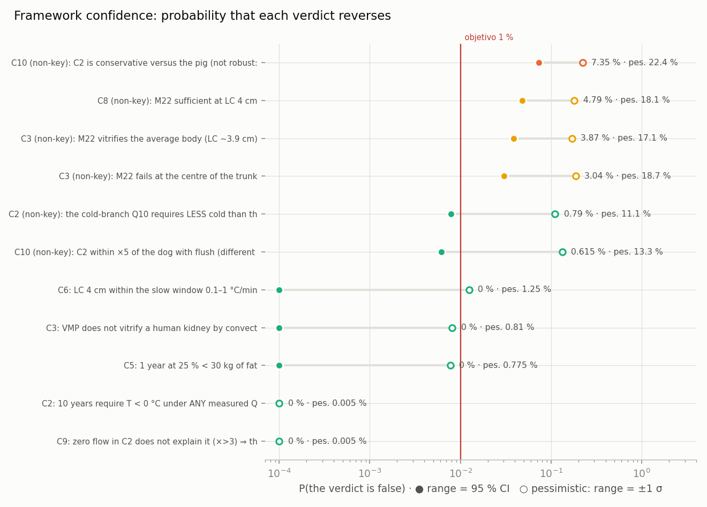

<!-- AUTO-GENERATED by red/confianza.py. DO NOT EDIT BY HAND. -->
# StasisPath: confidence — how much each verdict can fail, as a percentage

**What this adds to MARGENES.md:** there, the distance to a verdict's flip is measured by moving **one** parameter. Here **all of them move at once**, each according to its declared range, and **the probability that the verdict reverses** is counted. 20,000 samples per bound, fixed seed (the document is reproducible).

**How each range is read.** Primary: the range is a 95 % interval (split normal on a log scale, respecting asymmetry). This is an assumption, because several ranges are bounds or corners rather than CIs; that is why the **pessimistic** reading is also given, taking the range as ±1 σ. **The real probability lies between the two.** Parameters with a point range do not vary, and no correlations are declared.

> **This module does not touch the framework.** It changes no values, ranges, thresholds or grounding: it measures and ranks. If a probability is high, the answer is **to measure the indicated parameter to the indicated range**, not to move the threshold (R2). The 1 % target was set before any results were seen.

**Summary: 13 firm (0 % even in the pessimistic reading) · 7 reliable (≤ 1 %) · 3 to watch (1–5 %) · 1 at risk (> 5 %).**

**Probability that at least one KEY verdict fails: 0 % in the primary reading and 2.82 % in the pessimistic one** (assuming independent bounds). The verdicts that can fail with more than 1 % in the primary reading are all **non-key**.

| bound | verdict | key? | P(error) (95 % CI upper) | P(error) pessimistic | what range would bring P(error) down to ≤ 1 % | same, pessimistic reading | level |
|---|---|---|---|---|---|---|---|
| C10 | C2 is conservative versus the pig (not robust: at the generous corner it becomes OPTIMISTIC) | no | 7.35 % (≤ 7.72 %) | 22.4 % | Q10: from [2.08, 2.53] to [2.23, 2.37] (32 % of the width) | Q10 alone is not enough: even exact, 9.93 % remains | **at risk** |
| C8 | M22 sufficient at LC 4 cm | no | 4.79 % (≤ 5.1 %) | 18.1 % | CCR_M22: from [0.05, 0.15] to [0.0641, 0.13] (64 % of the width) | CCR_M22 alone is not enough: even exact, 1.41 % remains | **vigilar** |
| C3 | M22 vitrifies the average body (LC ~3.9 cm) | no | 3.87 % (≤ 4.15 %) | 17.1 % | CCR_M22: from [0.05, 0.15] to [0.0655, 0.128] (61 % of the width) | CCR_M22 alone is not enough: even exact, 5.09 % remains | **vigilar** |
| C3 | M22 fails at the centre of the trunk | no | 3.04 % (≤ 3.29 %) | 18.7 % | CCR_M22: from [0.05, 0.15] to [0.0636, 0.13] (65 % of the width) | CCR_M22 alone is not enough: even exact, 6.08 % remains | **vigilar** |
| C2 | the cold-branch Q10 requires LESS cold than the temperate one (non-linearity, NOT significant in the source) | no | 0.79 % (≤ 0.922 %) | 11.1 % | ya cumple | Q10_frio: from [2.52, 4.23] to [3, 3.82] (46 % of the width) | confiable |
| C10 | C2 within ×5 of the dog with flush (different protocol, not key) | no | 0.615 % (≤ 0.733 %) | 13.3 % | ya cumple | flush_T alone is not enough: even exact, 3 % remains | confiable |
| C6 | LC 4 cm within the slow window 0.1–1 °C/min | yes | 0 % (≤ 0.019 %) | 1.25 % | ya cumple | exp_LC: from [1.67, 2.18] to [1.69, 2.17] (93 % of the width) | confiable |
| C3 | VMP does not vitrify a human kidney by convection | yes | 0 % (≤ 0.019 %) | 0.81 % | ya cumple | ya cumple | confiable |
| C5 | 1 year at 25 % < 30 kg of fat | yes | 0 % (≤ 0.019 %) | 0.775 % | ya cumple | ya cumple | confiable |
| C2 | 10 years require T < 0 °C under ANY measured Q10 (temperate and cold) | yes | 0 % (≤ 0.019 %) | 0.005 % | ya cumple | ya cumple | confiable |
| C9 | zero flow in C2 does not explain it (×>3) ⇒ there was low flow | yes | 0 % (≤ 0.019 %) | 0.005 % | ya cumple | ya cumple | confiable |
| C1 | VMP requires volumetric warming above 1 cm | yes | 0 % (≤ 0.019 %) | 0 % | ya cumple | ya cumple | firme |
| C1 | M22 cannot be surface-rewarmed in the trunk (r ~15 cm) | yes | 0 % (≤ 0.019 %) | 0 % | ya cumple | ya cumple | firme |
| C4 | frog > ×100 | yes | 0 % (≤ 0.019 %) | 0 % | ya cumple | ya cumple | firme |
| C4 | turtle > ×100 | yes | 0 % (≤ 0.019 %) | 0 % | ya cumple | ya cumple | firme |
| C4 | turtle at 22 °C > ×10 (non-thermal) | yes | 0 % (≤ 0.019 %) | 0 % | ya cumple | ya cumple | firme |
| C6 | latent heat < 3 h | yes | 0 % (≤ 0.019 %) | 0 % | ya cumple | ya cumple | firme |
| C7 | grey zone: τ_cel > τ_org (survives with deficit) | yes | 0 % (≤ 0.019 %) | 0 % | ya cumple | ya cumple | firme |
| C7 | existence outside the reproducible range: τ_org,good < τ_exist ≤ τ_cel | yes | 0 % (≤ 0.019 %) | 0 % | ya cumple | ya cumple | firme |
| C7 | legal death is declared before the organism threshold | yes | 0 % (≤ 0.019 %) | 0 % | ya cumple | ya cumple | firme |
| C8 | VMP insufficient at LC 4 cm | yes | 0 % (≤ 0.019 %) | 0 % | ya cumple | ya cumple | firme |
| C11 | crossing the 0-20 C band while cooling slowly takes > 15 min (real exposure) | yes | 0 % (≤ 0.019 %) | 0 % | ya cumple | ya cumple | firme |
| C11 | at LC 4 cm convection is even slower than the slow ceiling | yes | 0 % (≤ 0.019 %) | 0 % | ya cumple | ya cumple | firme |
| C10 | C2 calibrates within ×5 against the PIG at 10 °C | yes | 0 % (≤ 0.019 %) | 0 % | ya cumple | ya cumple | firme |

## What to measure and to what precision

**Key verdicts exceeding 1 % in the pessimistic reading** (0 % in the primary one):

- **C6** — «LC 4 cm within the slow window 0.1–1 °C/min»: 1.25 % ⇒ exp_LC: from [1.67, 2.18] to [1.69, 2.17] (93 % of the width).

**Non-key verdicts above 1 % in the primary reading:**

- **C10** — «C2 is conservative versus the pig (not robust: at the generous corner it becomes OPTIMISTIC)»: 7.35 % (pesimista 22.4 %) ⇒ Q10: from [2.08, 2.53] to [2.23, 2.37] (32 % of the width).
- **C8** — «M22 sufficient at LC 4 cm»: 4.79 % (pesimista 18.1 %) ⇒ CCR_M22: from [0.05, 0.15] to [0.0641, 0.13] (64 % of the width).
- **C3** — «M22 vitrifies the average body (LC ~3.9 cm)»: 3.87 % (pesimista 17.1 %) ⇒ CCR_M22: from [0.05, 0.15] to [0.0655, 0.128] (61 % of the width).
- **C3** — «M22 fails at the centre of the trunk»: 3.04 % (pesimista 18.7 %) ⇒ CCR_M22: from [0.05, 0.15] to [0.0636, 0.13] (65 % of the width).

## Which measurement most reduces the total risk of the key verdicts

For each parameter, how much the sum of P(error) over the key verdicts would drop if it were known exactly, in the pessimistic reading (in the primary one the key risk is already practically nil). **This is the cost-effectiveness order for measuring, and it is recomputed automatically whenever the YAML changes.**

| # | parameter | source | status | declared range | share of the key risk it removes |
|---|---|---|---|---|---|
| 1 | exp_LC | F2 | V | [1.67, 2.18] | 40 % |
| 2 | anc_LC | F2 | V | [2.1, 2.35] | 34 % |
| 3 | BMR | — | P | [1.5e+03, 2e+03] | 15 % |
| 4 | anc_rate | F2 | V | [0.45, 0.5] | 6 % |
| 5 | LC_kidneyH | — | V | [0.85, 0.91] | 5 % |
