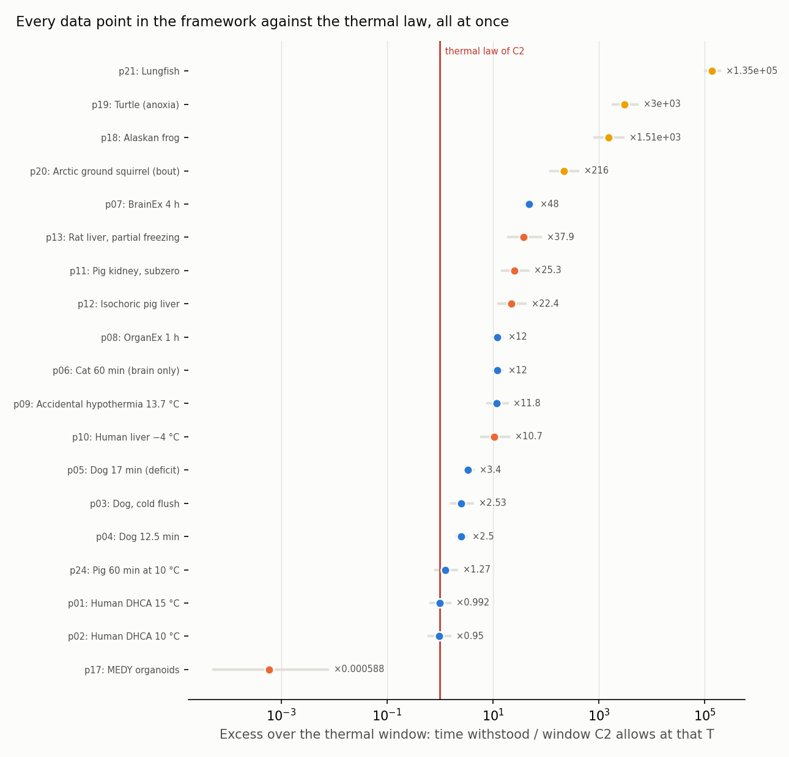

<!-- AUTO-GENERATED by red/cruce.py. DO NOT EDIT BY HAND. -->
# StasisPath: systematic cross-check — the entire data layer against the law layer

`ENCUENTROS.md` crosses **dimensions** pairwise. Here something else is done: **every data point is pitted against the thermal law**, all at once. C4, C9 and C10 already did this for four isolated points; this does it for the 19 that have both temperature and time.

> **Everything here is DERIVED, not measured.** A computed excess is not a new datum: it is a re-reading of data that was already present. It serves to **point at where to look**. No anomaly closes a node on its own (R5).

## 1. Every data point against the C2 window

Window: w(T) = t37 · Q10^((37−T)/10), with t37 = 5 min and Q10 = 2.3. The band in parentheses is the corners of the declared range of both. A point counts as an excess only if **the whole** band exceeds 1.5.

| point | system | T °C | t min | class | excess × | verdict |
|---|---|---|---|---|---|---|
| p01 | Human DHCA 15 °C | 15 | 31 | hypothermia | ×0.992 (0.67–1.55) | within the thermal law |
| p02 | Human DHCA 10 °C | 10 | 45 | hypothermia | ×0.95 (0.612–1.56) | within the thermal law |
| p03 | Dog, cold flush | 10 | 120 | hypothermia | ×2.53 (1.63–4.15) | **EXCESS**: requires a non-thermal mechanism |
| p04 | Dog 12.5 min | 37 | 12.5 | normothermia | ×2.5 (2.08–3.12) | **EXCESS**: requires a non-thermal mechanism |
| p05 | Dog 17 min (deficit) | 37 | 17 | normothermia | ×3.4 (2.83–4.25) | **EXCESS**: requires a non-thermal mechanism |
| p06 | Cat 60 min (brain only) | 37 | 60 | normothermia | ×12 (10–15) | **EXCESS**: requires a non-thermal mechanism |
| p07 | BrainEx 4 h | 37 | 240 | cellular | ×48 (40–60) | **EXCESS**: requires a non-thermal mechanism |
| p08 | OrganEx 1 h | 37 | 60 | cellular | ×12 (10–15) | **EXCESS**: requires a non-thermal mechanism |
| p09 | Accidental hypothermia 13.7 °C | 13.7 | 412 | low_flow | ×11.8 (7.9–18.7) | **EXCESS**: requires a non-thermal mechanism |
| p10 | Human liver −4 °C | -4 | 1.62e+03 | controlled_phase | ×10.7 (6.01–20.1) | **EXCESS**: requires a non-thermal mechanism |
| p11 | Pig kidney, subzero | -0.5 | 2.88e+03 | controlled_phase | ×25.3 (14.8–46.2) | **EXCESS**: requires a non-thermal mechanism |
| p12 | Isochoric pig liver | -2 | 2.88e+03 | controlled_phase | ×22.4 (12.9–41.4) | **EXCESS**: requires a non-thermal mechanism |
| p13 | Rat liver, partial freezing | -15 | 1.44e+04 | controlled_phase | ×37.9 (19.2–79.9) | **EXCESS**: requires a non-thermal mechanism |
| p14 | Vitrified rat kidney | -150 | 1.44e+05 | glass | — | not applicable (glass: no metabolism) |
| p16 | C. elegans (memory) | -196 | 30 | glass | — | not applicable (glass: no metabolism) |
| p17 | MEDY organoids | -196 | 7.88e+05 | controlled_phase | ×0.000588 (5.32e-05–0.00765) | within the thermal law |
| p18 | Alaskan frog | -6.3 | 2.78e+05 | natural | ×1.51e+03 (832–2.92e+03) | **EXCESS**: requires a non-thermal mechanism |
| p19 | Turtle (anoxia) | 3 | 2.55e+05 | natural | ×3e+03 (1.81e+03–5.28e+03) | **EXCESS**: requires a non-thermal mechanism |
| p20 | Arctic ground squirrel (bout) | -3 | 3.02e+04 | natural | ×216 (123–404) | **EXCESS**: requires a non-thermal mechanism |
| p21 | Lungfish | 25 | 1.84e+06 | natural | ×1.35e+05 (1.01e+05–1.91e+05) | **EXCESS**: requires a non-thermal mechanism |
| p24 | Pig 60 min at 10 °C | 10 | 60 | hypothermia | ×1.27 (0.816–2.08) | within the thermal law |
| p25 | Mouse hippocampus (LTP) | -150 | 1.01e+04 | glass | — | not applicable (glass: no metabolism) |
| p26 | Mouse brain in situ | -140 | 1.15e+04 | glass | — | not applicable (glass: no metabolism) |

**15 points robustly require a non-thermal mechanism.**

## 2. Is there structure in the excesses?

**By system class:**

| class | n | minimum | median | maximum |
|---|---|---|---|---|
| natural | 4 | 216 | 2.26e+03 | 1.35e+05 |
| cellular | 2 | 12 | 30 | 48 |
| controlled_phase | 5 | 0.000588 | 22.4 | 37.9 |
| normothermia | 3 | 2.5 | 3.4 | 12 |
| low_flow | 1 | 11.8 | 11.8 | 11.8 |
| hypothermia | 4 | 0.95 | 1.13 | 2.53 |

**By phase:**

| phase | n | minimum | median | maximum |
|---|---|---|---|---|
| liquid | 12 | 0.95 | 7.62 | 1.35e+05 |
| extra_ice | 3 | 0.000588 | 37.9 | 1.51e+03 |
| supercooled | 4 | 10.7 | 23.9 | 216 |

**By origin (artificial = human protocol; natural = biology):**

| artificial | n | minimum | median | maximum |
|---|---|---|---|---|
| no | 4 | 216 | 2.26e+03 | 1.35e+05 |
| yes | 15 | 0.000588 | 10.7 | 48 |

> **REGULARITY FOUND, and the framework had not written it down as a law.** Among the points that exceed the thermal law there is a **clean gap**: the largest excess achieved by an **artificial protocol** is **×48**, and the smallest achieved by **natural biology** is **×216** — a jump of **×4.5** with no point in between. ⇒ What the biochemistry of a hibernator or an amphibian achieves is **beyond the reach of every tested human protocol**, and not narrowly: by a factor of 4.5. It is the same frontier C4 found for the frog and the turtle, but now measured over **all** the points in the framework and with the gap quantified. The bands **do not overlap even at their extremes** (artificial ceiling ×79.9 versus natural floor ×123), so it is not an artefact of the Q10 range.

> **THREE CAVEATS, and without them the finding misleads** (the third was added later, audited against; the first two were already present).
> 1. **The gap describes what has been ATTEMPTED, not what is possible.** The artificial ceiling of ×48 is the best **tested** protocol, not a demonstrated limit. No law in the framework forbids exceeding it; if a protocol reaches ×100 tomorrow the gap closes without refuting any of this. It is an **empirical frontier**, not a barrier.
> 2. **Part of the natural excess is ectothermy, not transferable biochemistry.** The window is calibrated with t37 = 5 min and Q10 = 2.3, **measured in human brain** (F4). Applying it to a turtle or a lungfish extrapolates outside its domain: those animals have a far lower basal metabolism to begin with. C4 already warns of this. The excess of the **arctic ground squirrel** (×216) is the most informative of the natural ones, because it is a **mammal**, and there the comparison is close. **Checked: the point that sets the natural floor IS the ground squirrel (a mammal), so the ectothermy confound does NOT invalidate the gap** — removing the frog, the turtle and the lungfish leaves the natural floor exactly where it is, at ×216.
> 3. **The two sides of the gap are not at the same level of demonstrated success, and that is a bias of our own.** The artificial ceiling is set by **p07**, which reaches **E1**, while every natural point sits at **E4** (animal recovered). Comparing a cellular result with a whole animal is not comparing like with like. Requiring the same E level on both sides, the artificial ceiling drops to ×12 and the gap **widens** to ×18. ⇒ The caveat **does not break the finding: it enlarges it.** But it had to be stated, because a reader could read the gap as 'human protocols reach ×48 with a recovered animal', and that is false.

## 3. Pathways against bounds

27 pathways in the framework. **12 declare their window as free text with no figure in minutes**, so they cannot be checked automatically against a bound. This is a **formatting debt, not a knowledge gap**: whoever writes a window as a number and a unit makes this check run by itself.

Pathways with no checkable window: V07, V12, V14, V15, V16, V17, V18, V21, V22, V24, V25, V26

## What to do with this

1. The points marked **EXCESS** are those that sustain the existence of a biological route: without them, the thermal alone would suffice to describe the whole framework.
2. Those marked **ambiguous** are the measurement candidates: narrowing Q10 or t37 would resolve them with no new experiment.
3. Pathways without a numerical window are bookkeeping work, at almost zero cost, that unlocks an automatic check.
