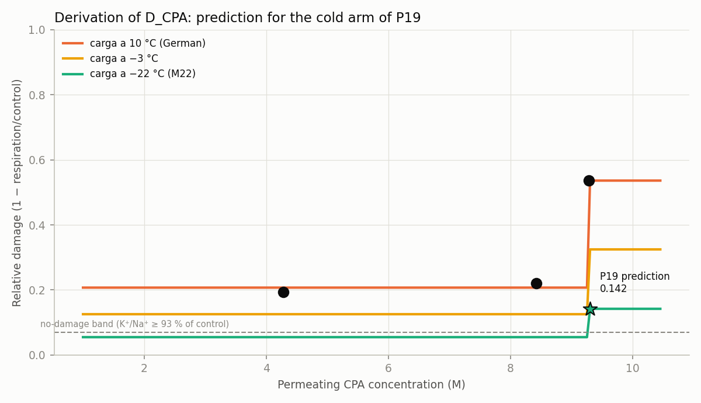

<!-- AUTO-GENERATED by red/derivar.py. DO NOT EDIT BY HAND. -->
# StasisPath: closure by derivation — D_CPA and the P19 prediction

**The idea.** With enough verified laws, some open nodes need no new measurement: they are **derived** from the closed ones. Here toxicity-in-concentration (from one dataset) is composed with toxicity-in-temperature (from **another independent dataset**) to predict the arm of P19 nobody has run.

**Rule:** a derivation is only valid if it uses data other than the node it closes, declares its range of validity and produces a falsifiable prediction with a threshold.

## 1. Shape of the concentration curve at 10 °C

From German's series (F72), damage = 1 − respiration/control:

| C (M) | measured damage |
|---|---|
| 4.28 | 0.194 |
| 8.42 | 0.22 |
| 9.28 | 0.536 |

**It is not a power law: it is a threshold.** Damage stays on a plateau of **0.207** between 4.3 and 8.4 M and **jumps to 0.536** at 9.28 M. *(Self-correction: the first attempt fitted a power law and gave exponent 0.9, which does not describe these data. A sigmoid cannot be fitted reliably to 3 points, so **nothing is fitted**: the measured point is used and scaled in temperature only.)*

## 2. Temperature fit, from an INDEPENDENT dataset

From Szurek & Eroglu (F55), PROH 1.5 M and 15 min fixed, only T changes: degeneration 54.2 % at 23 °C and 85.0 % at 37 °C ⇒ Arrhenius with **Ea/R = 2.95e+03 K** (Ea ≈ 24.5 kJ/mol, the typical order for protein damage).

## 3. Composition and prediction

| case | C (M) | T °C | predicted D_CPA damage | temperature factor |
|---|---|---|---|---|
| German 9.28 M at 10 °C (MEASURED: damage 0.54) | 9.28 | 10 | 0.536 | 1 |
| M22 9.3 M at −22 °C (arm C of P19) | 9.3 | -22 | 0.142 | 0.265 |
| M22 9.3 M a −3 °C (Fahy: inaceptable) | 9.3 | -3 | 0.325 | 0.605 |
| VMP 8.4 M a −3 °C (Fahy: tolerable) | 8.4 | -3 | 0.125 | 0.605 |
| V3 8.42 M at 10 °C (MEASURED: damage 0.22) | 8.42 | 10 | 0.207 | 1 |

> **DERIVED PREDICTION:** loading M22 at 9.3 M **at −22 °C** produces damage of **0.142**, versus **0.536** at 10 °C: a reduction of **×3.78**. That places the cold arm **OUTSIDE** the no-damage band (≤ 0.07, equivalent to K⁺/Na⁺ ≥ 93 % of control).

## 4. Validation against anchors NOT used in the fit

| Fahy's qualitative anchor (F39, F65) | reproduces it? |
|---|---|
| M22 at −3 °C must come out WORSE than VMP at −3 °C | ✔ |
| M22 at −22 °C must come out BETTER than M22 at −3 °C | ✔ |
| V3 at 10 °C must come out better than 9.28 M at 10 °C | ✔ |

**All three anchors are reproduced.** These are qualitative data from Fahy that entered no fit.

## 5. What holds and what does not

- **It stands as a falsifiable prediction for P19**, with the threshold fixed here and before any data: if the cold arm gives damage > 0.25, the derivation is **refuted**; if it gives ≤ 0.10, **confirmed**.
- **It does not close X2 on its own.** It is a prediction, not a measurement: the node stays open until someone runs P19. What it does is turn P19 into an experiment **with its expected result published in advance**, which is stronger than an exploratory one.
- **Declared range of validity:** the concentration fit spans 4.3 to 9.3 M in neural tissue; the temperature one, 23 to 37 °C in oocytes. **Extrapolating to −22 °C is a large extrapolation**, and it is the principal weakness: it assumes the same activation energy governs damage below 0 °C. Fahy warns that at low temperature the dominant damage may be **osmotic rather than chemical** (L20), and that term **is not in the model**.
