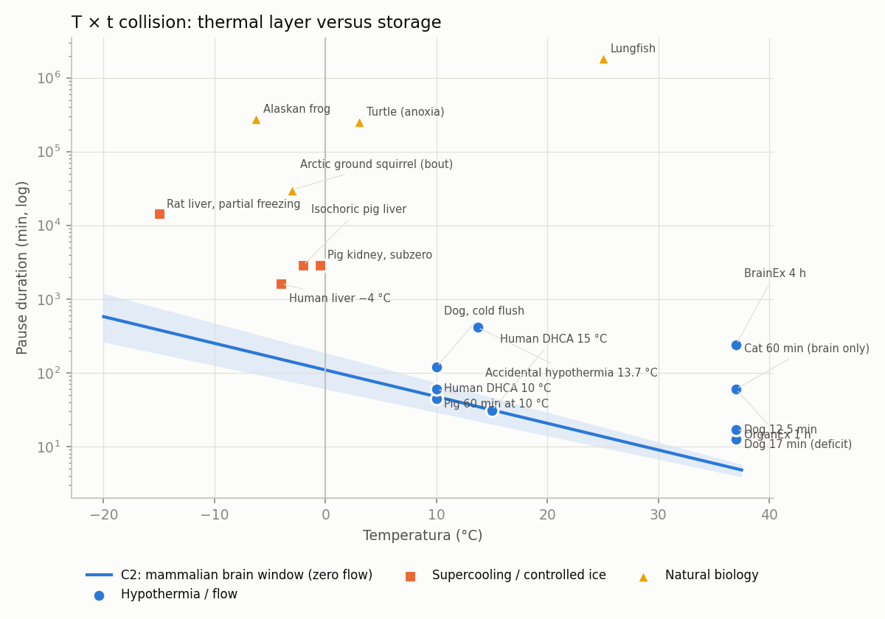
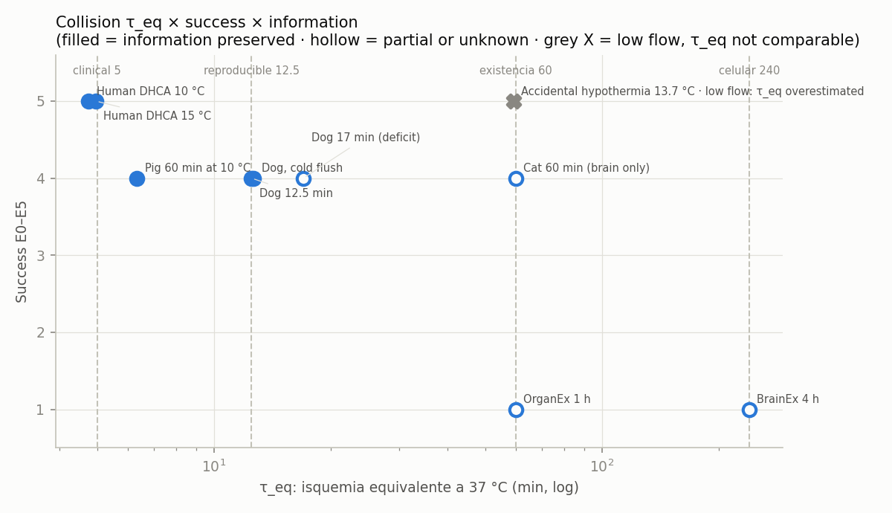
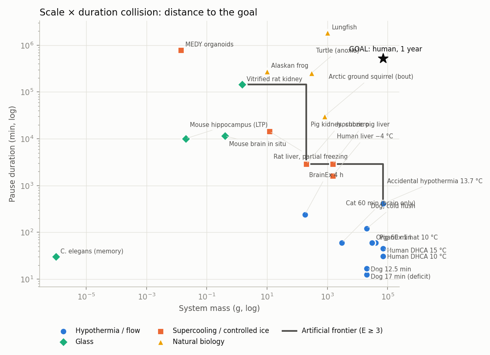
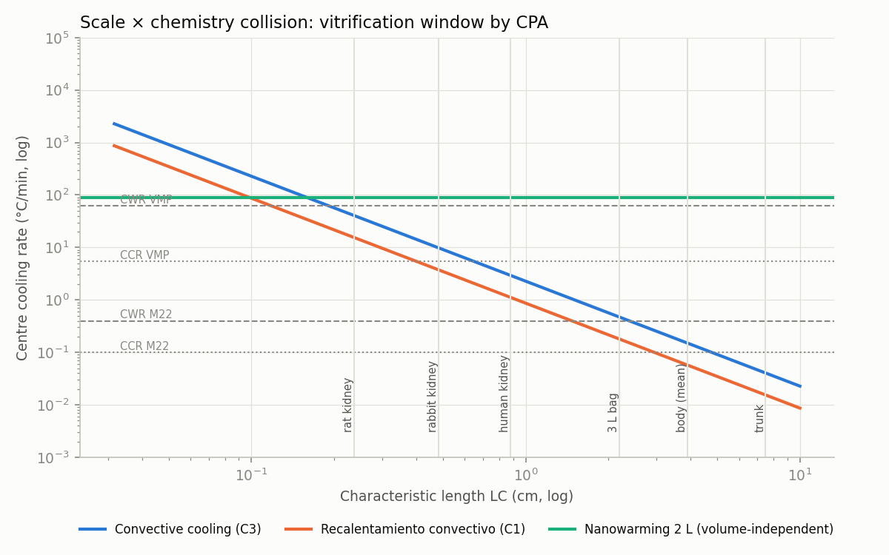

<!-- AUTO-GENERATED by red/encuentros.py (called from red/motor.py). DO NOT EDIT BY HAND. -->
# StasisPath: collisions between layers

Each layer of the framework is projected onto a dimension. Each pair of dimensions is a **collision**: a law draws a frontier, the data fall on one side or the other, and the verdict is computed. The data live in `red/stasispath.yaml → puntos`; changing a parameter or adding a point regenerates everything.

Colours: blue = hypothermia/flow · orange = supercooling/controlled ice · green = glass · yellow = natural biology (the marker shape repeats the class).

## E1 · Temperature × duration

**Law:** C2 (band = corners of t37 and Q10). Above the band, the pause is not explained by passive thermal suppression of the mammalian brain.

| point | T °C | t min | t / C2 window | diagnostic | source |
|---|---|---|---|---|---|
| C. elegans (memory) | -196 | 30 | ×2.24e-08 (≥ ×2.02e-09) | glass: outside the domain of C2 (chemistry halted below Tg) | F29 |
| MEDY organoids | -196 | 788,400 | ×0.000588 (≥ ×5.32e-05) | exceeds C2 → state below 0 °C (controlled ice or supercooling) | F35 |
| Mouse hippocampus (LTP) | -150 | 10,080 | ×0.000347 (≥ ×4.86e-05) | glass: outside the domain of C2 (chemistry halted below Tg) | F46 |
| Vitrified rat kidney | -150 | 144,000 | ×0.00496 (≥ ×0.000695) | glass: outside the domain of C2 (chemistry halted below Tg) | F1 |
| Mouse brain in situ | -140 | 11,520 | ×0.000912 (≥ ×0.000141) | glass: outside the domain of C2 (chemistry halted below Tg) | F46 |
| Rat liver, partial freezing | -15 | 14,400 | ×37.9 (≥ ×19.2) | exceeds C2 → state below 0 °C (controlled ice or supercooling) | F21 |
| Alaskan frog | -6.3 | 277,920 | ×1.51e+03 (≥ ×832) | exceeds C2 → natural non-thermal biochemistry | F11 |
| Human liver −4 °C | -4 | 1.62e+03 | ×10.7 (≥ ×6.01) | exceeds C2 → state below 0 °C (controlled ice or supercooling) | F8 |
| Arctic ground squirrel (bout) | -3 | 30,240 | ×216 (≥ ×123) | exceeds C2 → natural non-thermal biochemistry | F10 |
| Isochoric pig liver | -2 | 2.88e+03 | ×22.4 (≥ ×12.9) | exceeds C2 → state below 0 °C (controlled ice or supercooling) | F22 |
| Pig kidney, subzero | -0.5 | 2.88e+03 | ×25.3 (≥ ×14.8) | exceeds C2 → state below 0 °C (controlled ice or supercooling) | F20 |
| Turtle (anoxia) | 3 | 254,880 | ×3e+03 (≥ ×1.81e+03) | exceeds C2 → natural non-thermal biochemistry | F60 |
| Human DHCA 10 °C | 10 | 45 | ×0.95 (≥ ×0.612) | explained by passive Q10 | F4 |
| Dog, cold flush | 10 | 120 | ×2.53 (≥ ×1.63) | tissue or flow margin (≤ ×5) | F30 |
| Pig 60 min at 10 °C | 10 | 60 | ×1.27 (≥ ×0.816) | explained by passive Q10 | F42 |
| Accidental hypothermia 13.7 °C | 13.7 | 412 | ×11.8 (≥ ×7.9) | exceeds C2 → there was (low) flow | F13 |
| Human DHCA 15 °C | 15 | 31 | ×0.992 (≥ ×0.67) | explained by passive Q10 | F4 |
| Lungfish | 25 | 1,840,000 | ×135,449 (≥ ×100,675) | exceeds C2 → natural non-thermal biochemistry | F91 |
| Dog 12.5 min | 37 | 12.5 | ×2.5 (≥ ×2.08) | tissue or flow margin (≤ ×5) | F25b |
| Dog 17 min (deficit) | 37 | 17 | ×3.4 (≥ ×2.83) | tissue or flow margin (≤ ×5) | F25 |
| Cat 60 min (brain only) | 37 | 60 | ×12 (≥ ×10) | exceeds C2 → optimized reperfusion (grey zone X1) | F38 |
| BrainEx 4 h | 37 | 240 | ×48 (≥ ×40) | exceeds C2 → optimized reperfusion (grey zone X1) | F23 |
| OrganEx 1 h | 37 | 60 | ×12 (≥ ×10) | exceeds C2 → optimized reperfusion (grey zone X1) | F24 |

## E2 · Equivalent ischemia × success × information

**Invariant of the collision:** the thermal layer (C2) and the ischemia layer (G1) agree: the hypothermic cases with E ≥ 4 fall at τ_eq = 4.75–12.7 min, the same range as the reproducible normothermic ones (5–12.5 min). The dog with cold flush (120 min at 10 °C) lands at τ_eq ≈ 12.7 min: the same threshold as the normothermic dog (12.5 min). ⇒ **τ_eq works as a single quantity across species and temperatures.** Above ~13 min, E4 appears only with partial information (deficit or hippocampal atrophy).

| point | t min | T °C | τ_eq min (Q10 range) | E | info | flow | source |
|---|---|---|---|---|---|---|---|
| Human DHCA 15 °C | 31 | 15 | 4.96 (4.02–6.19) | 5 | yes | zero | F4 |
| Human DHCA 10 °C | 45 | 10 | 4.75 (3.67–6.23) | 5 | yes | zero | F4 |
| Dog, cold flush | 120 | 10 | 12.7 (9.79–16.6) | 4 | yes | zero | F30 |
| Pig 60 min at 10 °C | 60 | 10 | 6.33 (4.89–8.31) | 4 | yes | zero | F42 |
| Dog 12.5 min | 12.5 | 37 | 12.5 (12.5–12.5) | 4 | yes | zero | F25b |
| Dog 17 min (deficit) | 17 | 37 | 17 (17–17) | 4 | partial | zero | F25 |
| Cat 60 min (brain only) | 60 | 37 | 60 (60–60) | 4 | partial | zero | F38 |
| BrainEx 4 h | 240 | 37 | 240 (240–240) | 1 | unknown | zero | F23 |
| OrganEx 1 h | 60 | 37 | 60 (60–60) | 1 | unknown | zero | F24 |
| Accidental hypothermia 13.7 °C | 412 | 13.7 | 59.2 (47.4–74.8) | 5 | yes | low | F13 |

## E3 · Scale × duration (reversibility frontier)

- **Artificial frontier (Pareto, E ≥ 3):** Vitrified rat kidney (1.5 g, 144,000 min) → Pig kidney, subzero (200 g, 2.88e+03 min) → Accidental hypothermia 13.7 °C (70,000 g, 412 min)
- At the goal's mass (≥ 17.5 kg), the longest artificial pause with E ≥ 3 is **412 min** ⇒ **3.1 orders of magnitude** of time are missing.
- At the goal's duration (≥ 1 year), the maximum artificial mass with E ≥ 3 is **none** ⇒ no artificial system with E ≥ 3 has reached 1 year.
- **Chebyshev distance from the goal to the frontier: 2.5 orders of magnitude** (the smallest simultaneous jump in mass and time).
- Natural biology already occupies the months-to-years region at 10–1000 g (Alaskan frog, Turtle (anoxia), Arctic ground squirrel (bout), Lungfish): the goal lies outside the artificial frontier, but not outside what is biologically possible at small mass.
## E4 · Scale × chemistry (cool / rewarm / CPA)

**Layer clash:** the vitrification window is closed by **cooling** (blue curve), not rewarming, because nanowarming raises the warming ceiling at any size. The window grows as CCR falls, which demands higher concentration and more aggressive chemistry ⇒ **the scale axis pushes on the toxicity axis**. The toxicity ordering (1 = lowest) is **ordinal with no common scale [P]**: the scale × toxicity collision is **unquantified** (see E6).

| CPA | CCR °C/min | M | Max LC vitrifiable by convection | objects that fit | toxicity (ordinal, P) |
|---|---|---|---|---|---|
| VMP | 5.4 | 8.4 | 0.649 cm (worst case 0.606) | rat kidney, rabbit kidney | 1 |
| VS55 | 2.5 | 8.4 | 0.954 cm (worst case 0.891) | rat kidney, rabbit kidney, human kidney | 2 |
| M22 | 0.1 | 9.3 | 4.77 cm (worst case 3.64) | rat kidney, rabbit kidney, human kidney, 3 L bag, body (mean) | 3 |

## E5 · Function × information

**Ontological collision:** function and information are separate axes. Cases that prove it: *Cat 60 min* (high function, partial information), *ASC* (no function, information yes), *C. elegans* (low measured function, information yes). Organs have no information axis (n/a). **Gap:** no point simultaneously has E ≥ 4, measured information and a pause > 1 day in an artificial mammal.

| function | information | n | points |
|---|---|---|---|
| high (E ≥ 3) | n/a | 4 | Rabbit kidney (dielectric); Pig kidney, subzero; Vitrified rat kidney; Rabbit kidney M22 |
| high (E ≥ 3) | partial | 2 | Dog 17 min (deficit); Cat 60 min (brain only) |
| high (E ≥ 3) | yes | 10 | Human DHCA 15 °C; Human DHCA 10 °C; Dog, cold flush; Pig 60 min at 10 °C; Dog 12.5 min; Accidental hypothermia 13.7 °C; Alaskan frog; Turtle (anoxia); Arctic ground squirrel (bout); Lungfish |
| low (E1–E2) | n/a | 3 | Human liver −4 °C; Isochoric pig liver; Rat liver, partial freezing |
| low (E1–E2) | partial | 2 | Mouse brain in situ; MEDY organoids |
| low (E1–E2) | unknown | 3 | BrainEx 4 h; OrganEx 1 h; VM3 hippocampal slices |
| low (E1–E2) | yes | 2 | Mouse hippocampus (LTP); C. elegans (memory) |
| nula (E0) | partial | 1 | Real cryonics case P-19 |
| nula (E0) | yes | 1 | ASC, pig brain |

## E7 · Chemistry: concentration × temperature × protocol → toxicity

**Hallazgo calculado:** there are 2 pairs with **the same concentration and the same temperature but the opposite outcome**: a 8.4 M y -3 °C: VMP → 3 frente a 8.4 M, predating qv*-guided design → 0; a 9.3 M y -22 °C: M22 (washed out on warming) → 3 frente a M22 (added and removed at −22 °C) → 1. ⇒ Toxicity **is not a function of molarity or of temperature separately**: it is decided by composition (qv*) and by the loading and unloading protocol. The 'toxicity' dimension must be modelled as D_CPA(composition, T, t, protocol), not as one number per CPA.

| CPA / protocol | M | T °C | t min | mass g | system | result (ordinal) | source |
|---|---|---|---|---|---|---|---|
| VMP | 8.4 | -3 | — | 12.7 | rabbit kidney | 3 · no toxicity or full function | F39 |
| M22 (washed out on warming) | 9.3 | -22 | 25 | 12.7 | rabbit kidney | 3 · no toxicity or full function | F39 |
| M22 (added and removed at −22 °C) | 9.3 | -22 | — | 12.7 | rabbit kidney | 1 · damaging or sometimes fatal | F39 |
| 8.4 M, predating qv*-guided design | 8.4 | -3 | — | 12.7 | rabbit kidney | 0 · letal | F26 |
| VM3 (61 % w/v) | — | — | — | 0.01 | hippocampal slices | 3 · no toxicity or full function | F37b |
| V(EG) 53 % w/v | — | — | — | 0.01 | hippocampal slices | 1 · damaging or sometimes fatal | F37b |
| VS55 | 8.4 | — | — | 1.5 | rat kidney | 1 · damaging or sometimes fatal | F1 |
| VMP | 8.4 | — | — | 1.5 | rat kidney | 3 · no toxicity or full function | F1 |
| EG + DMSO (isotonic vehicle) | — | — | — | 200 | pig and human kidney | 2 · low or partial damage | F31 |

## E6 · Collision matrix (model coverage)

36 possible collisions among 9 dimensions; 21 relevant. **Gaps (empty, unscaled, or law without data): 4**: t×tox, mass×CCR, E×CCR, CCR×tox → these are the prioritized research list (each is a pair of layers whose clash cannot yet be computed).

| collision | law | n points | state |
|---|---|---|---|
| Temperature × Pause duration | C2 | 23 | cuantificado |
| Temperature × System mass | — | 27 | not applicable |
| Temperature × Equivalent ischemia τ_eq | C2 | 10 | cuantificado |
| Temperature × Phase of water | C2/G2 | 27 | cuantificado |
| Temperature × Success E0–E5 | — | 27 | not applicable |
| Temperature × Information preserved | — | 18 | not applicable |
| Temperature × CPA CCR | — | 2 | not applicable |
| Temperature × CPA toxicity | — | 4 | cuantificado (ordinal) |
| Pause duration × System mass | frontera | 23 | cuantificado |
| Pause duration × Equivalent ischemia τ_eq | G1 | 10 | cuantificado |
| Pause duration × Phase of water | — | 23 | not applicable |
| Pause duration × Success E0–E5 | frontera | 23 | cuantificado |
| Pause duration × Information preserved | — | 16 | data without a law |
| Pause duration × CPA CCR | — | 1 | not applicable |
| Pause duration × CPA toxicity | — | 1 | **few data** |
| System mass × Equivalent ischemia τ_eq | — | 10 | not applicable |
| System mass × Phase of water | — | 28 | data without a law |
| System mass × Success E0–E5 | frontera | 28 | cuantificado |
| System mass × Information preserved | — | 18 | not applicable |
| System mass × CPA CCR | C3 | 2 | law without data |
| System mass × CPA toxicity | C8 | 9 | cuantificado (ordinal) |
| Equivalent ischemia τ_eq × Phase of water | — | 10 | not applicable |
| Equivalent ischemia τ_eq × Success E0–E5 | G1/X1 | 10 | cuantificado |
| Equivalent ischemia τ_eq × Information preserved | O4/X1 | 8 | cuantificado |
| Equivalent ischemia τ_eq × CPA CCR | — | 0 | not applicable |
| Equivalent ischemia τ_eq × CPA toxicity | — | 0 | not applicable |
| Phase of water × Success E0–E5 | — | 28 | data without a law |
| Phase of water × Information preserved | — | 18 | data without a law |
| Phase of water × CPA CCR | — | 2 | not applicable |
| Phase of water × CPA toxicity | — | 0 | not applicable |
| Success E0–E5 × Information preserved | O4 | 18 | cuantificado |
| Success E0–E5 × CPA CCR | — | 2 | **empty** |
| Success E0–E5 × CPA toxicity | — | 9 | cuantificado (ordinal) |
| Information preserved × CPA CCR | — | 0 | not applicable |
| Information preserved × CPA toxicity | — | 0 | not applicable |
| CPA CCR × CPA toxicity | L6 (qv*) | 3 | **no quantitative scale** |

## Warnings from the layer collisions
- none (no point crosses a frontier without a declared mechanism)
