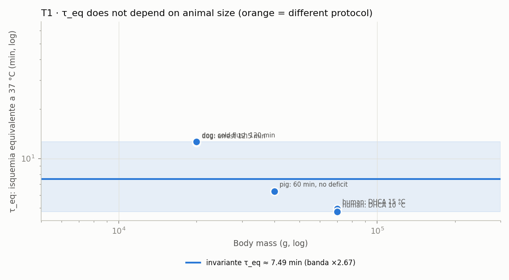

<!-- AUTO-GENERATED by red/escalado.py (called from red/motor.py). DO NOT EDIT BY HAND. -->
# StasisPath: cross-species scaling and leave-one-out validation

**The question:** can what has been achieved in animals be scaled to project a human number, and then checked for where it is right and where it is not?

**Short answer:** yes, but **not with neuron count**. It can be done with the laws whose leave-one-out error can be measured. Here each candidate law is validated by leaving out one species and predicting it from the others; only those that pass are used to project.

## T1 · Is τ_eq invariant across species? (leave-one-out validation)

Each species is left out and predicted from the others.

| species | observation | T °C | t min | τ_eq min | predicted without it | error | source |
|---|---|---|---|---|---|---|---|
| human | DHCA 15 °C | 15 | 31 | **4.96** | 8.31 | ×1.67 | F4 |
| human | DHCA 10 °C | 10 | 45 | **4.75** | 8.4 | ×1.77 | F4 |
| dog | arrest 12.5 min | 37 | 12.5 | **12.5** | 6.59 | ×1.9 | F25b |
| dog | cold flush 120 min | 10 | 120 | **12.7** | 6.57 | ×1.93 | F30 |
| pig | 60 min, no deficit | 10 | 60 | **6.33** | 7.81 | ×1.23 | F42 |
| cat | 1 h, brain only (excluded) | 37 | 60 | **60** | — | — | F38 |

- **Maximum leave-one-out error: ×1.93** · total spread ×2.67.
- **Dependence on body mass:** log-log slope **-0.77** (r = -0.99) over 3 orders of magnitude of mass (dog 20 kg → human 70 kg → pig 40 kg). A slope ≈ 0 means **τ_eq does not depend on size**.
- **Projection to human without using any human datum: 10 min.** Real human value: 4.85 min. Projection error: **×2.06**.
- Verdict: **FAIL**. The cross-species projection of τ_eq is valid within a factor of ×1.93. The cat is excluded from the fit because its ischemia was **brain-only** (a different protocol), and precisely for that reason its τ_eq jumps to 60: **the law does not fail by species, it fails by protocol.**

## T2 · Does the LC⁻² thermal law hold outside its anchor?

The law was anchored on the 3 L bag (LC 2.2 cm → 0.47 °C/min) and is checked against independent measured points from the same work.

| case | LC cm | measured °C/min | predicted by LC⁻² | error | source |
|---|---|---|---|---|---|
| bolsa 0.5 L | 1.2 | 1.4 | 1.58 | ×1.13 | F2 |
| bolsa 1 L | 1.4 | 1 | 1.16 | ×1.16 | F2 |
| pig liver ~1 L | 1.8 | 0.6 | 0.702 | ×1.17 | F2 |

- **Maximum error: ×1.17.** The thermal law **PASSES**: it predicts cooling rates within ×1.17 over the 0.5–3 L range.
- That is why extrapolation to LC of 4–7.5 cm (body and trunk) is credible to order of magnitude, though it still lacks a direct datum.

## T3 · Does neuron count work as a scaling variable?

| species | neurons [P] | brain g | achieved mass g | what was achieved | year | source |
|---|---|---|---|---|---|---|
| rat | 200,000,000 | 2 | 0.01 | function (K+/Na+, ultrastructure) in slices | 2006 | F37 |
| mouse | 71,000,000 | 0.4 | 0.02 | function (LTP) in slices | 2026 | F46 |
| mouse | 71,000,000 | 0.4 | 0.4 | whole brain vitrified (function in slices) | 2026 | F46 |
| cat | 760,000,000 | 30 | 30 | whole brain frozen: partial electrical activity | 1974 | F48 |
| pig | 2,200,000,000 | 180 | 180 | whole brain vitrified unfixed: structure only | 2026 | F47 |

- Correlation between achieved mass and **neuron count**: r = **+0.85** (high).
- Correlation between achieved mass and **publication year**: r = **-0.24**.
- **But the high correlation is a confound, not a law.** Across species, neuron count and brain mass travel together (r = **+0.95**), and the achieved mass is essentially the brain mass of the chosen species (achieved/brain fractions: 0.005, 0.05, 1, 1, 1). That is: a high r only says that **whoever vitrifies a pig brain obtains the mass of a pig brain**. It is a tautology, not predictive power.
- **The test that settles it:** neuron count appears in none of the equations that limit the problem. **What limits is geometry, not neuron count.** Heat diffuses as LC², the cryoprotectant distributes through the vasculature, and fractures depend on the thermal gradient. None of those three things knows how many neurons are inside.
- **Where neuron count does matter:** on the **information** axis, not the physical one. The human brain has ~1.21e+03 times the neurons of the mouse and ~284,768,212 times those of *C. elegans*: that fixes **how much** information must be preserved and how much must be sampled to verify it (P15), not whether the tissue survives.
- **Methodological conclusion:** scaling by neuron count would yield a number with no physical content. To project to human one must use geometry (LC, mass) on the physical axes and neuron count only on the information axis.

## T4 · Projection to human with the validated laws

| law | leave-one-out error | human projection | verdict |
|---|---|---|---|
| entry τ_eq | ×1.93 | 10 min | **valid**: no mass dependence and bounded leave-one-out error |
| Brain cooling (LC⁻²) | ×1.17 | 0.425 °C/min by convection at LC 2.31 cm | **valid** to order of magnitude |
| Scaling by neuron count | — | no physical content | **invalid** for the physical axes (T3) |

**The number, computed:** German 2026 vitrifies the mouse brain (LC ≈ 0.152 cm) cooling at ≥ 147 °C/min. A human brain has LC ≈ 2.31 cm, that is **×87.8 worse in conduction** (respecting the regime change at Bi = 1; applying LC⁻² across the whole path would give ×231 and **overestimate the difficulty by ×2.6**). That same protocol demands 147 °C/min, but convection in a human brain gives only **0.425 °C/min**: a deficit of **×346**.

⇒ **German's protocol does not scale to the human brain by convection: it is short by ~2.5 orders of magnitude in cooling rate.** This is not an opinion: it is the same LC⁻² law that was already accurate to within ×1.17 in T2.

**What a human brain therefore demands:** a CPA whose CCR is ≤ 0.425 °C/min (the M22 class, CCR 0.1, **meets it**; V3 and VMP do not) plus volumetric warming. That is exactly what Fahy 2026 does (M22, pig brain, structure only) and what German does NOT do (V3, high rate, mouse only). **The two halves of the bottleneck use mutually incompatible chemistries.**

## Resumen

| law | valid? | error | use |
|---|---|---|---|
| τ_eq invariant across species | yes | ×1.93 | projecting ischemia windows to human |
| LC⁻² cooling | yes | ×1.17 | projecting vitrification to any size |
| scaling by neuron count | **no** | — | only for sizing the information (P15), not the physics |
