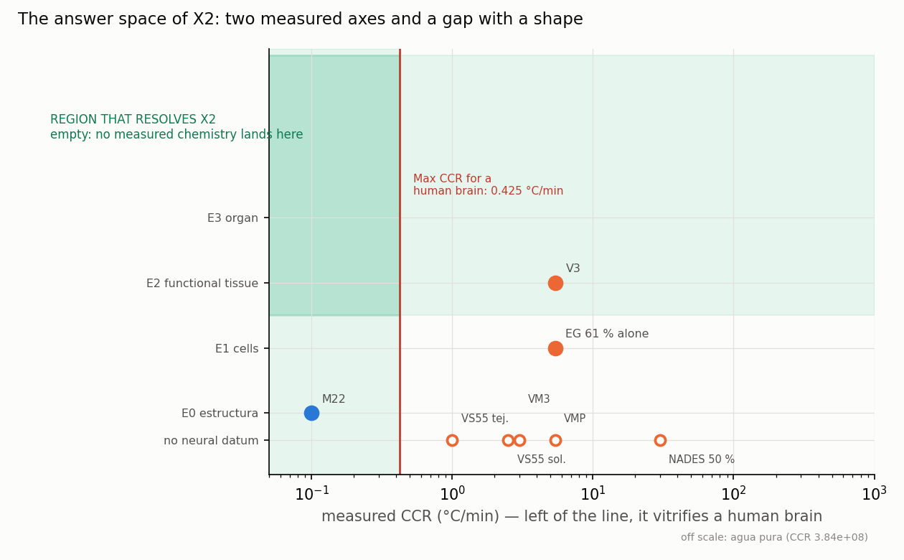

<!-- AUTO-GENERATED by red/espacio.py. DO NOT EDIT BY HAND. -->
# StasisPath: the answer space of X2 — catalogued, not blank

X2 asks whether a chemistry exists that **vitrifies at human scale AND preserves function**. Leaving it as a blank gap wastes what the framework already knows: every known chemistry occupies a point with **measured coordinates**, and the gap has a shape and a size.

> **What this document does NOT do.** The framework already *predicts* the outcome of arm C of P19 (DERIVACION.md gives damage 0.142; both paths of I1 predict PASS). **That prediction is not counted as a datum.** It is precisely what the experiment puts to the test: counting it would close the loop on itself and the framework would lose the ability to be wrong. Only **measured** coordinates enter here.

## 1. Catalogue: every chemistry in the framework, with its two coordinates

**Vitrification requirement:** CCR ≤ **0.425 °C/min** (inverting C3 for a human brain of 1400 g, LC = 2.31 cm). **Function requirement:** at least **E2**, functional, which is the level at which LTP is measured.

| chemistry | CCR °C/min | M | level in NEURAL | level in other tissue | source | verdict |
|---|---|---|---|---|---|---|
| M22 | 0.1 | 9.3 | E0 | E3 | F2,F47,F5 | vitrifies, function missing |
| VM3 | 3 | 8.9 | — | — | F37b | neither of the two |
| VS55 tej. | 1 | 8.4 | — | E1 | F3 | neither of the two |
| VS55 sol. | 2.5 | 8.4 | — | E1 | F3 | neither of the two |
| V3 | 5.4 | 8.42 | E2 | — | F46,F71 | function, does not vitrify |
| VMP | 5.4 | 8.4 | — | E3 | F1,F3 | neither of the two |
| EG 61 % alone | 5.4 | — | E1 | — | F52,F71 | neither of the two |
| MEDY | — | — | E2 | — | F35 | function, does not vitrify |
| NADES 50 % | 30 | — | — | E1 | F80 | neither of the two |
| agua pura | 3.84e+08 | 0 | — | — | F76 | neither of the two |

> **Checked:** the CCRs of M22, VS55 and VMP in this table **agree with `parametros` in `red/stasispath.yaml`**. They were written by hand and duplicated the datum; now a mismatch would be detected and declared right here. It matters because `CCR_M22` has an **open gap** (solution or tissue) and the day is tagged, this document has to find out about it.

## 2. The gap, measured

- **Chemistries that vitrify at human-brain scale:** 1 — M22 (0.1).
- **Chemistries with demonstrated function in neural tissue (≥ E2):** 2 — V3 (E2), MEDY (E2).
- **Intersection: empty.** No measured chemistry satisfies both.

**By how much the best candidate on each side fails:**

- On the function axis, the best is **V3**, with demonstrated E2 neural function, but its CCR (5.4) is **×12.7 the permitted value**. It must come down by a factor of 12.7.
- On the vitrification axis, the best is **M22** (CCR 0.1, ×4.3 of headroom over the requirement), but in neural tissue **it has only demonstrated ultrastructure (E0, F47), with no proof of function**.

> **The gap is not diffuse: it is a jump between two known chemistries.** X2 reduces to one concrete question — **does M22 preserve the function of neural tissue?** — and that is exactly **arm C of P19**, which is already preregistered with frozen thresholds. Cataloguing the space does not close X2, but **it shows that a single experiment decides it**.

## 3. Is the target region excluded by any law in the framework?

This is the test that closed V15 (pattern L43): if the uncertainty cannot accommodate any answer, the verdict is closed even though nobody has measured.

**It is NOT excluded.** The only law that could forbid it would be one requiring that every low-CCR chemistry be lethal. The framework says the opposite: **L20, L25 and E7 establish that toxicity depends on the quadruple (composition, temperature, time, protocol) and NOT on molarity alone.** That is why M22 loaded at −22 °C and V3 loaded at 10 °C are **different points** in the space even though their molarity is nearly equal (9.3 vs 8.42 M, a 10 % difference). ⇒ X2 **does not close by impossibility**: it stays open, and that is a result, not a gap.

**What a candidate would have to satisfy, in one line:** CCR ≤ 0.425 °C/min with LTP ≥ 130 % of baseline in CA1 after HFS (the preregistered P19 threshold). M22 meets the first by a factor of 4.3; nobody has measured the second.
