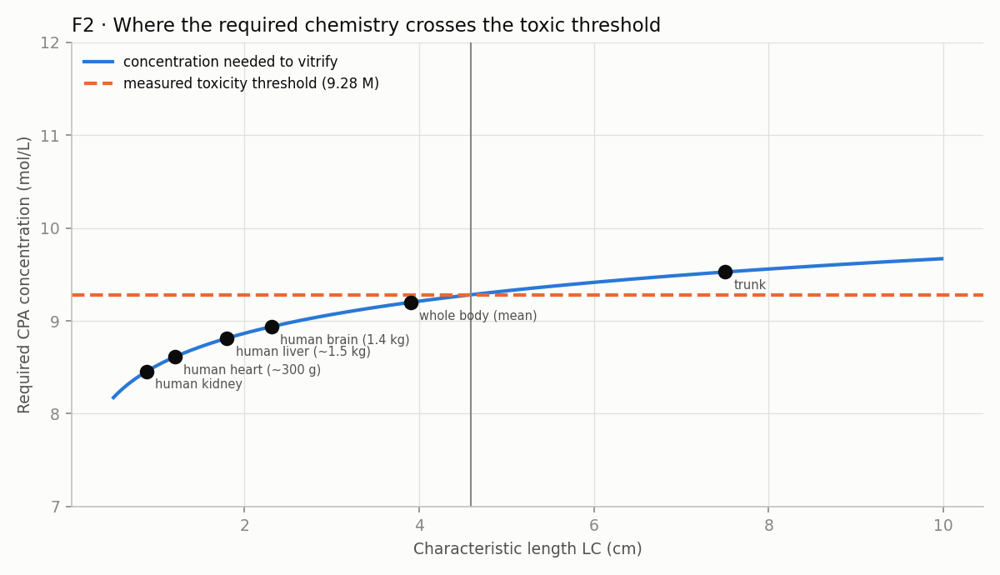

<!-- AUTO-GENERATED by red/formular.py. DO NOT EDIT BY HAND. -->
# StasisPath: internal formulation — the framework solving itself

Each formula composes **already closed** laws to produce a quantitative statement nobody measured directly. What it derives from, its range of validity, and whether it reaches a falsifiable prediction are all declared. **A formula resting on an open node is marked conditional, not derived.**

| formula | status |
|---|---|
| **F1 · Maximum vitrifiable mass by convection, per cryoprotectant** | derivada |
| **F2 · Viability theorem: is any chemistry possible for a given organ?** | weak derivation, with chemical-class range |
| **F3 · piecewise τ_eq, with declared domain** | derivada |
| **F4 · Volume × time invariant of supercooling** | hypothesis, not derived |
| **F5 · Optimal cooling protocol (non-monotonic)** | derivada cualitativa |

## F1 · Maximum vitrifiable mass by convection, per cryoprotectant

*Status: derivada.*

**Derives from:** C3 (cooling ∝ LC⁻ⁿ, anchored on the 3 L bag) + the measured CCRs.

**Formula:** LC\* = LC₀ · (rate₀ / CCR)^(1/n) and M\* = (4/3)π(3·LC\*)³ for an aqueous sphere.

| CPA | CCR °C/min | M (mol/L) | max LC (cm) | max mass (g) |
|---|---|---|---|---|
| M22 | 0.1 | 9.3 | 4.77 (4.19–6.16) | 12,271 (8.3e+03–26,442) |
| VS55 (tissue) | 2.5 | 8.4 | 0.954 (0.752–1.12) | 98.2 (48.1–160) |
| VMP | 5.4 | 8.4 | 0.649 (0.474–0.789) | 30.9 (12.1–55.5) |

**Reading:** with convection alone, M22 reaches tens of kg and VMP does not exceed a few grams. This is the number that was missing to say 'which organ fits which chemistry' without simulating each case.

## F2 · Viability theorem: is any chemistry possible for a given organ?

*Status: weak derivation, with chemical-class range.*

**Derives from:** F1 + the measured CCR↔concentration relation (3 CPAs) + German's toxicity threshold (9.28 M, where basal respiration halves).

**Formula:** log₁₀(CCR) = 15.2 + -1.74·M ⇒ to vitrify a given LC requires M ≥ (log₁₀(CCR_required) − a)/b. If that M exceeds the toxic threshold, **no known chemistry works**.

| object | LC cm | required CCR °C/min | required M (mol/L) | verdict |
|---|---|---|---|---|
| human kidney | 0.88 | 2.94 | 8.46 | **viable** |
| human heart (~300 g) | 1.2 | 1.58 | 8.61 | **viable** |
| human liver (~1.5 kg) | 1.8 | 0.702 | 8.81 | **viable** |
| human brain (1.4 kg) | 2.31 | 0.426 | 8.94 | **viable** |
| whole body (mean) | 3.9 | 0.15 | 9.2 | **viable** |
| trunk | 7.5 | 0.0404 | 9.53 | **requires C > toxic threshold** |

> **DERIVED RESULT:** the limit lies at **LC ≈ 4.59 cm**, that is a mass of **≈ 10.9 kg**. Above that, the required concentration crosses the threshold where toxicity escalates. 

**What the table says when read carefully:** the human brain requires **8.94 M**, below the threshold, with a margin of only **0.34 M**. The whole body (mean LC) requires **9.20 M**: a margin of **0.08 M**, practically nil. **The trunk is the only one that crosses it** (9.53 M) — and it is precisely the piece C3 already flagged as failing along the pure thermal route. **The derivation reproduces that result from another direction**, which is a cross-check, not a coincidence sought after the fact.

**Validation with a third point, from a distant field (L31):** the CCR of **pure water** is 384,000,000 °C/min (cryo-electron microscopy). With it, the relation is seen to be **curved**: −0.95 decades/mol between 0 and 8.4 M, but **−1.74 between 8.4 and 9.3 M**. ⇒ **Extrapolating with the local slope near 9 M, as F2 does, is the correct choice**, and it is now justified by evidence rather than by assumption.

**Honesty warning:** the CCR↔M line is fitted with **three points and only two distinct concentrations** (8.4 and 9.3 M). It is the weakest piece of the whole derivation. The result must be read as an **order of magnitude**, not as a precise frontier, and it is refuted as soon as a CPA with a low CCR at low concentration is measured.

**And a neighbouring field says that is possible (L29):** tardigrade CAHS proteins form a glass or gel at **~0.6 mM**, four orders of magnitude below the 8.4–9.3 M of M22 or V3. The CCR↔molarity relation that underpins F2 **is not a law of nature: it is a property of the chemical class the field chose** (small molecules). F2 remains valid **within that class**, and that is its real range of validity.

## F3 · piecewise τ_eq, with declared domain

*Status: derivada.*

**Derives from:** C2 + L2 (Q10 not constant) + L24 (mechanism) + L27 (the hibernator is a different regime).

**Formula:** τ_eq = t · Q10(T)^((T−37)/10), with **Q10 = 2.3 above 15 °C** and **3.5 below it**; and **undefined** for hibernators below 12 °C, where metabolism ceases to be a function of temperature.

| case | T °C | t min | τ_eq (min at 37 °C) |
|---|---|---|---|
| Human DHCA 15 °C, 31 min | 15 | 31 | 4.96 |
| Dog flush 10 °C, 120 min | 10 | 120 | 4.08 |
| Pig 10 °C, 60 min | 10 | 60 | 2.04 |
| Euthermic ground squirrel 37 °C, 8 min | 37 | 8 | 8 |
| Ground squirrel in torpor, 5 °C | 5 | 1.44e+03 | **not applicable** (L27) |

**What it contributes:** it unifies in a single expression what was spread across four laws, **and declares where it does not hold**. The 'not applicable' cell matters as much as the numbers: it is the error we would make by applying C2 to a cold hibernator.

## F4 · Volume × time invariant of supercooling

*Status: hypothesis, not derived.*

**Derives from:** L16 (cumulative nucleation limits the time, not the minimum temperature) + G7 (cold-injury band).

**Proposed form:** if nucleation is a Poisson process with rate per unit volume J(T), the probability of NO nucleation is exp(−J(T)·V·t) ⇒ **the invariant is V·t at fixed T**.

**Only anchor available:** pig kidney, 0.2 L at -2 °C for 5 h ⇒ V·t = 1 L·h without nucleating. For 48 h the same group had to raise it to -0.5 °C.

> **PREDICTION (not fully derived):** at −2 °C, a 1.5 L organ (liver) would last only ≈ 0.667 h before matching the nucleation dose the kidney accumulated in 5 h.

**Honest status: this is NOT yet a valid derivation.** There is **a single point**: one datum does not determine J(T) nor does it verify that the invariant is V·t. It is left written **as a falsifiable hypothesis** because the experiment that would test it is cheap: supercool two different volumes at the same temperature and see whether the time to nucleation scales as 1/V.

## F5 · Optimal cooling protocol (non-monotonic)

*Status: derivada cualitativa.*

**Derives from:** L14 (rate conflict) + G7 (0–20 °C cold-injury band) + G3 (Tg and rewarming profile) + F68 (lowering the rate between storage and Tg reduces stress).

**Derived rule, in three regimes:**
1. **From 37 to 20 °C:** rate unconstrained. There is neither cold injury nor ice risk.
2. **From 20 to 0 °C: as fast as possible.** This is the phase-transition band of membrane lipids, where damage grows with *exposure time* (G7). Exception: if the route is controlled extracellular ice, cellular dehydration governs here and one must go slowly (0.1–1 °C/min) — **the two objectives are incompatible in this band and the route must be chosen before entering it.**
3. **From 0 °C to Tg (-123 °C):** above the CPA's CCR, but **no faster than necessary**: excess of rate only adds a thermal gradient.
4. **Below Tg:** slow (< 1 °C/min) and far from Tg in storage, because storing just below Tg **doubles the CWR** needed afterwards (F2).

**What it contributes:** it is the only one of these formulas that is directly **actionable in a protocol**, and it comes from composing four laws that came from four different fields (human reproduction, organ cryobiology, materials and neurociencia).

## What this formulation achieved

- **Two new falsifiable formulas** (F1, F2) answering questions that previously required case-by-case simulation.
- **One unification** (F3): four laws in one expression, with its domain of validity declared.
- **One actionable protocol rule** (F5), composed from four different fields.
- **One hypothesis honestly marked as not derived** (F4): with a single point there is no law, and that is stated.

**What it does NOT achieve:** none of these formulas closes X2. Deriving produces **predictions**, not measurements. The framework can now say what it expects to find and where it would break if it is wrong — which is exactly what it would take for the experiment to be worth more.
