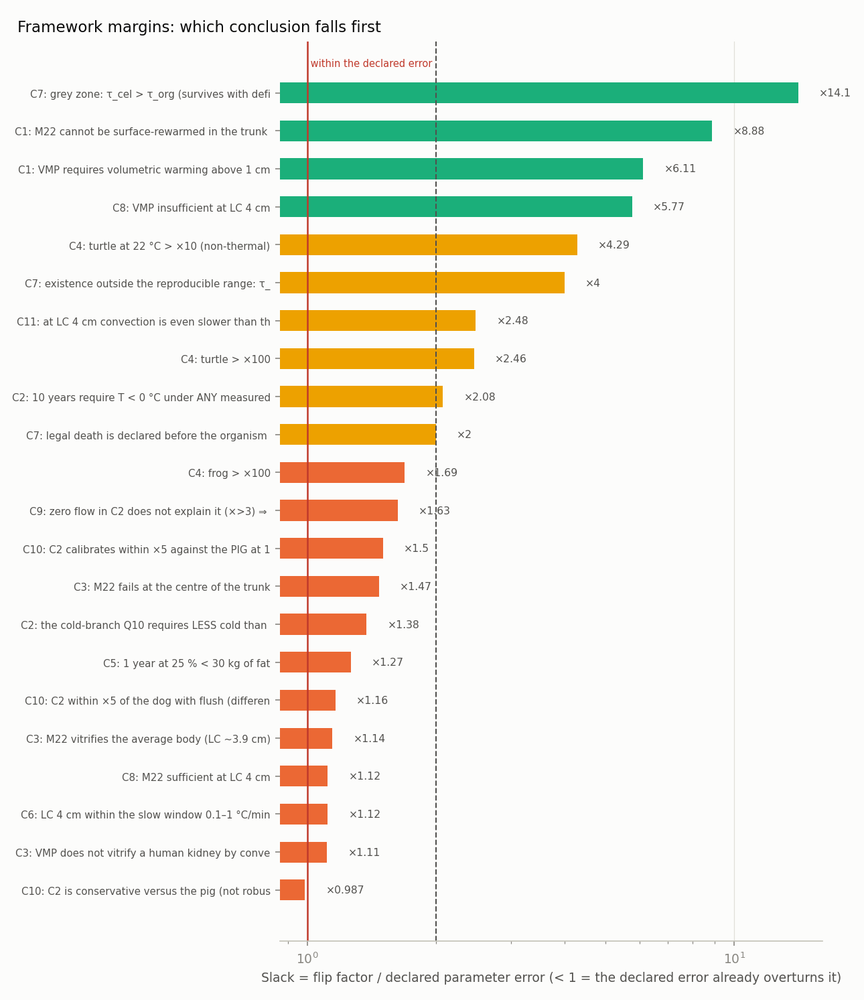

<!-- AUTO-GENERATED by red/margenes.py. DO NOT EDIT BY HAND. -->
# StasisPath: margins of the framework

**What this measures:** for every verdict that currently holds, by how much the **most sensitive** parameter would have to be wrong for the verdict to reverse (the rest stay at their central values). A verdict with factor ×1.3 and another with factor ×1000 both appear as 'M' in the framework, but **they are not worth the same**: this separates them.

The flip factor alone is misleading: ×1.5 is not small if the parameter is known to ±10 %. That is why it is normalized against the parameter's own **declared uncertainty**. **Slack = flip factor / declared error.**

- **WITHIN THE ERROR** (slack < 1): the range we have already declared overturns the verdict. Either measure better or weaken the claim.
- **FRAGILE** (1–2): survives narrowly.
- **ajustado** (2–5).
- **comfortable** (> 5): the conclusion does not depend on the parameter's precision.
- **structural**: no parameter overturns it ⇒ the verdict is qualitative, not numerical.

**Summary: 12 fragile · 6 tight · 4 holgados · 2 estructurales.**

| bound | verdict | key? | most sensitive parameter | flip factor | declared error | slack | margin |
|---|---|---|---|---|---|---|---|
| C1 | VMP requires volumetric warming above 1 cm | yes | alpha | ×7.95 | ±30 % | 6.11 | holgado |
| C1 | M22 cannot be surface-rewarmed in the trunk (r ~15 cm) | yes | alpha | ×11.5 | ±30 % | 8.88 | holgado |
| C2 | 10 years require T < 0 °C under ANY measured Q10 (temperate and cold) | yes | Q10 | ÷2.3 | ±10.6 % | 2.08 | ajustado |
| C2 | the cold-branch Q10 requires LESS cold than the temperate one (non-linearity, NOT significant in the source) | no | Q10 | ×1.52 | ±10.6 % | 1.38 | **FRAGILE** |
| C3 | VMP does not vitrify a human kidney by convection | yes | exp_LC | ×1.33 | ±19.8 % | 1.11 | **FRAGILE** |
| C3 | M22 vitrifies the average body (LC ~3.9 cm) | no | anc_LC | ÷1.22 | ±6.82 % | 1.14 | **FRAGILE** |
| C3 | M22 fails at the centre of the trunk | no | anc_LC | ×1.57 | ±6.82 % | 1.47 | **FRAGILE** |
| C4 | frog > ×100 | yes | Q10 | ×1.87 | ±10.6 % | 1.69 | **FRAGILE** |
| C4 | turtle > ×100 | yes | Q10 | ×2.72 | ±10.6 % | 2.46 | ajustado |
| C4 | turtle at 22 °C > ×10 (non-thermal) | yes | Q10 | ×4.74 | ±10.6 % | 4.29 | ajustado |
| C5 | 1 year at 25 % < 30 kg of fat | yes | BMR | ×1.49 | ±17.6 % | 1.27 | **FRAGILE** |
| C6 | LC 4 cm within the slow window 0.1–1 °C/min | yes | anc_LC | ÷1.19 | ±6.82 % | 1.12 | **FRAGILE** |
| C6 | latent heat < 3 h | yes | — | — | — | ∞ | **estructural** |
| C7 | grey zone: τ_cel > τ_org (survives with deficit) | yes | tau_org_surv | ×14.1 | ±0 % | 14.1 | holgado |
| C7 | existence outside the reproducible range: τ_org,good < τ_exist ≤ τ_cel | yes | tau_org_exist | ×4 | ±0 % | 4 | ajustado |
| C7 | legal death is declared before the organism threshold | yes | tau_org_good | ÷2.5 | ±25 % | 2 | ajustado |
| C8 | VMP insufficient at LC 4 cm | yes | anc_LC | ×6.16 | ±6.82 % | 5.77 | holgado |
| C8 | M22 sufficient at LC 4 cm | no | anc_LC | ÷1.19 | ±6.82 % | 1.12 | **FRAGILE** |
| C9 | zero flow in C2 does not explain it (×>3) ⇒ there was low flow | yes | Q10 | ×1.8 | ±10.6 % | 1.63 | **FRAGILE** |
| C11 | crossing the 0-20 C band while cooling slowly takes > 15 min (real exposure) | yes | — | — | — | ∞ | **estructural** |
| C11 | at LC 4 cm convection is even slower than the slow ceiling | yes | anc_LC | ×2.65 | ±6.82 % | 2.48 | ajustado |
| C10 | C2 calibrates within ×5 against the PIG at 10 °C | yes | Q10 | ÷1.66 | ±10.6 % | 1.5 | **FRAGILE** |
| C10 | C2 is conservative versus the pig (not robust: at the generous corner it becomes OPTIMISTIC) | no | Q10 | ×1.09 | ±10.6 % | 0.987 | **DENTRO DEL ERROR** |
| C10 | C2 within ×5 of the dog with flush (different protocol, not key) | no | Q10 | ÷1.29 | ±10.6 % | 1.16 | **FRAGILE** |

## The fragile parts, in measurement priority order

1. **C2** — «the cold-branch Q10 requires LESS cold than the temperate one (non-linearity, NOT significant in the source)» fails if **Q10** is off by ×1.52; declared error ±10.6 % ⇒ slack 1.38.
2. **C3** — «VMP does not vitrify a human kidney by convection» fails if **exp_LC** is off by ×1.33; declared error ±19.8 % ⇒ slack 1.11.
3. **C3** — «M22 vitrifies the average body (LC ~3.9 cm)» fails if **anc_LC** is off by ÷1.22; declared error ±6.82 % ⇒ slack 1.14.
4. **C3** — «M22 fails at the centre of the trunk» fails if **anc_LC** is off by ×1.57; declared error ±6.82 % ⇒ slack 1.47.
5. **C4** — «frog > ×100» fails if **Q10** is off by ×1.87; declared error ±10.6 % ⇒ slack 1.69.
6. **C5** — «1 year at 25 % < 30 kg of fat» fails if **BMR** is off by ×1.49; declared error ±17.6 % ⇒ slack 1.27.
7. **C6** — «LC 4 cm within the slow window 0.1–1 °C/min» fails if **anc_LC** is off by ÷1.19; declared error ±6.82 % ⇒ slack 1.12.
8. **C8** — «M22 sufficient at LC 4 cm» fails if **anc_LC** is off by ÷1.19; declared error ±6.82 % ⇒ slack 1.12.
9. **C9** — «zero flow in C2 does not explain it (×>3) ⇒ there was low flow» fails if **Q10** is off by ×1.8; declared error ±10.6 % ⇒ slack 1.63.
10. **C10** — «C2 calibrates within ×5 against the PIG at 10 °C» fails if **Q10** is off by ÷1.66; declared error ±10.6 % ⇒ slack 1.5.
11. **C10** — «C2 is conservative versus the pig (not robust: at the generous corner it becomes OPTIMISTIC)» fails if **Q10** is off by ×1.09; declared error ±10.6 % ⇒ slack 0.987.
12. **C10** — «C2 within ×5 of the dog with flush (different protocol, not key)» fails if **Q10** is off by ÷1.29; declared error ±10.6 % ⇒ slack 1.16.
