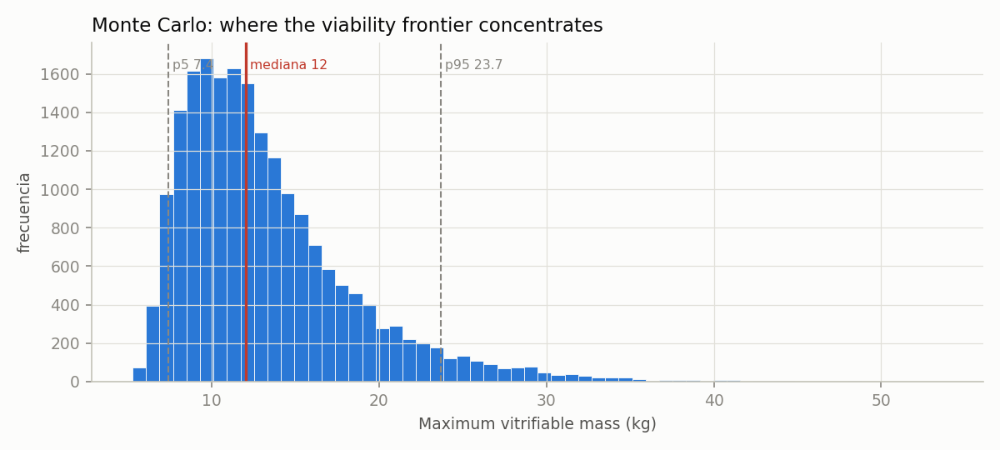

<!-- AUTO-GENERATED by red/precision.py. DO NOT EDIT BY HAND. -->
# StasisPath: precision — narrowing what triangulation leaves open

Four methods, chosen because **they can be applied with the data already in hand**. Those requiring data nobody has published are declared at the end rather than applied halfway.

## 1. Biot number: where does our law hold?

C3's exponent is not universal. The law **rate ∝ LC⁻²** assumes a **conduction-limited** regime (Bi ≫ 1). If Bi ≪ 1 the body is nearly isothermal and the rate is set by surface convection: it scales as **LC⁻¹**.

With h = 100 W/m²K (declared in F2) and k ≈ 0.4 W/mK, the Bi = 1 boundary lies at **LC = 0.4 cm**.

| system | LC cm | Bi | regime |
|---|---|---|---|
| hippocampal slices (350 µm) | 0.0117 | 0.0292 | convection — **LC⁻² does NOT hold** |
| mouse brain (German) | 0.152 | 0.38 | transition |
| rat kidney | 0.36 | 0.9 | transition |
| human kidney | 0.88 | 2.2 | conduction — **LC⁻² holds** |
| 3 L bag (C3 anchor) | 2.2 | 5.5 | conduction — **LC⁻² holds** |
| human brain | 2.31 | 5.77 | conduction — **LC⁻² holds** |
| whole body | 3.9 | 9.75 | conduction — **LC⁻² holds** |
| trunk | 7.5 | 18.8 | conduction — **LC⁻² holds** |

> **Good news:** all the framework's extrapolations to human organs (LC 0.88–7.5 cm) fall in the **conduction** regime, where LC⁻² is correct. F1, F2, C3 and C6 are validated over their range of use.

> ⚠ **CORRECTION of an error of our own:** in the scaling module the conduction penalty from mouse brain (LC 0.152 cm) to human (2.31 cm) was computed by applying LC⁻² across the whole path, giving **×231**. But that path **crosses the regime boundary**: respecting it gives **×87.8**. **The difficulty was overestimated by ×2.63.** The deficit for repeating German's protocol in a human brain does not change (it is computed from the human rate, not by scaling from the mouse), but the statement 'the human brain is ×231 worse in conduction' was incorrect.

## 2. Monte Carlo: a distribution instead of corners

Corners give a range; Monte Carlo gives **where it concentrates**. 20,000 samples with a triangular distribution within each parameter's declared range (mode at the central value: it respects what is declared without assuming normality).

**Maximum vitrifiable mass (the F2 frontier):**

| percentile | mass |
|---|---|
| percentil 5 | 7.4 kg |
| percentil 25 | 9.57 kg |
| **mediana** | **12 kg** |
| percentil 75 | 15.5 kg |
| percentil 95 | 23.7 kg |

> The corner range was wide; the median is at **12 kg** and the central 50 % lies between **9.57 and 15.5 kg**. The distribution is **right-skewed**: the typical value is lower than the mean, so reporting the mean would be optimistic.

## 3. Sensitivity: what would resolve the I1 contradiction

Triangulation found that Arrhenius predicts 0.142 while Fahy's anchors require ≤ 0.07. Instead of choosing by eye, **what would have to be true** for there to be no clash is computed.

| quantity | value | note |
|---|---|---|
| Ea/R used (from oocytes, F55) | 2.95e+03 K | gives damage 0.142 |
| Ea/R needed to reach 0.07 | 4.52e+03 K | ×1.53 the current value |
| Damage measured at 9.28 M and 10 °C | 0.536 | F72, not disputed |

> **For both paths to fit, the activation energy of damage would have to be ×1.53 the value measured in oocytes** (from 2.95e+03 to 4.52e+03 K, that is from ~24.5 to ~37.6 kJ/mol). That is **not implausible**: 24.5 kJ/mol is low for protein damage, and the value comes from a system (oocyte) and a temperature range (23–37 °C) that are very different. ⇒ **The likeliest hypothesis is that the Arrhenius extrapolation underestimates the activation energy, not that Fahy is wrong.** A concrete prediction P19 can check.

## 4. Nucleation as a Poisson process: from one observation to a probability

A single 'did not nucleate' observation does not give a number, but **it does give a bound** if modelled as Poisson: P(no nucleation) = exp(−J·V·t). From the pig kidney (0.2 L, 5 h at −2 °C without nucleating) one obtains, with 95 % confidence, **J ≤ 3 per L·h**.

| system | V (L) | t at 95 % success (h) | t at 50 % success (h) |
|---|---|---|---|
| pig kidney | 0.2 | 0.0855 | 1.16 |
| human liver | 1.5 | 0.0114 | 0.154 |
| whole body | 70 | 0.000244 | 0.0033 |

> I5 thus stops being '≤ 0.67 h' and becomes **a probability curve against time**, which is what a clinical protocol needs. **Important caveat:** this holds only in the **isobaric** regime; the isochoric system suppresses nucleation and follows a different law (see I5).

## Methods that cannot be applied yet, and which datum they lack

| method | what for | which datum is missing |
|---|---|---|
| Kissinger / Ozawa / Avrami | crystallization kinetics from calorimetry | **DSC data for the eutectic solvents** (I2) |
| Kaplan-Meier / Cox regression | survival versus ischemia time | times to failure in a cohort (I4) |
| Finite elements with real geometry | thermal field in an organ, not in a sphere | mesh of a human organ + CPA properties |
| Inferencia bayesiana completa | posterior for each parameter instead of a range | independent replicates; today most are n = 1 |
