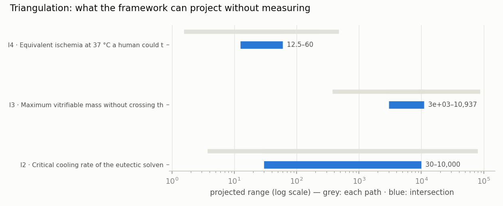

<!-- AUTO-GENERATED by red/triangular.py. DO NOT EDIT BY HAND. -->
# StasisPath: triangulation of unknowns

For every datum we **do not have**, all independent paths in the network that bound it are walked and the **intersection** is taken. It does not give the exact number: it gives the **projected range**, which is later sharpened by measurement.

**The most useful output is not the intersection, it is the contradiction.** If two independent paths give incompatible ranges, one of the laws feeding them is wrong — and that is a result, not a failure.

| id | unknown | projected range | width | note |
|---|---|---|---|---|
| I1 | Relative damage (1 − respiration/control) when loadi | **contradiction** | — | Arrhenius from oocytes × German's measured point vs Fahy anchors: M22 is tolerable at −22 °C in kidney slice |
| I2 | Critical cooling rate of the eutectic solvents | 30 – 10,000 °C/min | ×333 | 3 paths |
| I3 | Maximum vitrifiable mass without crossing the toxic  | 3e+03 – 10,937 g | ×3.65 | 2 paths |
| I4 | Equivalent ischemia at 37 °C a human could tolerate  | 12.5 – 60 min | ×4.8 | 2 paths |
| I5 | Hours of supercooling at −2 °C for 1.5 L before nucl | −∞ – 0.667 h | open | 2 paths |

## I1 · Damage in the cold arm of P19 (M22 9.3 M at −22 °C)

**Relative damage (1 − respiration/control) when loading 9.3 M at −22 °C**

| path | independent? |  | min | max | what it derives from |
|---|---|---|---|---|---|
| Arrhenius from oocytes × German's measured point | yes | = | 0.142 | 0.142 | F72 (9.28 M at 10 °C → 0.536) scaled by Ea/R = 2952 K from F55 |
| Fahy anchors: M22 is tolerable at −22 °C in kidney slice | yes | ≤ |  | 0.07 | F65/F39 + no-damage band K⁺/Na⁺ ≥ 93 % (G4b) |
| Damage↔LTP calibration: at damage 0.220 LTP WAS preserved | yes | ≤ |  | 0.22 | F72: German measured in the SAME arm respiratory damage 0.220 (8.42 M) and LTP 138.1 % (control 157.7, n.s.) |
| Lower bound: cannot be better than the CPA-free control | yes | ≥ | 0 |  | definition |

> ⚠ **CONTRADICTION: the intersection is empty.** The paths 'Arrhenius from oocytes × German's measured point' and 'Fahy anchors: M22 is tolerable at −22 °C in kidney slice' are incompatible. **That is not a failure of the method: it is the result.** One of the laws feeding them is wrong, and the unknown cannot be projected until that is resolved.

**BUT the contradiction does NOT affect the P19 verdict, and that can be demonstrated.** German measured, in the **same arm**, respiratory damage of **0.220** (at 8.42 M) and LTP of **138.1 %**, which **passes** our preregistered threshold of 130 %. ⇒ There exists a damage level with **demonstrably preserved LTP: 0.220**. The two colliding paths predict **0.142 and ≤0.07**, and **both fall below 0.220**. **The contradiction is about HOW MUCH damage there will be, not about whether P19 passes: both paths predict PASS.**

**And it remains the best argument for running it.** The two paths are not matters of opinion: the Arrhenius one extrapolates from 23–37 °C down to −22 °C, a large extrapolation and **without L20's osmotic term**; Fahy's is a real measurement of M22 at −22 °C, but **in kidney slice, not neural tissue**. ⇒ The experiment does not merely measure a number: **it discriminates between two of the framework's own laws**. If it comes out ≈0.14, the Arrhenius extrapolation holds and Fahy's result does not transfer from kidney to brain. If it comes out ≤0.07, low-temperature toxicity falls faster than Arrhenius predicts, and **L20 was right: the dominant damage in the cold is osmotic, not chemical**.

## I2 · CCR of natural deep eutectic solvents (NADES)

**Critical cooling rate of the eutectic solvents**

| path | independent? |  | min | max | what it derives from |
|---|---|---|---|---|---|
| They vitrify by direct immersion in liquid N₂ | yes | ≤ |  | 10,000 | F80: if they vitrify when a small sample is immersed, their CCR does not exceed the immersion rate (~10⁴ °C/min) |
| They are not pure water: their CCR is below that of water | yes | ≤ |  | 384,000,000 | F76 (agua pura: 3.84 × 10⁸ °C/min) |
| **MEASURED (F80): they crystallize in DSC when cooled at 30 °C/min** | yes | ≥ | 30 |  | F80 Table 2: Tc onset −26.6 to −32.3 °C at 50 % w/v ⇒ CCR > 30 °C/min |

> **PROJECTED RANGE: 30 – 10,000 °C/min** (3 independent paths, width factor ×333).

**How to sharpen this to a number:** NO LONGER NEEDED: the calorimetry was already published in F80 and has been read. **CCR > 30 °C/min ⇒ prediction I2 (0.3 °C/min) is REFUTED by its own criterion (refuted if > 0.426).**

## I3 · Maximum mass of human tissue vitrifiable with current chemistry

**Maximum vitrifiable mass without crossing the toxic threshold**

| path | independent? |  | min | max | what it derives from |
|---|---|---|---|---|---|
| F2: where the required molarity crosses the toxic threshold | yes | ≤ |  | 10,937 | C3 + CCR↔M line + 9.28 M threshold from F72 |
| Physically demonstrated: 3 L of M22 vitrified | yes | ≥ | 3e+03 |  | F2 (physical glass at litre scale, no biology) |
| Demonstrated with function: 13.9 g rabbit kidney transplanted | **no** | ≥ | 13.9 |  | F50 (dielectric, normal clinical function) |

> **PROJECTED RANGE: 3e+03 – 10,937 g** (2 independent paths, width factor ×3.65).

**How to sharpen this to a number:** by measuring the CCR of a CPA at low concentration. If one exists, the limit rises; if not, it is confirmed.

## I4 · human τ_eq attainable with optimal reperfusion

**Equivalent ischemia at 37 °C a human could tolerate with the best reperfusion**

| path | independent? |  | min | max | what it derives from |
|---|---|---|---|---|---|
| Cross-species invariance: the dog withstands 17 min | yes | ≥ | 12.5 |  | F25/F25b + T1 from the scaling module (τ_eq invariant, error ×1.9) |
| Existence in another mammal: cat, 1 h brain only | yes | ≤ |  | 60 | F38 — upper bound: nobody has exceeded this in a whole organism |
| Cellular limit: BrainEx recovers cells at 4 h | **no** | ≤ |  | 240 | F23 — absolute ceiling; above it not even the cell returns |

> **PROJECTED RANGE: 12.5 – 60 min** (2 independent paths, width factor ×4.8).

**How to sharpen this to a number:** an optimized reperfusion trial in pig, the closest model and already in use (F42).

## I5 · Supercooling duration of a human liver at −2 °C

**Hours of supercooling at −2 °C for 1.5 L before nucleation**

| path | independent? |  | min | max | what it derives from |
|---|---|---|---|---|---|
| Poisson rate FITTED with rat liver (2 points, −6 °C) | yes | ≤ |  | 0.815 | F85: 100 % at 72 h and 58 % at 96 h ⇒ J(−6 °C) ≈ 0.57 /L·h; the time at 50 % success is given here |
| V·t invariant from the pig kidney (isobaric) | yes | ≤ |  | 0.667 | F20 (0.2 L × 5 h at −2 °C) assuming Poisson-type nucleation (F4 of FORMULACION) |
| Measured at −2 °C in isochoric pig liver | yes | ≥ | 24 |  | F22 (1.5 L, 24–48 h without freezing, isochoric system) |

> **Separate regime — 'Measured at −2 °C in isochoric pig liver' (isochoric: constant volume generates pressure upon nucleation and **suppresses nucleation**).** It does not enter the intersection: it does not contradict the others, it describes **a different physical system**. It bounds ≥ 24 h.

> **PROJECTED RANGE: −∞ – 0.667 h** (2 independent paths, unbounded on one side).

**How to sharpen this to a number:** supercool two different volumes at the same temperature and see whether the time scales as 1/V. **A cheap and decisive experiment for L16.** The isobaric/isochoric contrast additionally gives a direct measure of how much constant-volume confinement suppresses nucleation.

