<!-- AUTO-GENERATED by red/motor.py from red/stasispath.yaml. DO NOT EDIT BY HAND. -->
# StasisPath network

Green = M/V · amber = P · red = A · black = BROKEN. Arrows run from dependency to dependent node.

```mermaid
flowchart LR
  subgraph param[Parameters]
    t37[t37]
    Q10_frio[Q10_frio]
    Q10[Q10]
    alpha[alpha]
    dT_rew[dT_rew]
    Tg[Tg]
    CCR_M22[CCR_M22]
    CWR_M22[CWR_M22]
    CCR_VMP[CCR_VMP]
    CWR_VMP[CWR_VMP]
    CCR_VS55[CCR_VS55]
    anc_LC[anc_LC]
    exp_LC[exp_LC]
    anc_rate[anc_rate]
    dT_crack[dT_crack]
    nano_rate[nano_rate]
    LC_trunk[LC_trunk]
    LC_body[LC_body]
    LC_kidneyH[LC_kidneyH]
    tau_org_good[tau_org_good]
    tau_org_surv[tau_org_surv]
    tau_org_exist[tau_org_exist]
    tau_cel[tau_cel]
    legal_obs[legal_obs]
    frog_days[frog_days]
    turtle_days[turtle_days]
    turtle22_h[turtle22_h]
    BMR[BMR]
    hypo_case_T[hypo_case_T]
    hypo_case_min[hypo_case_min]
    pig_min[pig_min]
    pig_T[pig_T]
    flush_min[flush_min]
    flush_T[flush_T]
  end
  subgraph cota[Bounds]
    C1[C1]
    C2[C2]
    C3[C3]
    C4[C4]
    C5[C5]
    C6[C6]
    C7[C7]
    C8[C8]
    C9[C9]
    C11[C11]
    C10[C10]
  end
  subgraph afirmacion[Claims]
    O1[O1]
    O2[O2]
    O3[O3]
    G1[G1]
    G2[G2]
    G2b[G2b]
    G6[G6]
    G3[G3]
    G4[G4]
    L14[L14]
    L15[L15]
    L13[L13]
    X2[X2]
    G8[G8]
    L12[L12]
    G5[G5]
    L1[L1]
    L2[L2]
    L18[L18]
    L3[L3]
    L4[L4]
    L37[L37]
    L38[L38]
    L39[L39]
    L34[L34]
    L35[L35]
    L43[L43]
    L45[L45]
    L44[L44]
    L42[L42]
    L40[L40]
    L41[L41]
    L36[L36]
    L31[L31]
    L32[L32]
    L33[L33]
    L29[L29]
    L30[L30]
    L27[L27]
    L28[L28]
    L24[L24]
    L26[L26]
    L20[L20]
    L25[L25]
    L22[L22]
    L23[L23]
    L21[L21]
    L19[L19]
    L16[L16]
    L17[L17]
    L5[L5]
    L6[L6]
    L7[L7]
    L8[L8]
    L9[L9]
    L10[L10]
    X1[X1]
    O4[O4]
    G4b[G4b]
    G7[G7]
    L11[L11]
  end
  subgraph prereg[Preregistration]
    P15[P15]
    P18[P18]
    P20[P20]
    P19[P19]
    P21[P21]
  end
  subgraph via[Pathways]
    V01[V01]
    V02[V02]
    V03[V03]
    V04[V04]
    V27[V27]
    V05[V05]
    V24[V24]
    V06[V06]
    V07[V07]
    V08[V08]
    V18[V18]
    V19[V19]
    V23[V23]
    V09[V09]
    V26[V26]
    V25[V25]
    V10[V10]
    V11[V11]
    V21[V21]
    V22[V22]
    V20[V20]
    V12[V12]
    V13[V13]
    V14[V14]
    V15[V15]
    V16[V16]
    V17[V17]
  end
  subgraph pregunta[Questions]
    Q1[Q1]
    Q2[Q2]
    Q3[Q3]
    Q4[Q4]
    Q5[Q5]
    Q6[Q6]
    Q19[Q19]
    Q7[Q7]
    Q20[Q20]
    Q8[Q8]
    Q9[Q9]
    Q23[Q23]
    Q11[Q11]
    Q12[Q12]
    Q13[Q13]
    Q14[Q14]
    Q15[Q15]
    Q16[Q16]
    Q17[Q17]
    Q22[Q22]
    Q21[Q21]
    Q18[Q18]
  end
  alpha --> C1
  dT_rew --> C1
  CWR_M22 --> C1
  CWR_VMP --> C1
  t37 --> C2
  Q10 --> C2
  Q10_frio --> C2
  anc_LC --> C3
  anc_rate --> C3
  CCR_M22 --> C3
  CCR_VMP --> C3
  LC_trunk --> C3
  LC_body --> C3
  LC_kidneyH --> C3
  exp_LC --> C3
  t37 --> C4
  Q10 --> C4
  frog_days --> C4
  turtle_days --> C4
  turtle22_h --> C4
  BMR --> C5
  anc_LC --> C6
  anc_rate --> C6
  exp_LC --> C6
  t37 --> C7
  tau_org_good --> C7
  tau_org_surv --> C7
  tau_org_exist --> C7
  tau_cel --> C7
  legal_obs --> C7
  anc_LC --> C8
  anc_rate --> C8
  CCR_M22 --> C8
  CCR_VMP --> C8
  exp_LC --> C8
  t37 --> C9
  Q10 --> C9
  hypo_case_T --> C9
  hypo_case_min --> C9
  anc_LC --> C11
  anc_rate --> C11
  exp_LC --> C11
  t37 --> C10
  Q10 --> C10
  flush_min --> C10
  flush_T --> C10
  pig_min --> C10
  pig_T --> C10
  C7 --> O2
  C2 --> G1
  C7 --> G1
  C8 --> G4
  G7 --> L14
  C11 --> L14
  L2 --> L15
  C2 --> L15
  L13 --> X2
  L12 --> X2
  C2 --> L12
  C1 --> L1
  C2 --> L2
  C2 --> L18
  G2 --> L18
  C3 --> L3
  C4 --> L4
  C3 --> L38
  L36 --> L39
  L27 --> L39
  G1 --> L39
  C3 --> L34
  L3 --> L34
  G4 --> L35
  C3 --> L43
  C8 --> L43
  G4b --> L43
  C3 --> L45
  C6 --> L45
  C3 --> L44
  C10 --> L42
  L9 --> L42
  G1 --> L40
  C10 --> L40
  X1 --> L40
  L16 --> L41
  G1 --> L36
  G3 --> L32
  L8 --> L33
  L28 --> L33
  G3 --> L30
  L24 --> L27
  C2 --> L27
  L8 --> L28
  C5 --> L28
  L2 --> L24
  L20 --> L26
  L6 --> L20
  G4b --> L20
  L22 --> L25
  L20 --> L25
  G4b --> L23
  G1 --> L21
  L16 --> L19
  G7 --> L19
  G2 --> L16
  C2 --> L17
  C6 --> L5
  C8 --> L6
  C9 --> L7
  C5 --> L8
  C10 --> L9
  L6 --> L10
  C7 --> X1
  O2 --> O4
  C2 --> V02
  C7 --> V03
  C10 --> V04
  C6 --> V06
  C4 --> V07
  C4 --> V08
  L15 --> V23
  C3 --> V14
  C1 --> V15
  C3 --> V15
  L43 --> V15
  G5 --> P15
  L1 --> P18
  L2 --> P18
  L3 --> P18
  G1 --> P18
  G2 --> P18
  G3 --> P18
  L5 --> P18
  G5 --> P20
  L13 --> P19
  X2 --> P19
  G8 --> P19
  L6 --> P19
  L45 --> P21
  C3 --> P21
  C6 --> P21
  exp_LC --> P21
  G1 --> Q1
  G2 --> Q1
  G2b --> Q1
  G3 --> Q1
  G4 --> Q1
  G5 --> Q1
  O2 --> Q2
  O4 --> Q2
  O3 --> Q3
  L1 --> Q4
  L3 --> Q4
  L1 --> Q5
  L3 --> Q5
  L6 --> Q5
  L22 --> Q5
  L23 --> Q5
  L29 --> Q5
  L30 --> Q5
  L31 --> Q5
  L32 --> Q5
  L34 --> Q5
  L43 --> Q5
  L44 --> Q5
  L45 --> Q5
  L6 --> Q6
  G4 --> Q6
  G4b --> Q6
  L13 --> Q6
  L23 --> Q6
  L25 --> Q6
  L30 --> Q6
  L35 --> Q6
  G7 --> Q19
  L14 --> Q19
  G3 --> Q7
  L38 --> Q7
  L15 --> Q20
  L4 --> Q20
  L27 --> Q20
  L36 --> Q20
  L39 --> Q20
  L2 --> Q8
  L9 --> Q8
  L24 --> Q8
  G1 --> Q9
  X1 --> Q9
  G7 --> Q9
  L14 --> Q9
  L15 --> Q9
  L40 --> Q9
  O3 --> Q23
  G8 --> Q23
  L12 --> Q23
  L1 --> Q11
  L3 --> Q11
  L6 --> Q11
  L10 --> Q11
  X2 --> Q11
  L37 --> Q11
  L43 --> Q11
  L2 --> Q12
  L4 --> Q12
  L8 --> Q12
  L8 --> Q13
  L28 --> Q13
  L33 --> Q13
  O1 --> Q14
  L21 --> Q14
  P15 --> Q15
  G8 --> Q15
  P19 --> Q15
  O1 --> Q16
  O3 --> Q17
  G2 --> Q17
  L17 --> Q17
  L26 --> Q22
  L21 --> Q22
  G4 --> Q22
  L16 --> Q21
  G7 --> Q21
  L14 --> Q21
  L19 --> Q21
  L41 --> Q21
  P18 --> Q18
  classDef m fill:#1b7f3b,color:#fff
  classDef v fill:#2e9e57,color:#fff
  classDef p fill:#e0a800
  classDef a fill:#c0392b,color:#fff
  classDef roto fill:#000,color:#fff
  class t37 v
  class Q10_frio v
  class Q10 v
  class alpha p
  class dT_rew p
  class Tg p
  class CCR_M22 v
  class CWR_M22 v
  class CCR_VMP v
  class CWR_VMP v
  class CCR_VS55 v
  class anc_LC v
  class exp_LC v
  class anc_rate v
  class dT_crack v
  class nano_rate v
  class LC_trunk p
  class LC_body p
  class LC_kidneyH v
  class tau_org_good p
  class tau_org_surv v
  class tau_org_exist v
  class tau_cel v
  class legal_obs v
  class frog_days v
  class turtle_days v
  class turtle22_h v
  class BMR p
  class hypo_case_T v
  class hypo_case_min v
  class pig_min v
  class pig_T v
  class flush_min v
  class flush_T v
  class C1 m
  class C2 m
  class C3 m
  class C4 m
  class C5 m
  class C6 m
  class C7 m
  class C8 m
  class C9 m
  class C11 m
  class C10 m
  class O1 v
  class O2 v
  class O3 m
  class G1 v
  class G2 v
  class G2b v
  class G6 v
  class G3 v
  class G4 v
  class L14 v
  class L15 v
  class L13 v
  class X2 a
  class G8 v
  class L12 v
  class G5 v
  class L1 m
  class L2 v
  class L18 v
  class L3 m
  class L4 m
  class L37 v
  class L38 v
  class L39 v
  class L34 v
  class L35 v
  class L43 v
  class L45 v
  class L44 v
  class L42 v
  class L40 v
  class L41 v
  class L36 v
  class L31 v
  class L32 v
  class L33 v
  class L29 v
  class L30 v
  class L27 v
  class L28 v
  class L24 v
  class L26 v
  class L20 v
  class L25 v
  class L22 v
  class L23 v
  class L21 v
  class L19 v
  class L16 v
  class L17 v
  class L5 v
  class L6 v
  class L7 v
  class L8 v
  class L9 v
  class L10 v
  class X1 v
  class O4 v
  class G4b v
  class G7 v
  class L11 v
  class V01 v
  class V02 v
  class V03 v
  class V04 v
  class V27 v
  class V05 v
  class V24 v
  class V06 v
  class V07 v
  class V08 v
  class V18 v
  class V19 v
  class V23 v
  class V09 v
  class V26 v
  class V25 v
  class V10 v
  class V11 v
  class V21 v
  class V22 v
  class V20 v
  class V12 v
  class V13 v
  class V14 v
  class V15 v
  class V16 v
  class V17 v
  class P15 m
  class P18 m
  class P20 m
  class P19 m
  class P21 m
  class Q1 v
  class Q2 v
  class Q3 m
  class Q4 m
  class Q5 m
  class Q6 v
  class Q19 v
  class Q7 v
  class Q20 v
  class Q8 v
  class Q9 v
  class Q23 m
  class Q11 a
  class Q12 v
  class Q13 v
  class Q14 v
  class Q15 m
  class Q16 v
  class Q17 m
  class Q22 v
  class Q21 v
  class Q18 m
```

