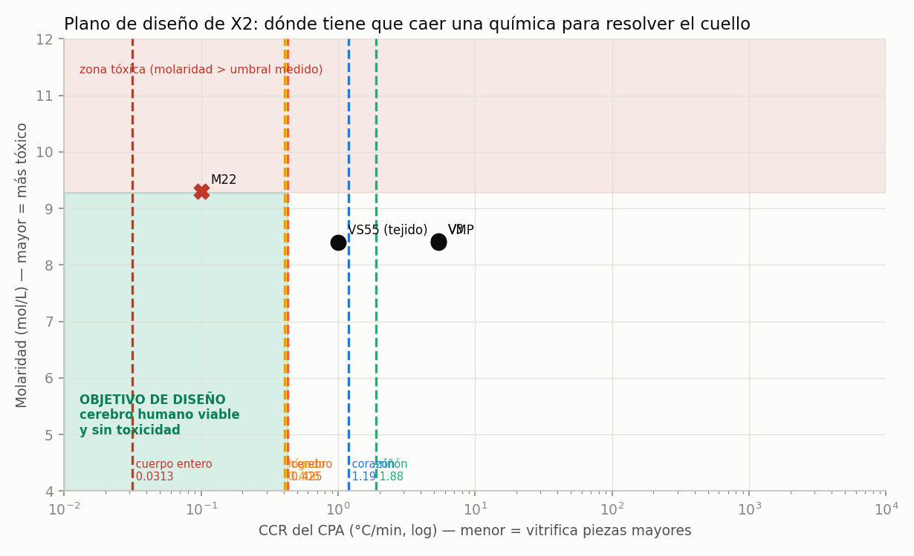

<!-- AUTO-GENERADO por red/barrido.py. NO EDITAR A MANO. -->
# StasisPath: barrido de márgenes

Cada rango abierto se discretiza y **cada valor se propaga por las leyes del marco**. No busca un número: busca **dónde dentro del rango el marco cambia de respuesta**. Eso convierte «hay que medirlo» en «hay que medirlo con esta precisión y alrededor de este valor» — y a veces en «no hace falta medirlo».

## Valores de corte encontrados

| barrido | magnitud | valor de corte | qué cambia ahí |
|---|---|---|---|
| B1 | daño de P19 | 0.220 | por debajo pasa, por encima falla |
| B2 | CCR de los NADES | 0.426 °C/min | por debajo, cerebro humano viable |
| B3 | masa máxima | — | ningún veredicto cambia en todo el rango |
| B4 | τ_eq humano | 30 min | debajo no cambia la práctica; encima la duplica |
| B5 | tasa de nucleación | 0.85 /L·h | encima no se llega a 4 h con 95 % |

## B1 · Daño del brazo frío de P19

*Unidad: daño relativo (1 − respiración/control).*

| daño | ¿LTP se conserva? | ≈ Arrhenius | ≤ Fahy | qué significaría |
|---|---|---|---|---|
| 0 | ✅ |  | ✅ | PASA y confirma a Fahy ⇒ el daño en frío es osmótico |
| 0.0273 | ✅ |  | ✅ | PASA y confirma a Fahy ⇒ el daño en frío es osmótico |
| 0.0545 | ✅ |  | ✅ | PASA y confirma a Fahy ⇒ el daño en frío es osmótico |
| 0.0818 | ✅ |  |  | PASA, valor intermedio: ninguna ley queda confirmada |
| 0.109 | ✅ |  |  | PASA, valor intermedio: ninguna ley queda confirmada |
| 0.136 | ✅ | ✅ |  | PASA y confirma Arrhenius |
| 0.164 | ✅ | ✅ |  | PASA y confirma Arrhenius |
| 0.191 | ✅ |  |  | PASA, valor intermedio: ninguna ley queda confirmada |
| 0.218 | ✅ |  |  | PASA, valor intermedio: ninguna ley queda confirmada |
| 0.245 | ❌ |  |  | **FALLA: por encima del daño con LTP demostrada** |
| 0.273 | ❌ |  |  | **FALLA: por encima del daño con LTP demostrada** |
| 0.3 | ❌ |  |  | **FALLA: por encima del daño con LTP demostrada** |

**Valor de corte: 0.220.** Por debajo, P19 pasa haga lo que haga la ley; por encima, falla. Los dos caminos en conflicto (0.142 y ≤0.07) están **ambos del lado favorable**, así que **la medición no necesita ser precisa para dar veredicto: basta con distinguir si está por encima o por debajo de 0.22.** Para *calibrar* Arrhenius en cambio sí hace falta precisión: separar 0.07 de 0.142 exige un error < 0.03.

## B2 · CCR de los disolventes eutécticos naturales

*Unidad: °C/min.*

| CCR | LC máx (cm) | masa máx (kg) | ¿mejor que M22? | órganos que caben |
|---|---|---|---|---|
| 0.01 | 15.1 | 388 | ✅ | riñón, corazón, hígado, cerebro, cuerpo_entero, páncreas |
| 0.0351 | 8.05 | 59 | ✅ | riñón, corazón, hígado, cerebro, páncreas |
| 0.123 | 4.3 | 8.96 | ❌ | riñón, corazón, hígado, cerebro, páncreas |
| 0.433 | 2.29 | 1.36 | ❌ | riñón, corazón, páncreas |
| 1.52 | 1.22 | 0.207 | ❌ | riñón, páncreas |
| 5.34 | 0.653 | 0.0315 | ❌ | ninguno |
| 18.7 | 0.348 | 0.00478 | ❌ | ninguno |
| 65.8 | 0.186 | 0.000727 | ❌ | ninguno |
| 231 | 0.0992 | 0.000111 | ❌ | ninguno |
| 811 | 0.053 | 1.68e-05 | ❌ | ninguno |
| 2.85e+03 | 0.0283 | 2.55e-06 | ❌ | ninguno |
| 10,000 | 0.0151 | 3.88e-07 | ❌ | ninguno |

**Valor de corte exacto: CCR = 0.426 °C/min** — por debajo de ese valor los NADES bastarían para un **cerebro humano entero**. Y esto es lo importante: **no hace falta que sean mejores que M22** (0.1 °C/min), basta con que lleguen a **0.426**, que es **4.26 veces más permisivo**. Como además su toxicidad ya está medida como baja, **una CCR en ese rango resolvería X2 sin necesidad de P19**. ⇒ La calorimetría de los NADES pasa a ser **la medición más rentable de todo el programa**.

## B3 · Masa máxima vitrificable

*Unidad: kg.*

| masa (kg) | LC (cm) | órganos que caben | ¿cerebro? | ¿cuerpo entero? |
|---|---|---|---|---|
| 3 | 2.98 | riñón, corazón, hígado, cerebro, páncreas | ✅ | ❌ |
| 5 | 3.54 | riñón, corazón, hígado, cerebro, páncreas | ✅ | ❌ |
| 7 | 3.96 | riñón, corazón, hígado, cerebro, páncreas | ✅ | ❌ |
| 9 | 4.3 | riñón, corazón, hígado, cerebro, páncreas | ✅ | ❌ |
| 11 | 4.6 | riñón, corazón, hígado, cerebro, páncreas | ✅ | ❌ |
| 13 | 4.86 | riñón, corazón, hígado, cerebro, páncreas | ✅ | ❌ |
| 15 | 5.1 | riñón, corazón, hígado, cerebro, páncreas | ✅ | ❌ |
| 17 | 5.32 | riñón, corazón, hígado, cerebro, páncreas | ✅ | ❌ |
| 19 | 5.52 | riñón, corazón, hígado, cerebro, páncreas | ✅ | ❌ |
| 21 | 5.7 | riñón, corazón, hígado, cerebro, páncreas | ✅ | ❌ |
| 23 | 5.88 | riñón, corazón, hígado, cerebro, páncreas | ✅ | ❌ |
| 25 | 6.05 | riñón, corazón, hígado, cerebro, páncreas | ✅ | ❌ |

**El cerebro entra en todo el rango; el cuerpo entero en ninguno.** ⇒ La incertidumbre de esta magnitud (7–24 kg según Monte Carlo) **no cambia ningún veredicto del marco**: sea cual sea el valor dentro del rango, el cerebro es viable y el cuerpo entero no. **Medirla mejor no aporta.** Es el ejemplo más claro de un margen ancho que resulta **irrelevante**, y saberlo ahorra un experimento.

## B4 · τ_eq humano alcanzable con reperfusión óptima

*Unidad: min.*

| τ_eq | anchura de la zona gris (×) | ≥ 30 min | ≥ 60 min | consecuencia |
|---|---|---|---|---|
| 12.5 | 19.2 | ❌ | ❌ | sin cambio práctico frente a hoy |
| 16.8 | 14.3 | ❌ | ❌ | sin cambio práctico frente a hoy |
| 21.1 | 11.4 | ❌ | ❌ | sin cambio práctico frente a hoy |
| 25.5 | 9.43 | ❌ | ❌ | sin cambio práctico frente a hoy |
| 29.8 | 8.06 | ❌ | ❌ | sin cambio práctico frente a hoy |
| 34.1 | 7.04 | ✅ | ❌ | margen clínico real |
| 38.4 | 6.25 | ✅ | ❌ | margen clínico real |
| 42.7 | 5.62 | ✅ | ❌ | margen clínico real |
| 47 | 5.1 | ✅ | ❌ | margen clínico real |
| 51.4 | 4.67 | ✅ | ❌ | margen clínico real |
| 55.7 | 4.31 | ✅ | ❌ | margen clínico real |
| 60 | 4 | ✅ | ✅ | la zona gris casi desaparece |

**Valor de corte: 30 min.** Por debajo no cambia nada en la práctica clínica; por encima, la ventana de extracción de órganos se duplicaría. ⇒ Un ensayo de reperfusión sólo vale la pena si **puede detectar la diferencia entre 12.5 y 30 min**; medir con más finura dentro de ese intervalo no cambia decisiones.

## B5 · Tasa de nucleación J a −2/−6 °C (isobárico)

*Unidad: por L·h.*

| J | t con 95 % éxito (h) | t con 50 % éxito (h) | ≥ 4 h al 95 % | ≥ 24 h al 50 % |
|---|---|---|---|---|
| 0.05 | 0.684 | 9.24 | ❌ | ❌ |
| 0.076 | 0.45 | 6.08 | ❌ | ❌ |
| 0.116 | 0.296 | 4 | ❌ | ❌ |
| 0.176 | 0.195 | 2.63 | ❌ | ❌ |
| 0.267 | 0.128 | 1.73 | ❌ | ❌ |
| 0.406 | 0.0843 | 1.14 | ❌ | ❌ |
| 0.616 | 0.0555 | 0.75 | ❌ | ❌ |
| 0.937 | 0.0365 | 0.493 | ❌ | ❌ |
| 1.42 | 0.024 | 0.325 | ❌ | ❌ |
| 2.16 | 0.0158 | 0.214 | ❌ | ❌ |
| 3.29 | 0.0104 | 0.14 | ❌ | ❌ |
| 5 | 0.00684 | 0.0924 | ❌ | ❌ |

Para un hígado humano (1.5 L). **Valor de corte: J ≈ 0.85 /L·h** para llegar a 4 h con 95 % de éxito, que es la ventana logística mínima de un trasplante. La J ajustada del hígado de rata (**0.57**) queda **del lado favorable**, pero con poco margen. ⇒ El sobreenfriamiento isobárico da **horas, no días**, salvo que se baje J con antinucleantes (L19) o se pase a isocórico, que va por otra ley.

## Lo que el barrido enseña en conjunto

- **Dos márgenes son irrelevantes:** la masa máxima vitrificable (B3) no cambia ningún veredicto en todo su rango, y el daño de P19 (B1) sólo necesita saber si está por encima o por debajo de 0.22. **Medirlos con precisión no aporta.**
- **Un margen es decisivo y barato:** la CCR de los NADES (B2). Si cae por debajo de su valor de corte, **resuelve X2 sin necesidad de P19** — y X2 es el 60 % de lo que le falta al marco.
- **Dos márgenes tienen corte claro y caro:** τ_eq humano (B4) y la tasa de nucleación (B5). Sólo valen la pena si el experimento puede resolver el corte concreto.

## B6 · Plano de diseño: los dos ejes de X2 a la vez

Un barrido de un solo margen no ve las interacciones. Cruzando los **dos ejes que definen X2** —capacidad de vitrificar (CCR) y toxicidad (molaridad)— aparece una **región objetivo** en vez de un número.

| órgano | masa g | LC cm | CCR máx. admisible | M máx. admisible | ¿alcanzable con M22? |
|---|---|---|---|---|---|
| riñón | 150 | 1.1 | 1.88 | 9.28 | **sí** |
| corazón | 300 | 1.38 | 1.19 | 9.28 | **sí** |
| hígado | 1.5e+03 | 2.37 | 0.406 | 9.28 | **sí** |
| cerebro | 1.4e+03 | 2.31 | 0.425 | 9.28 | **sí** |
| cuerpo entero | 70,000 | 8.52 | 0.0313 | 9.28 | no con M22 |

**Lo que aflora al cruzar los ejes, y un barrido simple no veía:**

1. **AVISO que el propio marco impone sobre esta figura:** el eje vertical usa **molaridad** como proxy de toxicidad, y **L20 y E7 dicen que eso es falso** — la toxicidad depende del cuádruple (composición, temperatura, tiempo, protocolo), no de la molaridad sola. El umbral de 9.28 M se midió con **química V3 cargada a 10 °C**; M22 a 9.3 M se carga a **−22 °C**, que es otro punto del espacio. ⇒ **Decir que M22 «se pasa por 0.02 mol/L» sería una sobreinterpretación del gráfico.** El plano vale para ver la **estructura** del problema, no para situar un CPA concreto.
2. **La región objetivo es enorme.** Cualquier química con CCR ≤ 0.426 y molaridad ≤ 9.28 resuelve el cerebro humano. No hace falta optimizar ambos ejes: **hay ~3 órdenes de magnitud de margen en CCR** por debajo del corte.
3. **El riñón y el corazón ya están resueltos en el plano** (admiten CCR de 1.9 y 1.2), y sin embargo nadie ha vitrificado un riñón humano. ⇒ **El cuello para órganos pequeños NO es el que modela el plano**: es la perfusión, la carga del CPA y el recalentamiento, no la relación CCR-toxicidad.
4. **Lo que sí se puede leer del plano, con el aviso del punto 1:** la región objetivo se alcanza **bajando CCR sin subir molaridad**, y existe un mecanismo conocido para eso que no cambia la concentración: los **bloqueadores de hielo** (L22 — VM3 es V3 más 1 % de X-1000 y 1 % de Z-1000, con la misma base). ⇒ **La dirección de diseño no es «menos tóxico» ni «más concentrado», sino «misma base, aditivos que bajan la CCR».** Es lo que ya hace la familia de Fahy y lo que los NADES podrían hacer por otra vía.
