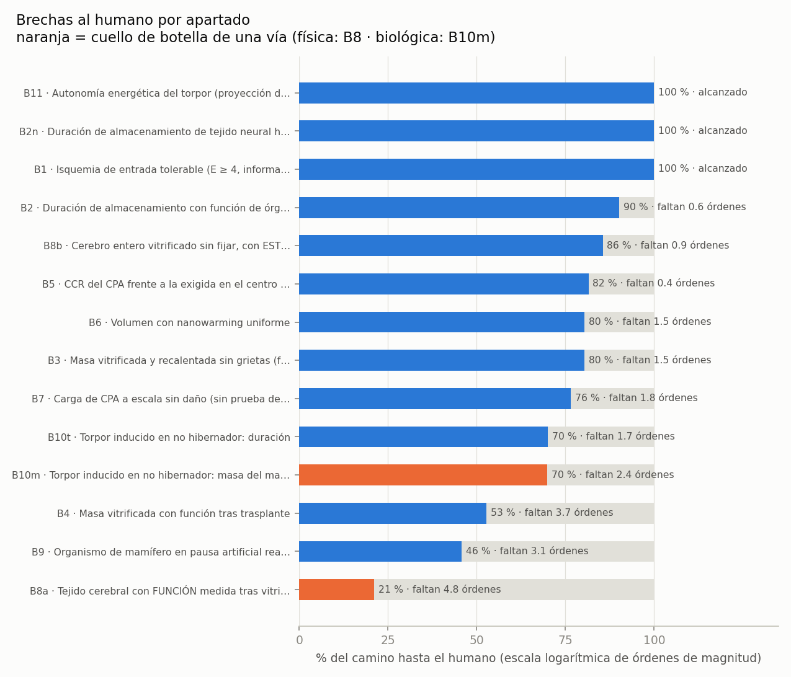

<!-- AUTO-GENERADO por red/brechas.py (llamado desde red/motor.py). NO EDITAR A MANO. -->
# StasisPath: brechas al humano (triangulación + regla de tres generalizada)

**Qué mide esto y qué no:** el progreso del *marco* (conocimiento) está en MARCO.md. Aquí se mide **cuánto camino tecnológico falta hasta la meta humana** en cada apartado. El marco puede llegar al 100 % (saber exactamente qué falta y por qué) con la tecnología todavía lejos.

**Método:** cada dato animal se proyecta al humano con la ley de escala del apartado, v_h = v·(M_h/M)^b: b = 0 invariante (τ_eq, tiempo bajo Tg), b = 1 lineal (energía, potencia), b = 0.25 Kleiber (autonomía de reservas). La regla de tres *lineal* sólo se usa donde la física es lineal: escalar el enfriamiento de un riñón de rata (1.5 g) a 70 kg con regla de tres lineal daría una tasa ~36 veces menor que la correcta (M^−2/3). % = órdenes logrados / (logrados + restantes), con base declarada en cada fila. **Triangulación:** n = especies o sistemas independientes (n < 3 ⇒ débil).

## Rutas hacia la meta (ley del mínimo: todos los apartados a la vez)

- **Vía física (vitrificación → años):** cuello de botella **B8a · Tejido cerebral con FUNCIÓN medida tras vitrificar (LTP o electrofisiología)** con **21 %** (faltan 4.8 órdenes de magnitud). Media geométrica de sus apartados: 69 %.
- **Vía biológica (torpor → meses a 1 año):** cuello de botella **B10m · Torpor inducido en no hibernador: masa del mayor animal** con **70 %** (faltan 2.4 órdenes de magnitud). Media geométrica de sus apartados: 84 %.

## Apartados

| id | apartado | meta humana | proyección triangulada | órdenes restantes | % camino | n | base |
|---|---|---|---|---|---|---|---|
| B8a | Tejido cerebral con FUNCIÓN medida tras vitrificar (LTP o electrofisiología) | 1.4e+03 g de tejido con función medida | 0.02 (max) · con disputado: 30 → 73 % | 4.85 | **21 %** | 4 | 0.001 |
| B9 | Organismo de mamífero en pausa artificial reanimado (E ≥ 4) | 525,600 min | 412 (max) | 3.11 | **46 %** | 4 | 1 |
| B4 | Masa vitrificada con función tras trasplante | 70,000 g | 13.9 (max) | 3.70 | **53 %** | 2 ⚠ débil | 0.001 |
| B10m | Torpor inducido en no hibernador: masa del mayor animal | 70,000 g | 300 (max) | 2.37 | **70 %** | 2 ⚠ débil | 0.001 |
| B10t | Torpor inducido en no hibernador: duración | 525,600 min | 10,080 (max) | 1.72 | **70 %** | 2 ⚠ débil | 1 |
| B7 | Carga de CPA a escala sin daño (sin prueba de función) | 70,000 g | 1e+03 (max) | 1.85 | **76 %** | 2 ⚠ débil | 0.001 |
| B3 | Masa vitrificada y recalentada sin grietas (física) | 70,000 g | 2e+03 (max) | 1.54 | **80 %** | 2 ⚠ débil | 0.001 |
| B6 | Volumen con nanowarming uniforme | 70,000 g | 2e+03 (max) | 1.54 | **80 %** | 3 | 0.001 |
| B5 | CCR del CPA frente a la exigida en el centro del tronco | 0.0404 °C/min | 0.1 (min) | 0.39 | **82 %** | 3 | 5.4 |
| B8b | Cerebro entero vitrificado sin fijar, con ESTRUCTURA conservada | 1.4e+03 g de cerebro entero | 180 (max) | 0.89 | **86 %** | 2 ⚠ débil | 0.001 |
| B2 | Duración de almacenamiento con función de órgano (E ≥ 3) | 525,600 min | 144,000 (max) | 0.56 | **90 %** | 2 ⚠ débil | 1 |
| B1 | Isquemia de entrada tolerable (E ≥ 4, información intacta) | 5 min τ_eq | 12.5 (mediana) | 0.00 | **100 %** | 2 ⚠ débil | 1 |
| B2n | Duración de almacenamiento de tejido neural humano (E2) | 525,600 min | 788,400 (max) | 0.00 | **100 %** | 2 ⚠ débil | 1 |
| B11 | Autonomía energética del torpor (proyección de Kleiber) | 525,600 min | 1,189,127 (mediana) | 0.00 | **100 %** | 3 | 1 |

## Detalle de la proyección (animal → humano)

### B1 · Isquemia de entrada tolerable (E ≥ 4, información intacta)
Meta = retraso sin flujo de una entrada electiva con circulación extracorpórea [P].

| observación | valor (min τ_eq) | masa g | exponente b | proyectado al humano | fuente |
|---|---|---|---|---|---|
| humano (DHCA) | 5 | 70,000 | 0 | 5 | F4 |
| perro (37 °C) | 12.5 | 20,000 | 0 | 12.5 | F25b |
| perro (flush 10 °C) | 12.7 | 20,000 | 0 | 12.7 | F30 |
Dispersión de la triangulación: ×2.54 entre la mayor y la menor proyección.

### B10m · Torpor inducido en no hibernador: masa del mayor animal
En macaco, cerdo y oveja se intentó sin torpor real ⇒ no cuentan. Masa de la rata adulta ~300 g [P] (no está en los resúmenes).

| observación | valor (g) | masa g | exponente b | proyectado al humano | fuente |
|---|---|---|---|---|---|
| ratón (neuronas Q) | 30 | 30 | 0 | 30 | F43 |
| rata (bulbo raquídeo ventromedial rostral, 6 h) | 300 | 300 | 0 | 300 | F44 |
| rata (ultrasonido) | 300 | 300 | 0 | 300 | F45 |
Dispersión de la triangulación: ×10 entre la mayor y la menor proyección.

### B10t · Torpor inducido en no hibernador: duración
| observación | valor (min) | masa g | exponente b | proyectado al humano | fuente |
|---|---|---|---|---|---|
| ratón (neuronas Q, ~1 semana) | 10,080 | 30 | 0 | 10,080 | F12 |
| ratón (ultrasonido, > 24 h) | 1.44e+03 | 30 | 0 | 1.44e+03 | F45 |
| rata (6 h) | 360 | 300 | 0 | 360 | F44 |
Dispersión de la triangulación: ×28 entre la mayor y la menor proyección.

### B11 · Autonomía energética del torpor (proyección de Kleiber)
Si se lograra inducirlo, las reservas alcanzan: autonomía ∝ M^0.25. Masa del lémur ~0.2 kg [P].

| observación | valor (min) | masa g | exponente b | proyectado al humano | fuente |
|---|---|---|---|---|---|
| lémur Cheirogaleus (7 meses) | 302,400 | 200 | 0.25 | 1,307,973 | F90 |
| ardilla ártica (temporada 9 meses) | 388,800 | 800 | 0.25 | 1,189,127 | F10 |
| humano (C5: 20 kg de grasa al 25 %) | 525,600 | 70,000 | 0 | 525,600 | F13 |
Dispersión de la triangulación: ×2.49 entre la mayor y la menor proyección.

### B2 · Duración de almacenamiento con función de órgano (E ≥ 3)
F57 (riñón de cerdo y humano, congelación parcial, 10 días) NO se acredita aquí: la función se evalúa por trasplante simulado, no real ⇒ no es E3. Se refleja en V06 y en L5.

| observación | valor (min) | masa g | exponente b | proyectado al humano | fuente |
|---|---|---|---|---|---|
| rata (riñón vitrificado) | 144,000 | 1.5 | 0 | 144,000 | F1 |
| cerdo (riñón bajo cero) | 2.88e+03 | 200 | 0 | 2.88e+03 | F20 |
| rata (hígado, congelación parcial; E2) | 14,400 | 12 | 0 | 14,400 | F21 |
Dispersión de la triangulación: ×50 entre la mayor y la menor proyección.

### B2n · Duración de almacenamiento de tejido neural humano (E2)
| observación | valor (min) | masa g | exponente b | proyectado al humano | fuente |
|---|---|---|---|---|---|
| humano (organoides MEDY) | 788,400 | 0.014 | 0 | 788,400 | F35 |
| C. elegans (memoria) | 30 | 1e-06 | 0 | 30 | F29 |
Dispersión de la triangulación: ×26,280 entre la mayor y la menor proyección.

### B3 · Masa vitrificada y recalentada sin grietas (física)
| observación | valor (g) | masa g | exponente b | proyectado al humano | fuente |
|---|---|---|---|---|---|
| bolsa M22 (recalentada) | 2e+03 | 2e+03 | 0 | 2e+03 | F2 |
| hígado de cerdo (vitrificado) | 1e+03 | 1e+03 | 0 | 1e+03 | F2 |
Dispersión de la triangulación: ×2 entre la mayor y la menor proyección.

### B4 · Masa vitrificada con función tras trasplante
Wowk 2025 supera a Fahy 2009 no en masa (13.9 frente a 12.7 g) sino en CALIDAD: función clínica normal (creatinina < 2 mg/dL) y receptor vivo 17 meses, frente a función parcial 48 días.

| observación | valor (g) | masa g | exponente b | proyectado al humano | fuente |
|---|---|---|---|---|---|
| conejo (riñón, dieléctrico, función NORMAL, 17 meses) | 13.9 | 13.9 | 0 | 13.9 | F50 |
| conejo (riñón M22, parcial) | 12.7 | 12.7 | 0 | 12.7 | F28 |
| rata (riñón VMP) | 1.5 | 1.5 | 0 | 1.5 | F1 |
Dispersión de la triangulación: ×9.27 entre la mayor y la menor proyección.

### B5 · CCR del CPA frente a la exigida en el centro del tronco
| observación | valor (°C/min) | masa g | exponente b | proyectado al humano | fuente |
|---|---|---|---|---|---|
| M22 | 0.1 | 1 | 0 | 0.1 | F2 |
| VS55 | 2.5 | 1 | 0 | 2.5 | F3 |
| VMP | 5.4 | 1 | 0 | 5.4 | F3 |
Dispersión de la triangulación: ×54 entre la mayor y la menor proyección.

### B6 · Volumen con nanowarming uniforme
Potencia (regla de tres lineal, P ∝ masa × tasa): 120 kW × (70/2) × (CWR_M22/88) ≈ 19 kW para 70 kg ⇒ **la potencia no limita**; limita el volumen con campo uniforme.

| observación | valor (g) | masa g | exponente b | proyectado al humano | fuente |
|---|---|---|---|---|---|
| bolsa M22 2 L | 2e+03 | 2e+03 | 0 | 2e+03 | F2 |
| rata (riñón) | 1.5 | 1.5 | 0 | 1.5 | F1 |
| cerdo (arterias y válvulas, 50 mL, viabilidad = control) | 50 | 50 | 0 | 50 | F41 |
Dispersión de la triangulación: ×1.33e+03 entre la mayor y la menor proyección.

### B7 · Carga de CPA a escala sin daño (sin prueba de función)
| observación | valor (g) | masa g | exponente b | proyectado al humano | fuente |
|---|---|---|---|---|---|
| cerdo/humano (riñón, 150–220 g) | 220 | 220 | 0 | 220 | F31 |
| cerdo (hígado 1 L) | 1e+03 | 1e+03 | 0 | 1e+03 | F2 |
Dispersión de la triangulación: ×4.55 entre la mayor y la menor proyección.

### B8a · Tejido cerebral con FUNCIÓN medida tras vitrificar (LTP o electrofisiología)
Criterio: masa del tejido en el que se MIDIÓ la función. **Suda 1966/1974 se marca DISPUTADO**: es congelación (no vitrificación), la recuperación de EEG es parcial y la crítica del campo es que congelar pierde sinapsis. El módulo calcula la brecha con y sin él. German 2026 vitrifica el cerebro entero de ratón in situ, pero la electrofisiología se hace en lonchas cortadas tras recalentar ⇒ aquí cuenta la masa de la loncha (350 µm, ~0.02 g [P]). El cerebro entero cuenta en B8b. Sin prueba de conducta en ningún caso.

| observación | valor (g de tejido con función medida) | masa g | exponente b | proyectado al humano | fuente |
|---|---|---|---|---|---|
| ratón (lonchas, LTP 138 % vs 158 % control, n.s.) | 0.02 | 0.02 | 0 | 0.02 | F46 |
| gato (cerebro entero CONGELADO, EEG parcial) [DISPUTADO] | 30 | 30 | 0 | 30 | F48 |
| rata (lonchas VM3, K+/Na+) | 0.01 | 0.01 | 0 | 0.01 | F37b |
| humano (tejido MEDY, red parcial) | 0.02 | 0.02 | 0 | 0.02 | F35 |
Dispersión de la triangulación: ×2 entre la mayor y la menor proyección.

### B8b · Cerebro entero vitrificado sin fijar, con ESTRUCTURA conservada
La ASC conserva cerebros enteros (cerdo, 180 g) con conectoma trazable, pero FIJA el tejido ⇒ irreversible por diseño: no cuenta aquí. Fahy 2026 es preprint [P]: conejo (~10 g) y cerdo (~180 g) con M22 sin fijación previa, sin pruebas de función; daño osmótico (encogimiento).

| observación | valor (g de cerebro entero) | masa g | exponente b | proyectado al humano | fuente |
|---|---|---|---|---|---|
| ratón (cerebro entero in situ, 1 de 3 protocolos) | 0.4 | 0.4 | 0 | 0.4 | F46 |
| cerdo (M22 sin fijar, sólo estructura) | 180 | 180 | 0 | 180 | F47 |
Dispersión de la triangulación: ×450 entre la mayor y la menor proyección.

### B9 · Organismo de mamífero en pausa artificial reanimado (E ≥ 4)
| observación | valor (min) | masa g | exponente b | proyectado al humano | fuente |
|---|---|---|---|---|---|
| perro (flush 10 °C) | 120 | 20,000 | 0 | 120 | F30 |
| humano (13.7 °C, bajo flujo) | 412 | 70,000 | 0 | 412 | F13 |
| gata (sólo cerebro) | 60 | 3e+03 | 0 | 60 | F38 |
| cerdo (10 °C, sin déficit cognitivo) | 60 | 40,000 | 0 | 60 | F42 |
Dispersión de la triangulación: ×6.87 entre la mayor y la menor proyección.

## Cómo atacar los agujeros

Ordenados por **órdenes de magnitud restantes** (el mayor es el que más limita):

1. **B8a** (4.8 órdenes): Tejido cerebral con FUNCIÓN medida tras vitrificar (LTP o electrofisiología)
2. **B4** (3.7 órdenes): Masa vitrificada con función tras trasplante
3. **B9** (3.1 órdenes): Organismo de mamífero en pausa artificial reanimado (E ≥ 4)
4. **B10m** (2.4 órdenes): Torpor inducido en no hibernador: masa del mayor animal
5. **B7** (1.8 órdenes): Carga de CPA a escala sin daño (sin prueba de función)
6. **B10t** (1.7 órdenes): Torpor inducido en no hibernador: duración
7. **B3** (1.5 órdenes): Masa vitrificada y recalentada sin grietas (física)
8. **B6** (1.5 órdenes): Volumen con nanowarming uniforme
9. **B8b** (0.9 órdenes): Cerebro entero vitrificado sin fijar, con ESTRUCTURA conservada
10. **B2** (0.6 órdenes): Duración de almacenamiento con función de órgano (E ≥ 3)
11. **B5** (0.4 órdenes): CCR del CPA frente a la exigida en el centro del tronco
