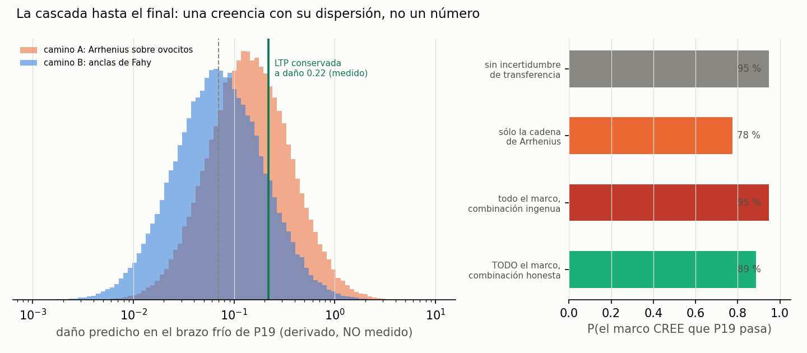

<!-- AUTO-GENERADO por red/cascada.py. NO EDITAR A MANO. -->
# StasisPath: la cascada hasta el final — qué probabilidad le da el marco a su propia predicción

`DERIVACION.md` predice el brazo frío de P19 con **un número puntual: 0.142**. Un número puntual no se compara honestamente con un umbral. Aquí se recorre la misma cascada con **toda la incertidumbre propagada**, 200,000 muestras.

> ## Esto NO cierra X2, y no puede
> Lo que sale de aquí es una **probabilidad de creencia**: qué cree el marco, dadas sus propias leyes y rangos. No es una medición. **El precio de confundirlas está pagado esta misma semana:** el marco predijo que la CCR de los NADES sería 0.3 °C/min y declaró que se refutaría por encima de 0.426. El valor medido resultó **> 30**, un factor **100** de error. Si esa predicción se hubiera contado como dato, hoy el marco tendría un valor gravemente falso en el núcleo y seguiría recomendando el experimento equivocado. **Historial de esta clase de predicción: 0 aciertos de 1.**

## Los tres eslabones, y dónde cada uno deja de ser cálculo

| eslabón | qué compone | dónde deja de ser cálculo |
|---|---|---|
| 1. Energía de activación | Ea/R = 2.95e+03 K (camino A) frente a 4.52e+03 K (camino B) | **la contradicción I1, abierta.** Los dos caminos discrepan en un factor ~1.5 en Ea/R. No se elige: se muestrean ambos al 50 % |
| 2. Extrapolación térmica | de 23–37 °C hasta -22 °C | se usa el modelo a **3.2 rangos de calibración** de distancia. Ningún dato dice que Arrhenius siga valiendo ahí |
| 3. Ovocito → neural | Ea/R está medida en OVOCITOS; P19 mide LTP en CA1 | **sin ningún dato.** Que la misma energía de activación gobierne ambos es una suposición, no una ley |

## El resultado

| magnitud | valor | naturaleza |
|---|---|---|
| **P(el marco cree que P19 pasa)** | **78 %** | creencia, no medición |
| daño predicho, mediana | 0.101 | derivado |
| 50 % central | 0.0498 – 0.202 | derivado |
| 90 % central | 0.0176 – 0.539 | derivado |
| umbral con LTP conservada | 0.22 | **MEDIDO** (F46: 138.1 % frente a 157.7, n.s.) |

## Todos los caminos del marco, y por qué no se suman como parecen

La cadena de Arrhenius es **uno** de los caminos. El marco tiene más, y hacerlos hablar es correcto. Pero varios **se apoyan en el mismo conjunto de datos de German** (F72/F46), así que no son evidencia independiente: si ese conjunto estuviera sesgado, fallarían a la vez.

| camino | P(pasa) que aporta por sí solo | razón de verosimilitud | ancla | ¿independiente? |
|---|---|---|---|---|
| Arrhenius × punto de German (I1, camino A) | en la cadena simulada | — | german | **no: comparte el dato de German** |
| Anclas de Fahy: M22 tolerable a −22 °C en loncha renal (I1, camino B) | en la cadena simulada | — | fahy | sí |
| Calibración daño↔LTP: a daño 0.220 la LTP se conservó (I1, camino C) | en la cadena simulada | — | german | **no: comparte el dato de German** |
| F47: M22 en cerebro de conejo, cerdo y biopsia humana, SIN hielo | 62 % | ×1.63 | fahy_brain | sí |
| F5: riñón de conejo con M22 trasplantado y funcional (E3) | 58 % | ×1.38 | conejo | sí |
| L13/F71: V3 (8.42 M) conserva LTP y M22 sólo es un 10 % más concentrado | 70 % | ×2.33 | german | **no: comparte el dato de German** |

**Combinación honesta (agrupando por ancla, 3 grupos independientes): 89 %.**

**Combinación ingenua (tratando los 6 como independientes): 95 %.**

> **Cada camino es una observación ruidosa del MISMO hecho, no una oportunidad independiente de que pase.** Por eso no se combinan con 1−∏(1−p), que satura en 99 % diga lo que diga cada uno: se multiplican **razones de verosimilitud** sobre un prior de 0.5. Dentro de un grupo que comparte ancla no se multiplican — si el ancla está sesgada fallan todos a la vez — y se toma la más fuerte del grupo.

> La diferencia entre 95 % y 89 % es **exactamente lo que cuesta contar dos veces el mismo experimento**. Tres de los seis caminos leen el mismo conjunto de datos: el de German. Sumarlos como si fueran independientes es el error clásico de la meta-evidencia, y aquí está cuantificado. **Añadir caminos que comparten ancla sube la confianza aparente sin añadir información.**

> **Y aun con todo el marco hablando, la combinación honesta no llega a certeza.** El techo lo pone el eslabón que no tiene dato: ninguno de los seis caminos mide **M22 sobre tejido neural con función**. Todos rodean el hueco; ninguno lo cruza. Por eso el número sube pero no se cierra.

**Si la contradicción I1 se resolviera a favor de cada camino:** camino A (Arrhenius sobre ovocitos) da **68 %**; camino B (anclas de Fahy) da **87 %**. Sin la incertidumbre de transferencia ni de extrapolación, la cascada daría **95 %** — y esa cifra es precisamente la que NO hay derecho a usar, porque esos dos eslabones son reales.

## Por qué esto no se puede convertir en un cierre

1. **El eslabón 3 no tiene dato.** Toda la cascada descansa en que la energía de activación del daño medida en ovocitos gobierne la plasticidad sináptica de CA1. Ninguna fuente de la red lo sostiene. Es el punto donde el cálculo se convierte en suposición, y ninguna cantidad de muestreo lo arregla.
2. **La contradicción I1 sigue abierta**, y es justo lo que P19 discrimina. Cerrar X2 con la cascada sería usar como prueba lo que está en disputa.
3. **P19 tiene umbrales preregistrados y congelados por hash.** Si una predicción pudiera cerrarlo, el preregistro no significaría nada y el marco perdería la capacidad de equivocarse — que es de donde saca su valor. Esta semana se ha falsado a sí mismo dos veces (I2 y el atajo de los NADES); ninguna de las dos habría sido posible bajo esa regla.

**Lo que sí aporta este documento:** convierte «el marco predice 0.142» en «el marco cree que P19 pasa con un 78 % y aquí está por qué». Eso hace la predicción **más falsable, no menos**: si P19 diera FALLA, este documento dice exactamente qué eslabón habría que revisar primero.
