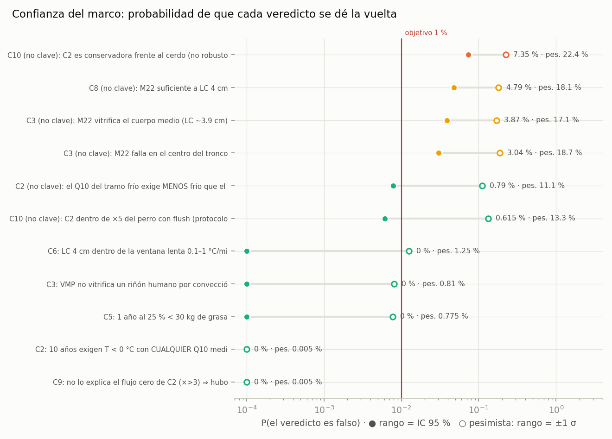

<!-- AUTO-GENERADO por red/confianza.py. NO EDITAR A MANO. -->
# StasisPath: confianza — cuánto puede fallar cada veredicto, en porcentaje

**Qué añade a MARGENES.md:** allí se mide a qué distancia está el vuelco de un veredicto moviendo **un** parámetro. Aquí se mueven **todos a la vez**, cada uno según su rango declarado, y se cuenta **con qué probabilidad el veredicto se da la vuelta**. 20,000 muestras por cota, semilla fija (el documento es reproducible).

**Cómo se lee cada rango.** Principal: el rango es un intervalo del 95 % (normal partida en escala log, respeta la asimetría). Es una suposición, porque varios rangos son cotas o esquinas y no IC; por eso se da también la lectura **pesimista**, que toma el rango como ±1 σ. **La probabilidad real queda entre las dos.** Los parámetros con rango puntual no varían, y no hay correlaciones declaradas.

> **Este módulo no toca el marco.** No cambia valores, rangos, umbrales ni el progreso: mide y prioriza. Si una probabilidad es alta, la respuesta es **medir el parámetro indicado con el rango indicado**, no mover el umbral (R2). El objetivo del 1 % se fijó antes de ver resultados.

**Resumen: 13 firmes (0 % incluso en la lectura pesimista) · 7 confiables (≤ 1 %) · 3 a vigilar (1–5 %) · 1 en riesgo (> 5 %).**

**Probabilidad de que falle al menos un veredicto CLAVE: 0 % en la lectura principal y 2.82 % en la pesimista** (suponiendo cotas independientes). Los veredictos que pueden fallar con más de un 1 % en la lectura principal son todos **no clave**.

| cota | veredicto | ¿clave? | P(error) (IC 95 % sup.) | P(error) pesimista | qué rango bajaría P(error) a ≤ 1 % | ídem, lectura pesimista | nivel |
|---|---|---|---|---|---|---|---|
| C10 | C2 es conservadora frente al cerdo (no robusto: en la esquina generosa se vuelve OPTIMISTA) | no | 7.35 % (≤ 7.72 %) | 22.4 % | Q10: de [2.08, 2.53] a [2.23, 2.37] (32 % del ancho) | no basta con Q10: aun exacto queda 9.93 % | **en riesgo** |
| C8 | M22 suficiente a LC 4 cm | no | 4.79 % (≤ 5.1 %) | 18.1 % | CCR_M22: de [0.05, 0.15] a [0.0641, 0.13] (64 % del ancho) | no basta con CCR_M22: aun exacto queda 1.41 % | **vigilar** |
| C3 | M22 vitrifica el cuerpo medio (LC ~3.9 cm) | no | 3.87 % (≤ 4.15 %) | 17.1 % | CCR_M22: de [0.05, 0.15] a [0.0655, 0.128] (61 % del ancho) | no basta con CCR_M22: aun exacto queda 5.09 % | **vigilar** |
| C3 | M22 falla en el centro del tronco | no | 3.04 % (≤ 3.29 %) | 18.7 % | CCR_M22: de [0.05, 0.15] a [0.0636, 0.13] (65 % del ancho) | no basta con CCR_M22: aun exacto queda 6.08 % | **vigilar** |
| C2 | el Q10 del tramo frío exige MENOS frío que el templado (no-linealidad, NO significativa en la fuente) | no | 0.79 % (≤ 0.922 %) | 11.1 % | ya cumple | Q10_frio: de [2.52, 4.23] a [3, 3.82] (46 % del ancho) | confiable |
| C10 | C2 dentro de ×5 del perro con flush (protocolo distinto, no clave) | no | 0.615 % (≤ 0.733 %) | 13.3 % | ya cumple | no basta con flush_T: aun exacto queda 3 % | confiable |
| C6 | LC 4 cm dentro de la ventana lenta 0.1–1 °C/min | sí | 0 % (≤ 0.019 %) | 1.25 % | ya cumple | exp_LC: de [1.67, 2.18] a [1.69, 2.17] (93 % del ancho) | confiable |
| C3 | VMP no vitrifica un riñón humano por convección | sí | 0 % (≤ 0.019 %) | 0.81 % | ya cumple | ya cumple | confiable |
| C5 | 1 año al 25 % < 30 kg de grasa | sí | 0 % (≤ 0.019 %) | 0.775 % | ya cumple | ya cumple | confiable |
| C2 | 10 años exigen T < 0 °C con CUALQUIER Q10 medido (templado y frío) | sí | 0 % (≤ 0.019 %) | 0.005 % | ya cumple | ya cumple | confiable |
| C9 | no lo explica el flujo cero de C2 (×>3) ⇒ hubo bajo flujo | sí | 0 % (≤ 0.019 %) | 0.005 % | ya cumple | ya cumple | confiable |
| C1 | VMP exige calentamiento volumétrico por encima de 1 cm | sí | 0 % (≤ 0.019 %) | 0 % | ya cumple | ya cumple | firme |
| C1 | M22 no se recalienta por superficie en el tronco (r ~15 cm) | sí | 0 % (≤ 0.019 %) | 0 % | ya cumple | ya cumple | firme |
| C4 | rana > ×100 | sí | 0 % (≤ 0.019 %) | 0 % | ya cumple | ya cumple | firme |
| C4 | tortuga > ×100 | sí | 0 % (≤ 0.019 %) | 0 % | ya cumple | ya cumple | firme |
| C4 | tortuga a 22 °C > ×10 (no térmico) | sí | 0 % (≤ 0.019 %) | 0 % | ya cumple | ya cumple | firme |
| C6 | calor latente < 3 h | sí | 0 % (≤ 0.019 %) | 0 % | ya cumple | ya cumple | firme |
| C7 | zona gris: τ_cel > τ_org (sobrevive con déficit) | sí | 0 % (≤ 0.019 %) | 0 % | ya cumple | ya cumple | firme |
| C7 | existencia fuera de lo reproducible: τ_org,bueno < τ_exist ≤ τ_cel | sí | 0 % (≤ 0.019 %) | 0 % | ya cumple | ya cumple | firme |
| C7 | la muerte legal se declara antes del umbral del organismo | sí | 0 % (≤ 0.019 %) | 0 % | ya cumple | ya cumple | firme |
| C8 | VMP insuficiente a LC 4 cm | sí | 0 % (≤ 0.019 %) | 0 % | ya cumple | ya cumple | firme |
| C11 | cruzar la banda 0-20 C enfriando lento tarda > 15 min (exposicion real) | sí | 0 % (≤ 0.019 %) | 0 % | ya cumple | ya cumple | firme |
| C11 | a LC 4 cm la conveccion es aun mas lenta que el techo lento | sí | 0 % (≤ 0.019 %) | 0 % | ya cumple | ya cumple | firme |
| C10 | C2 calibra dentro de ×5 contra el CERDO a 10 °C | sí | 0 % (≤ 0.019 %) | 0 % | ya cumple | ya cumple | firme |

## Qué medir y con qué precisión

**Veredictos clave que superan el 1 % en la lectura pesimista** (en la principal están en 0 %):

- **C6** — «LC 4 cm dentro de la ventana lenta 0.1–1 °C/min»: 1.25 % ⇒ exp_LC: de [1.67, 2.18] a [1.69, 2.17] (93 % del ancho).

**Veredictos no clave por encima del 1 % en la lectura principal:**

- **C10** — «C2 es conservadora frente al cerdo (no robusto: en la esquina generosa se vuelve OPTIMISTA)»: 7.35 % (pesimista 22.4 %) ⇒ Q10: de [2.08, 2.53] a [2.23, 2.37] (32 % del ancho).
- **C8** — «M22 suficiente a LC 4 cm»: 4.79 % (pesimista 18.1 %) ⇒ CCR_M22: de [0.05, 0.15] a [0.0641, 0.13] (64 % del ancho).
- **C3** — «M22 vitrifica el cuerpo medio (LC ~3.9 cm)»: 3.87 % (pesimista 17.1 %) ⇒ CCR_M22: de [0.05, 0.15] a [0.0655, 0.128] (61 % del ancho).
- **C3** — «M22 falla en el centro del tronco»: 3.04 % (pesimista 18.7 %) ⇒ CCR_M22: de [0.05, 0.15] a [0.0636, 0.13] (65 % del ancho).

## Qué medición reduce más el riesgo total de los veredictos clave

Para cada parámetro, cuánto bajaría la suma de P(error) de los veredictos clave si se conociera exactamente, en la lectura pesimista (en la principal el riesgo clave ya es prácticamente nulo). **Es el orden de rentabilidad de medir, y se recalcula solo cada vez que cambia el YAML.**

| # | parámetro | fuente | estatus | rango declarado | parte del riesgo clave que elimina |
|---|---|---|---|---|---|
| 1 | exp_LC | F2 | V | [1.67, 2.18] | 40 % |
| 2 | anc_LC | F2 | V | [2.1, 2.35] | 34 % |
| 3 | BMR | — | P | [1.5e+03, 2e+03] | 15 % |
| 4 | anc_rate | F2 | V | [0.45, 0.5] | 6 % |
| 5 | LC_kidneyH | — | V | [0.85, 0.91] | 5 % |
