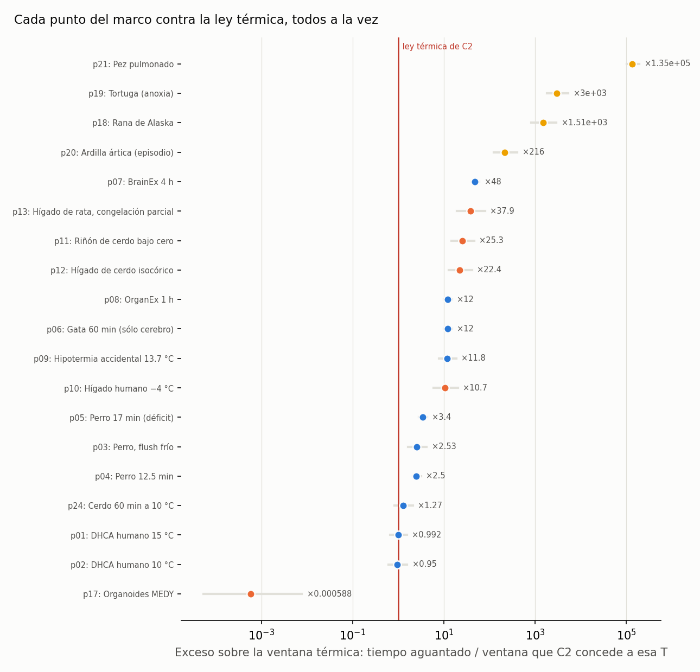

<!-- AUTO-GENERADO por red/cruce.py. NO EDITAR A MANO. -->
# StasisPath: cruce sistemático — la capa de datos entera contra la capa de leyes

`ENCUENTROS.md` cruza **dimensiones** por pares. Aquí se hace otra cosa: se enfrenta **cada punto de datos a la ley térmica**, todos a la vez. C4, C9 y C10 ya lo hacían para cuatro puntos sueltos; esto lo hace para los 19 que tienen temperatura y tiempo.

> **Todo lo de aquí es DERIVADO, no medido.** Un exceso calculado no es un dato nuevo: es una relectura de datos que ya estaban. Sirve para **señalar dónde mirar**. Ninguna anomalía cierra un nodo por sí sola (R5).

## 1. Cada punto contra la ventana de C2

Ventana: w(T) = t37 · Q10^((37−T)/10), con t37 = 5 min y Q10 = 2.3. La banda entre paréntesis son las esquinas del rango declarado de ambos. Un punto sólo cuenta como exceso si **toda** la banda supera 1.5.

| punto | sistema | T °C | t min | clase | exceso × | veredicto |
|---|---|---|---|---|---|---|
| p01 | DHCA humano 15 °C | 15 | 31 | hipotermia | ×0.992 (0.67–1.55) | dentro de la ley térmica |
| p02 | DHCA humano 10 °C | 10 | 45 | hipotermia | ×0.95 (0.612–1.56) | dentro de la ley térmica |
| p03 | Perro, flush frío | 10 | 120 | hipotermia | ×2.53 (1.63–4.15) | **EXCESO**: exige mecanismo no térmico |
| p04 | Perro 12.5 min | 37 | 12.5 | normotermia | ×2.5 (2.08–3.12) | **EXCESO**: exige mecanismo no térmico |
| p05 | Perro 17 min (déficit) | 37 | 17 | normotermia | ×3.4 (2.83–4.25) | **EXCESO**: exige mecanismo no térmico |
| p06 | Gata 60 min (sólo cerebro) | 37 | 60 | normotermia | ×12 (10–15) | **EXCESO**: exige mecanismo no térmico |
| p07 | BrainEx 4 h | 37 | 240 | celular | ×48 (40–60) | **EXCESO**: exige mecanismo no térmico |
| p08 | OrganEx 1 h | 37 | 60 | celular | ×12 (10–15) | **EXCESO**: exige mecanismo no térmico |
| p09 | Hipotermia accidental 13.7 °C | 13.7 | 412 | bajo_flujo | ×11.8 (7.9–18.7) | **EXCESO**: exige mecanismo no térmico |
| p10 | Hígado humano −4 °C | -4 | 1.62e+03 | fase_controlada | ×10.7 (6.01–20.1) | **EXCESO**: exige mecanismo no térmico |
| p11 | Riñón de cerdo bajo cero | -0.5 | 2.88e+03 | fase_controlada | ×25.3 (14.8–46.2) | **EXCESO**: exige mecanismo no térmico |
| p12 | Hígado de cerdo isocórico | -2 | 2.88e+03 | fase_controlada | ×22.4 (12.9–41.4) | **EXCESO**: exige mecanismo no térmico |
| p13 | Hígado de rata, congelación parcial | -15 | 1.44e+04 | fase_controlada | ×37.9 (19.2–79.9) | **EXCESO**: exige mecanismo no térmico |
| p14 | Riñón de rata vitrificado | -150 | 1.44e+05 | vidrio | — | no aplica (vidrio: sin metabolismo) |
| p16 | C. elegans (memoria) | -196 | 30 | vidrio | — | no aplica (vidrio: sin metabolismo) |
| p17 | Organoides MEDY | -196 | 7.88e+05 | fase_controlada | ×0.000588 (5.32e-05–0.00765) | dentro de la ley térmica |
| p18 | Rana de Alaska | -6.3 | 2.78e+05 | natural | ×1.51e+03 (832–2.92e+03) | **EXCESO**: exige mecanismo no térmico |
| p19 | Tortuga (anoxia) | 3 | 2.55e+05 | natural | ×3e+03 (1.81e+03–5.28e+03) | **EXCESO**: exige mecanismo no térmico |
| p20 | Ardilla ártica (episodio) | -3 | 3.02e+04 | natural | ×216 (123–404) | **EXCESO**: exige mecanismo no térmico |
| p21 | Pez pulmonado | 25 | 1.84e+06 | natural | ×1.35e+05 (1.01e+05–1.91e+05) | **EXCESO**: exige mecanismo no térmico |
| p24 | Cerdo 60 min a 10 °C | 10 | 60 | hipotermia | ×1.27 (0.816–2.08) | dentro de la ley térmica |
| p25 | Hipocampo de ratón (LTP) | -150 | 1.01e+04 | vidrio | — | no aplica (vidrio: sin metabolismo) |
| p26 | Cerebro de ratón in situ | -140 | 1.15e+04 | vidrio | — | no aplica (vidrio: sin metabolismo) |

**15 puntos exigen un mecanismo no térmico** de forma robusta.

## 2. ¿Hay estructura en los excesos?

**Por clase de sistema:**

| clase | n | mínimo | mediana | máximo |
|---|---|---|---|---|
| natural | 4 | 216 | 2.26e+03 | 1.35e+05 |
| celular | 2 | 12 | 30 | 48 |
| fase_controlada | 5 | 0.000588 | 22.4 | 37.9 |
| normotermia | 3 | 2.5 | 3.4 | 12 |
| bajo_flujo | 1 | 11.8 | 11.8 | 11.8 |
| hipotermia | 4 | 0.95 | 1.13 | 2.53 |

**Por fase:**

| fase | n | mínimo | mediana | máximo |
|---|---|---|---|---|
| liquido | 12 | 0.95 | 7.62 | 1.35e+05 |
| hielo_extra | 3 | 0.000588 | 37.9 | 1.51e+03 |
| sobreenfriado | 4 | 10.7 | 23.9 | 216 |

**Por origen (artificial = protocolo humano; natural = biología):**

| artificial | n | mínimo | mediana | máximo |
|---|---|---|---|---|
| no | 4 | 216 | 2.26e+03 | 1.35e+05 |
| sí | 15 | 0.000588 | 10.7 | 48 |

> **REGULARIDAD ENCONTRADA, y el marco no la tenía escrita como ley.** Entre los puntos que exceden la ley térmica hay una **brecha limpia**: el mayor exceso conseguido por un **protocolo artificial** es **×48**, y el menor conseguido por la **biología natural** es **×216** — un salto de **×4.5** sin ningún punto en medio. ⇒ Lo que la bioquímica de un hibernador o un anfibio consigue está **fuera del alcance de todo protocolo humano probado**, y no por poco: por un factor de 4.5. Es la misma frontera que C4 encontró para la rana y la tortuga, pero ahora medida sobre **todos** los puntos del marco y con la brecha cuantificada. Las bandas **no se solapan ni en sus extremos** (techo artificial ×79.9 frente a suelo natural ×123), así que no es un artefacto del rango de Q10.

> **TRES SALVEDADES, y sin ellas el hallazgo engaña** (la tercera se añadió en la tanda 52, auditoría en contra; las dos primeras ya estaban).
> 1. **La brecha describe lo INTENTADO, no lo posible.** El techo artificial de ×48 es el mejor protocolo **probado**, no un límite demostrado. Ninguna ley del marco prohíbe superarlo; si mañana un protocolo llega a ×100, la brecha se cierra sin que nada de esto se refute. Es una **frontera empírica**, no una barrera.
> 2. **Parte del exceso natural es ectotermia, no bioquímica transferible.** La ventana se calibra con t37 = 5 min y Q10 = 2.3, **medidos en cerebro humano** (F4). Aplicarla a una tortuga o a un pez pulmonado extrapola fuera de su dominio: esos animales tienen un metabolismo basal mucho menor de partida. C4 ya lo advierte. El exceso de la **ardilla ártica** (×216) es el más informativo de los naturales, porque es un **mamífero**, y ahí la comparación sí es cercana. **Comprobado en la tanda 52: el punto que fija el suelo natural ES la ardilla (un mamífero), así que el confundido de ectotermia NO invalida la brecha** — quitar la rana, la tortuga y el pez pulmonado deja el suelo natural exactamente donde está, en ×216.
> 3. **Los dos lados de la brecha no están al mismo nivel de éxito demostrado, y eso es un sesgo propio (tanda 52).** El techo artificial lo fija **p07**, que alcanza **E1**, mientras todos los puntos naturales están en **E4** (animal recuperado). Comparar un resultado celular con un animal entero no es comparar lo mismo con lo mismo. Exigiendo el mismo nivel E a los dos lados, el techo artificial baja a ×12 y la brecha **crece** a ×18. ⇒ La salvedad **no rompe el hallazgo: lo agranda.** Pero había que decirla, porque un lector podía leer la brecha como «los protocolos humanos llegan a ×48 con un animal recuperado», y eso es falso.

## 3. Vías contra cotas

27 vías en el marco. **12 declaran su ventana en texto libre sin cifra en minutos**, así que no se pueden enfrentar automáticamente a una cota. Es una **deuda de formato, no de conocimiento**: quien escriba una ventana como número y unidad hace que esta comprobación se ejecute sola.

Vías sin ventana comprobable: V07, V12, V14, V15, V16, V17, V18, V21, V22, V24, V25, V26

## Qué hacer con esto

1. Los puntos marcados **EXCESO** son los que sostienen que existe una vía biológica: sin ellos, la ley térmica bastaría para describir el marco entero.
2. Los marcados **ambiguo** son los candidatos a medición: estrechar Q10 o t37 los resolvería sin experimento nuevo.
3. Las vías sin ventana numérica son trabajo de ficha, de coste casi nulo, que desbloquea una comprobación automática.
