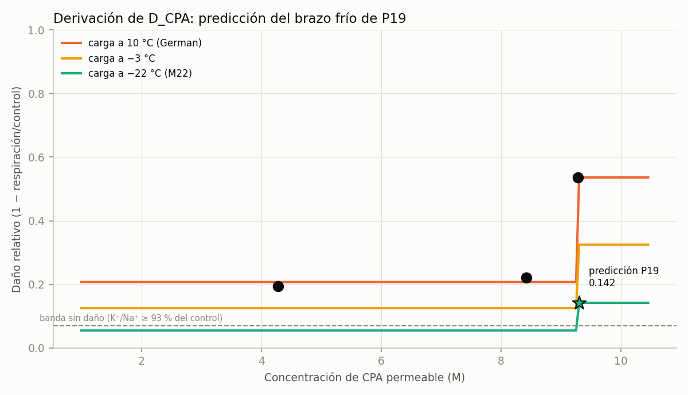

<!-- AUTO-GENERADO por red/derivar.py. NO EDITAR A MANO. -->
# StasisPath: cierre por derivación — D_CPA y la predicción de P19

**La idea.** Con suficientes leyes verificadas, algunos nodos abiertos no necesitan medición nueva: se **derivan** de los cerrados. Aquí se compone la toxicidad en concentración (de un conjunto de datos) con la toxicidad en temperatura (de **otro conjunto independiente**) y se predice el brazo de P19 que nadie ha hecho.

**Regla:** una derivación sólo vale si usa datos distintos del nodo que cierra, declara su rango de validez y produce una predicción falsable con umbral.

## 1. Forma de la curva en concentración, a 10 °C

De la serie de German (F72), daño = 1 − respiración/control:

| C (M) | daño medido |
|---|---|
| 4.28 | 0.194 |
| 8.42 | 0.22 |
| 9.28 | 0.536 |

**No es una ley de potencia: es un umbral.** El daño se queda en una meseta de **0.207** entre 4.3 y 8.4 M y **salta a 0.536** a 9.28 M. *(Autocorrección: el primer intento ajustó una potencia y dio exponente 0.9, que no describe estos datos. Con 3 puntos no se ajusta una sigmoide de forma fiable, así que **no se ajusta nada**: se usa el punto medido y se escala sólo en temperatura.)*

## 2. Ajuste en temperatura, de un conjunto INDEPENDIENTE

De Szurek & Eroglu (F55), PROH 1.5 M y 15 min fijos, sólo cambia T: degeneración 54.2 % a 23 °C y 85.0 % a 37 °C ⇒ Arrhenius con **Ea/R = 2.95e+03 K** (Ea ≈ 24.5 kJ/mol, orden típico de daño proteico).

## 3. Composición y predicción

| caso | C (M) | T °C | daño D_CPA predicho | factor temperatura |
|---|---|---|---|---|
| German 9.28 M a 10 °C (MEDIDO: daño 0.54) | 9.28 | 10 | 0.536 | 1 |
| M22 9.3 M a −22 °C (brazo C de P19) | 9.3 | -22 | 0.142 | 0.265 |
| M22 9.3 M a −3 °C (Fahy: inaceptable) | 9.3 | -3 | 0.325 | 0.605 |
| VMP 8.4 M a −3 °C (Fahy: tolerable) | 8.4 | -3 | 0.125 | 0.605 |
| V3 8.42 M a 10 °C (MEDIDO: daño 0.22) | 8.42 | 10 | 0.207 | 1 |

> **PREDICCIÓN DERIVADA:** cargar M22 a 9.3 M **a −22 °C** produce un daño de **0.142**, frente a **0.536** a 10 °C: una reducción de **×3.78**. Eso sitúa el brazo frío **FUERA** de la banda sin daño (≤ 0.07, equivalente a K⁺/Na⁺ ≥ 93 % del control).

## 4. Validación contra anclas que NO se usaron en el ajuste

| ancla cualitativa de Fahy (F39, F65) | ¿la reproduce? |
|---|---|
| M22 a −3 °C debe salir PEOR que VMP a −3 °C | ✔ |
| M22 a −22 °C debe salir MEJOR que M22 a −3 °C | ✔ |
| V3 a 10 °C debe salir mejor que 9.28 M a 10 °C | ✔ |

**Las tres anclas se reproducen.** Son datos cualitativos de Fahy que no entraron en ningún ajuste.

## 5. Qué vale y qué no

- **Vale como predicción falsable de P19**, con umbral fijado aquí y antes de cualquier dato: si el brazo frío da un daño > 0.25, la derivación queda **refutada**; si da ≤ 0.10, **confirmada**.
- **No cierra X2 por sí sola.** Es una predicción, no una medida: el nodo sigue abierto hasta que alguien ejecute P19. Lo que hace es convertir P19 en un experimento **con resultado esperado publicado de antemano**, que es más fuerte que uno exploratorio.
- **Rango de validez declarado:** el ajuste en concentración es de 4.3 a 9.3 M en tejido neural; el de temperatura, de 23 a 37 °C en ovocitos. **Extrapolar a −22 °C es una extrapolación grande**, y es la debilidad principal: asume que la misma energía de activación gobierna el daño por debajo de 0 °C. Fahy advierte que a baja temperatura el daño dominante puede ser **osmótico y no químico** (L20), y ese término **no está en el modelo**.
