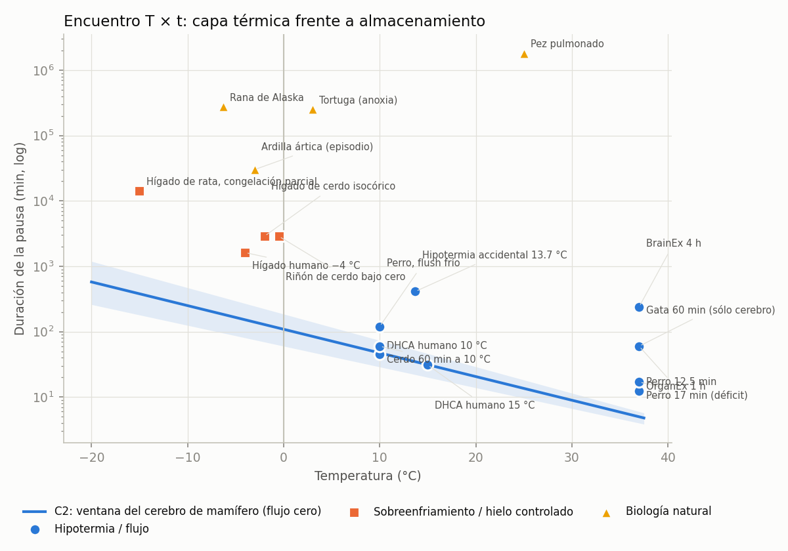
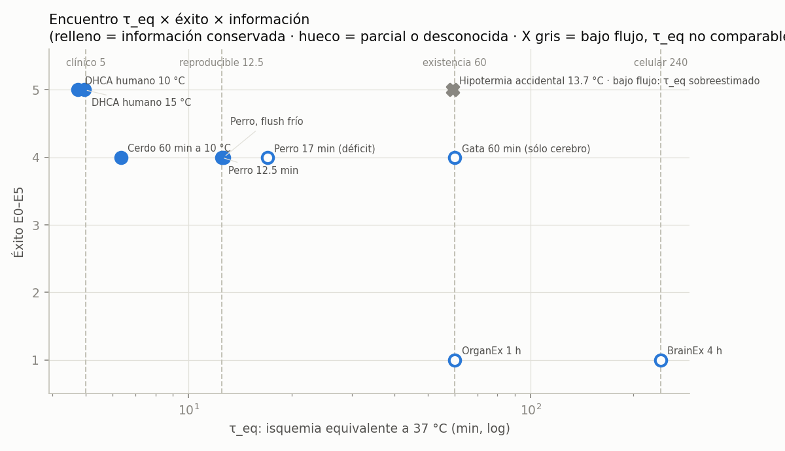
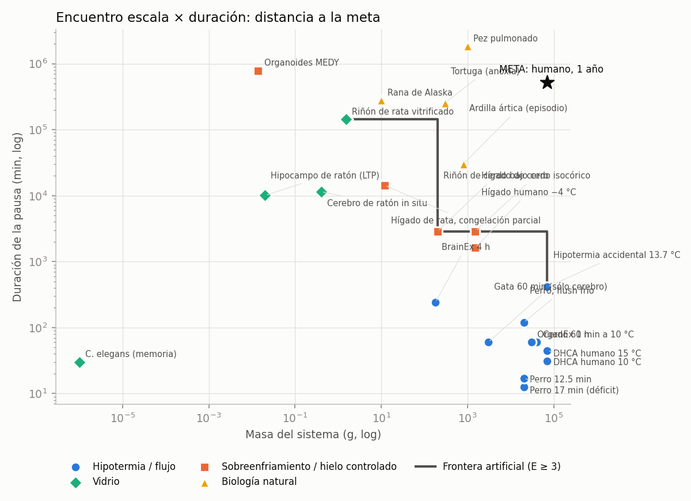
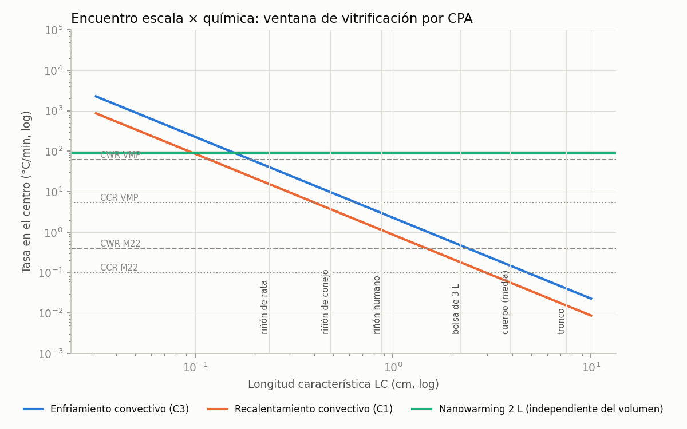

<!-- AUTO-GENERADO por red/encuentros.py (llamado desde red/motor.py). NO EDITAR A MANO. -->
# StasisPath: encuentros entre capas

Cada capa del marco se proyecta en una dimensión. Cada par de dimensiones es un **encuentro**: una ley traza una frontera, los datos caen a un lado u otro y el veredicto se calcula. Los datos viven en `red/stasispath.yaml → puntos`; cambiar un parámetro o añadir un punto regenera todo.

Colores: azul = hipotermia/flujo · naranja = sobreenfriamiento/hielo controlado · verde = vidrio · amarillo = biología natural (la forma del marcador repite la clase).

## E1 · Temperatura × duración

**Ley:** C2 (banda = esquinas de t37 y Q10). Encima de la banda, la pausa no la explica la supresión térmica pasiva del cerebro de mamífero.

| punto | T °C | t min | t / ventana C2 | diagnóstico | fuente |
|---|---|---|---|---|---|
| C. elegans (memoria) | -196 | 30 | ×2.24e-08 (≥ ×2.02e-09) | vidrio: fuera del dominio de C2 (química detenida bajo Tg) | F29 |
| Organoides MEDY | -196 | 788,400 | ×0.000588 (≥ ×5.32e-05) | excede C2 → estado bajo 0 °C (hielo controlado o sobreenfriamiento) | F35 |
| Hipocampo de ratón (LTP) | -150 | 10,080 | ×0.000347 (≥ ×4.86e-05) | vidrio: fuera del dominio de C2 (química detenida bajo Tg) | F46 |
| Riñón de rata vitrificado | -150 | 144,000 | ×0.00496 (≥ ×0.000695) | vidrio: fuera del dominio de C2 (química detenida bajo Tg) | F1 |
| Cerebro de ratón in situ | -140 | 11,520 | ×0.000912 (≥ ×0.000141) | vidrio: fuera del dominio de C2 (química detenida bajo Tg) | F46 |
| Hígado de rata, congelación parcial | -15 | 14,400 | ×37.9 (≥ ×19.2) | excede C2 → estado bajo 0 °C (hielo controlado o sobreenfriamiento) | F21 |
| Rana de Alaska | -6.3 | 277,920 | ×1.51e+03 (≥ ×832) | excede C2 → bioquímica natural no térmica | F11 |
| Hígado humano −4 °C | -4 | 1.62e+03 | ×10.7 (≥ ×6.01) | excede C2 → estado bajo 0 °C (hielo controlado o sobreenfriamiento) | F8 |
| Ardilla ártica (episodio) | -3 | 30,240 | ×216 (≥ ×123) | excede C2 → bioquímica natural no térmica | F10 |
| Hígado de cerdo isocórico | -2 | 2.88e+03 | ×22.4 (≥ ×12.9) | excede C2 → estado bajo 0 °C (hielo controlado o sobreenfriamiento) | F22 |
| Riñón de cerdo bajo cero | -0.5 | 2.88e+03 | ×25.3 (≥ ×14.8) | excede C2 → estado bajo 0 °C (hielo controlado o sobreenfriamiento) | F20 |
| Tortuga (anoxia) | 3 | 254,880 | ×3e+03 (≥ ×1.81e+03) | excede C2 → bioquímica natural no térmica | F60 |
| DHCA humano 10 °C | 10 | 45 | ×0.95 (≥ ×0.612) | explicado por Q10 pasivo | F4 |
| Perro, flush frío | 10 | 120 | ×2.53 (≥ ×1.63) | margen de tejido o flujo (≤ ×5) | F30 |
| Cerdo 60 min a 10 °C | 10 | 60 | ×1.27 (≥ ×0.816) | explicado por Q10 pasivo | F42 |
| Hipotermia accidental 13.7 °C | 13.7 | 412 | ×11.8 (≥ ×7.9) | excede C2 → hubo flujo (bajo) | F13 |
| DHCA humano 15 °C | 15 | 31 | ×0.992 (≥ ×0.67) | explicado por Q10 pasivo | F4 |
| Pez pulmonado | 25 | 1,840,000 | ×135,449 (≥ ×100,675) | excede C2 → bioquímica natural no térmica | F91 |
| Perro 12.5 min | 37 | 12.5 | ×2.5 (≥ ×2.08) | margen de tejido o flujo (≤ ×5) | F25b |
| Perro 17 min (déficit) | 37 | 17 | ×3.4 (≥ ×2.83) | margen de tejido o flujo (≤ ×5) | F25 |
| Gata 60 min (sólo cerebro) | 37 | 60 | ×12 (≥ ×10) | excede C2 → reperfusión optimizada (zona gris X1) | F38 |
| BrainEx 4 h | 37 | 240 | ×48 (≥ ×40) | excede C2 → reperfusión optimizada (zona gris X1) | F23 |
| OrganEx 1 h | 37 | 60 | ×12 (≥ ×10) | excede C2 → reperfusión optimizada (zona gris X1) | F24 |

## E2 · Isquemia equivalente × éxito × información

**Invariante del encuentro:** la capa térmica (C2) y la capa de isquemia (G1) coinciden: los casos hipotérmicos con E ≥ 4 caen en τ_eq = 4.75–12.7 min, el mismo rango que los normotérmicos reproducibles (5–12.5 min). El perro con flush frío (120 min a 10 °C) queda en τ_eq ≈ 12.7 min: es el mismo umbral del perro normotérmico (12.5 min). ⇒ **τ_eq funciona como magnitud única entre especies y temperaturas.** Por encima de ~13 min, E4 sólo aparece con información parcial (déficit o atrofia del hipocampo).

| punto | t min | T °C | τ_eq min (rango Q10) | E | info | flujo | fuente |
|---|---|---|---|---|---|---|---|
| DHCA humano 15 °C | 31 | 15 | 4.96 (4.02–6.19) | 5 | si | cero | F4 |
| DHCA humano 10 °C | 45 | 10 | 4.75 (3.67–6.23) | 5 | si | cero | F4 |
| Perro, flush frío | 120 | 10 | 12.7 (9.79–16.6) | 4 | si | cero | F30 |
| Cerdo 60 min a 10 °C | 60 | 10 | 6.33 (4.89–8.31) | 4 | si | cero | F42 |
| Perro 12.5 min | 12.5 | 37 | 12.5 (12.5–12.5) | 4 | si | cero | F25b |
| Perro 17 min (déficit) | 17 | 37 | 17 (17–17) | 4 | parcial | cero | F25 |
| Gata 60 min (sólo cerebro) | 60 | 37 | 60 (60–60) | 4 | parcial | cero | F38 |
| BrainEx 4 h | 240 | 37 | 240 (240–240) | 1 | desconocida | cero | F23 |
| OrganEx 1 h | 60 | 37 | 60 (60–60) | 1 | desconocida | cero | F24 |
| Hipotermia accidental 13.7 °C | 412 | 13.7 | 59.2 (47.4–74.8) | 5 | si | bajo | F13 |

## E3 · Escala × duración (frontera de reversibilidad)

- **Frontera artificial (Pareto, E ≥ 3):** Riñón de rata vitrificado (1.5 g, 144,000 min) → Riñón de cerdo bajo cero (200 g, 2.88e+03 min) → Hipotermia accidental 13.7 °C (70,000 g, 412 min)
- Con la masa de la meta (≥ 17.5 kg), la pausa artificial más larga con E ≥ 3 es de **412 min** ⇒ faltan **3.1 órdenes de magnitud** de tiempo.
- Con la duración de la meta (≥ 1 año), la masa artificial máxima con E ≥ 3 es de **ninguna** ⇒ ningún sistema artificial con E ≥ 3 ha llegado a 1 año.
- **Distancia de Chebyshev de la meta a la frontera: 2.5 órdenes de magnitud** (el menor salto simultáneo en masa y tiempo).
- La biología natural ya ocupa la región de meses a años con 10–1000 g (Rana de Alaska, Tortuga (anoxia), Ardilla ártica (episodio), Pez pulmonado): la meta está fuera de la frontera artificial, pero no fuera de lo biológicamente posible en masa pequeña.
## E4 · Escala × química (enfriar / recalentar / CPA)

**Choque de capas:** la ventana de vitrificación la cierra el **enfriamiento** (curva azul), no el recalentamiento, porque el nanowarming levanta el techo de calentamiento para cualquier tamaño. La ventana crece al bajar la CCR, lo que exige más concentración y química más agresiva ⇒ **el eje de escala empuja al eje de toxicidad**. El orden de toxicidad (1 = menor) es **ordinal y sin escala común [P]**: el encuentro escala × toxicidad está **sin cuantificar** (ver E6).

| CPA | CCR °C/min | M | LC máx. vitrificable por convección | objetos que caben | toxicidad (ordinal, P) |
|---|---|---|---|---|---|
| VMP | 5.4 | 8.4 | 0.649 cm (peor caso 0.606) | riñón de rata, riñón de conejo | 1 |
| VS55 | 2.5 | 8.4 | 0.954 cm (peor caso 0.891) | riñón de rata, riñón de conejo, riñón humano | 2 |
| M22 | 0.1 | 9.3 | 4.77 cm (peor caso 3.64) | riñón de rata, riñón de conejo, riñón humano, bolsa de 3 L, cuerpo (media) | 3 |

## E5 · Función × información

**Encuentro ontológico:** función e información son ejes separados. Casos que lo prueban: *Gata 60 min* (función alta, información parcial), *ASC* (función nula, información sí), *C. elegans* (baja función medida, información sí). Los órganos no tienen eje de información (n/a). **Hueco:** ningún punto tiene a la vez E ≥ 4, información medida y pausa > 1 día en mamífero artificial.

| función | información | n | puntos |
|---|---|---|---|
| alta (E ≥ 3) | n/a | 4 | Riñón de conejo (dieléctrico); Riñón de cerdo bajo cero; Riñón de rata vitrificado; Riñón de conejo M22 |
| alta (E ≥ 3) | parcial | 2 | Perro 17 min (déficit); Gata 60 min (sólo cerebro) |
| alta (E ≥ 3) | si | 10 | DHCA humano 15 °C; DHCA humano 10 °C; Perro, flush frío; Cerdo 60 min a 10 °C; Perro 12.5 min; Hipotermia accidental 13.7 °C; Rana de Alaska; Tortuga (anoxia); Ardilla ártica (episodio); Pez pulmonado |
| baja (E1–E2) | desconocida | 3 | BrainEx 4 h; OrganEx 1 h; Lonchas de hipocampo VM3 |
| baja (E1–E2) | n/a | 3 | Hígado humano −4 °C; Hígado de cerdo isocórico; Hígado de rata, congelación parcial |
| baja (E1–E2) | parcial | 2 | Cerebro de ratón in situ; Organoides MEDY |
| baja (E1–E2) | si | 2 | Hipocampo de ratón (LTP); C. elegans (memoria) |
| nula (E0) | parcial | 1 | Caso criónico real P-19 |
| nula (E0) | si | 1 | ASC, cerebro de cerdo |

## E7 · Química: concentración × temperatura × protocolo → toxicidad

**Hallazgo calculado:** hay 2 pares con **la misma concentración y la misma temperatura, pero resultado opuesto**: a 8.4 M y -3 °C: VMP → 3 frente a 8.4 M previa al diseño por qv* → 0; a 9.3 M y -22 °C: M22 (lavado al calentar) → 3 frente a M22 (añadir y retirar a −22 °C) → 1. ⇒ La toxicidad **no es función de la molaridad ni de la temperatura por separado**: la deciden la composición (qv*) y el protocolo de carga y descarga. La dimensión 'toxicidad' debe modelarse como D_CPA(composición, T, t, protocolo), no como un número por CPA.

| CPA / protocolo | M | T °C | t min | masa g | sistema | resultado (ordinal) | fuente |
|---|---|---|---|---|---|---|---|
| VMP | 8.4 | -3 | — | 12.7 | riñón de conejo | 3 · sin toxicidad o función completa | F39 |
| M22 (lavado al calentar) | 9.3 | -22 | 25 | 12.7 | riñón de conejo | 3 · sin toxicidad o función completa | F39 |
| M22 (añadir y retirar a −22 °C) | 9.3 | -22 | — | 12.7 | riñón de conejo | 1 · dañino o a veces fatal | F39 |
| 8.4 M previa al diseño por qv* | 8.4 | -3 | — | 12.7 | riñón de conejo | 0 · letal | F26 |
| VM3 (61 % p/v) | — | — | — | 0.01 | lonchas de hipocampo | 3 · sin toxicidad o función completa | F37b |
| V(EG) 53 % p/v | — | — | — | 0.01 | lonchas de hipocampo | 1 · dañino o a veces fatal | F37b |
| VS55 | 8.4 | — | — | 1.5 | riñón de rata | 1 · dañino o a veces fatal | F1 |
| VMP | 8.4 | — | — | 1.5 | riñón de rata | 3 · sin toxicidad o función completa | F1 |
| EG + DMSO (vehículo isotónico) | — | — | — | 200 | riñón de cerdo y humano | 2 · daño bajo o parcial | F31 |

## E6 · Matriz de encuentros (cobertura del modelo)

36 encuentros posibles entre 9 dimensiones; 21 pertinentes. **Huecos (vacíos, sin escala o con ley sin datos): 4**: t×tox, masa×CCR, E×CCR, CCR×tox → son la lista priorizada de investigación (cada uno es un par de capas cuyo choque no se puede calcular todavía).

| encuentro | ley | n puntos | estado |
|---|---|---|---|
| Temperatura × Duración de la pausa | C2 | 23 | cuantificado |
| Temperatura × Masa del sistema | — | 27 | no pertinente |
| Temperatura × Isquemia equivalente τ_eq | C2 | 10 | cuantificado |
| Temperatura × Fase del agua | C2/G2 | 27 | cuantificado |
| Temperatura × Éxito E0–E5 | — | 27 | no pertinente |
| Temperatura × Información conservada | — | 18 | no pertinente |
| Temperatura × CCR del CPA | — | 2 | no pertinente |
| Temperatura × Toxicidad del CPA | — | 4 | cuantificado (ordinal) |
| Duración de la pausa × Masa del sistema | frontera | 23 | cuantificado |
| Duración de la pausa × Isquemia equivalente τ_eq | G1 | 10 | cuantificado |
| Duración de la pausa × Fase del agua | — | 23 | no pertinente |
| Duración de la pausa × Éxito E0–E5 | frontera | 23 | cuantificado |
| Duración de la pausa × Información conservada | — | 16 | datos sin ley |
| Duración de la pausa × CCR del CPA | — | 1 | no pertinente |
| Duración de la pausa × Toxicidad del CPA | — | 1 | **pocos datos** |
| Masa del sistema × Isquemia equivalente τ_eq | — | 10 | no pertinente |
| Masa del sistema × Fase del agua | — | 28 | datos sin ley |
| Masa del sistema × Éxito E0–E5 | frontera | 28 | cuantificado |
| Masa del sistema × Información conservada | — | 18 | no pertinente |
| Masa del sistema × CCR del CPA | C3 | 2 | ley sin datos |
| Masa del sistema × Toxicidad del CPA | C8 | 9 | cuantificado (ordinal) |
| Isquemia equivalente τ_eq × Fase del agua | — | 10 | no pertinente |
| Isquemia equivalente τ_eq × Éxito E0–E5 | G1/X1 | 10 | cuantificado |
| Isquemia equivalente τ_eq × Información conservada | O4/X1 | 8 | cuantificado |
| Isquemia equivalente τ_eq × CCR del CPA | — | 0 | no pertinente |
| Isquemia equivalente τ_eq × Toxicidad del CPA | — | 0 | no pertinente |
| Fase del agua × Éxito E0–E5 | — | 28 | datos sin ley |
| Fase del agua × Información conservada | — | 18 | datos sin ley |
| Fase del agua × CCR del CPA | — | 2 | no pertinente |
| Fase del agua × Toxicidad del CPA | — | 0 | no pertinente |
| Éxito E0–E5 × Información conservada | O4 | 18 | cuantificado |
| Éxito E0–E5 × CCR del CPA | — | 2 | **vacío** |
| Éxito E0–E5 × Toxicidad del CPA | — | 9 | cuantificado (ordinal) |
| Información conservada × CCR del CPA | — | 0 | no pertinente |
| Información conservada × Toxicidad del CPA | — | 0 | no pertinente |
| CCR del CPA × Toxicidad del CPA | L6 (qv*) | 3 | **sin escala cuantitativa** |

## Avisos de los encuentros
- ninguno (ningún punto cruza una frontera sin mecanismo declarado)
