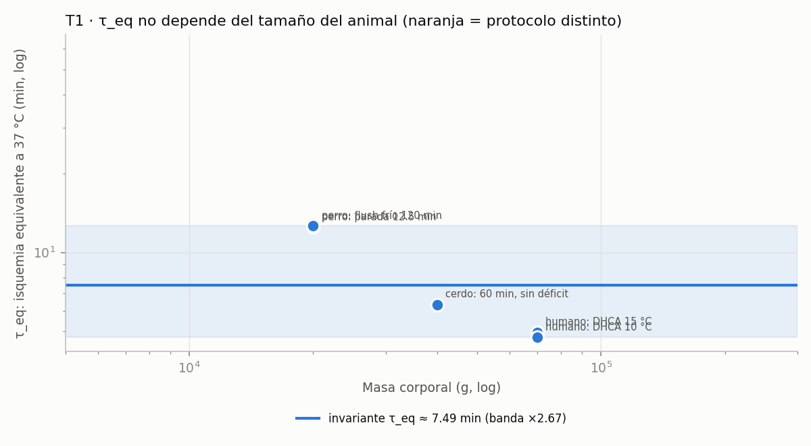

<!-- AUTO-GENERADO por red/escalado.py (llamado desde red/motor.py). NO EDITAR A MANO. -->
# StasisPath: escalado entre especies y validación por exclusión

**La pregunta:** ¿se puede escalar lo logrado en animales y proyectar un número humano, y después comprobar dónde acierta y dónde no?

**Respuesta corta:** sí, pero **no con el número de neuronas**. Se puede con las leyes cuyo error de exclusión se puede medir. Aquí cada ley candidata se valida dejando fuera una especie y prediciéndola con las demás; sólo las que pasan se usan para proyectar.

## T1 · ¿Es τ_eq invariante entre especies? (validación por exclusión)

Se deja fuera cada especie y se predice con las demás.

| especie | observación | T °C | t min | τ_eq min | predicho sin él | error | fuente |
|---|---|---|---|---|---|---|---|
| humano | DHCA 15 °C | 15 | 31 | **4.96** | 8.31 | ×1.67 | F4 |
| humano | DHCA 10 °C | 10 | 45 | **4.75** | 8.4 | ×1.77 | F4 |
| perro | parada 12.5 min | 37 | 12.5 | **12.5** | 6.59 | ×1.9 | F25b |
| perro | flush frío 120 min | 10 | 120 | **12.7** | 6.57 | ×1.93 | F30 |
| cerdo | 60 min, sin déficit | 10 | 60 | **6.33** | 7.81 | ×1.23 | F42 |
| gato | 1 h, sólo cerebro (excluido) | 37 | 60 | **60** | — | — | F38 |

- **Error máximo de exclusión: ×1.93** · dispersión total ×2.67.
- **Dependencia de la masa corporal:** pendiente log-log **-0.77** (r = -0.99) sobre 3 órdenes de magnitud de masa (perro 20 kg → humano 70 kg → cerdo 40 kg). Una pendiente ≈ 0 significa que **τ_eq no depende del tamaño**.
- **Proyección al humano sin usar ningún dato humano: 10 min.** Valor humano real: 4.85 min. Error de la proyección: **×2.06**.
- Veredicto: **FALLA**. La proyección entre especies de τ_eq es válida dentro de un factor ×1.93. El gato queda fuera del ajuste porque su isquemia fue **sólo cerebral** (otro protocolo), y precisamente por eso su τ_eq se dispara a 60: **la ley no falla por especie, falla por protocolo.**

## T2 · ¿Acierta la ley térmica LC⁻² fuera de su ancla?

La ley se ancló en la bolsa de 3 L (LC 2.2 cm → 0.47 °C/min) y se comprueba contra puntos medidos independientes del mismo trabajo.

| caso | LC cm | medido °C/min | predicho por LC⁻² | error | fuente |
|---|---|---|---|---|---|
| bolsa 0.5 L | 1.2 | 1.4 | 1.58 | ×1.13 | F2 |
| bolsa 1 L | 1.4 | 1 | 1.16 | ×1.16 | F2 |
| hígado de cerdo ~1 L | 1.8 | 0.6 | 0.702 | ×1.17 | F2 |

- **Error máximo: ×1.17.** La ley térmica **PASA**: predice tasas de enfriamiento dentro de ×1.17 en el rango 0.5–3 L.
- Por eso la extrapolación a LC de 4–7.5 cm (cuerpo y tronco) es creíble en orden de magnitud, aunque siga sin dato directo.

## T3 · ¿Sirve el número de neuronas como variable de escalado?

| especie | neuronas [P] | cerebro g | masa lograda g | qué se logró | año | fuente |
|---|---|---|---|---|---|---|
| rata | 200,000,000 | 2 | 0.01 | función (K+/Na+, ultraestructura) en lonchas | 2006 | F37 |
| ratón | 71,000,000 | 0.4 | 0.02 | función (LTP) en lonchas | 2026 | F46 |
| ratón | 71,000,000 | 0.4 | 0.4 | cerebro entero vitrificado (función en lonchas) | 2026 | F46 |
| gato | 760,000,000 | 30 | 30 | cerebro entero congelado: actividad eléctrica parcial | 1974 | F48 |
| cerdo | 2,200,000,000 | 180 | 180 | cerebro entero vitrificado sin fijar: sólo estructura | 2026 | F47 |

- Correlación entre la masa lograda y el **número de neuronas**: r = **+0.85** (alta).
- Correlación entre la masa lograda y el **año de publicación**: r = **-0.24**.
- **Pero la correlación alta es un confundido, no una ley.** Entre especies, neuronas y masa encefálica van juntas (r = **+0.95**), y la masa lograda es esencialmente la masa del cerebro de la especie elegida (fracciones logrado/cerebro: 0.005, 0.05, 1, 1, 1). Es decir: r alto sólo dice que **quien vitrifica un cerebro de cerdo obtiene la masa de un cerebro de cerdo**. Es una tautología, no capacidad predictiva.
- **La prueba que lo zanja:** el número de neuronas no aparece en ninguna de las ecuaciones que limitan el problema. **Lo que limita es la geometría, no el recuento neuronal.** El calor difunde como LC², el crioprotector se reparte por la vasculatura y las grietas dependen del gradiente térmico. Ninguna de esas tres cosas sabe cuántas neuronas hay dentro.
- **Dónde sí importa el recuento neuronal:** en el eje de **información**, no en el de física. El cerebro humano tiene ~1.21e+03 veces las neuronas del ratón y ~284,768,212 veces las de *C. elegans*: eso fija **cuánta** información hay que conservar y cuánto hay que muestrear para verificarlo (P15), no si el tejido sobrevive.
- **Conclusión de método:** escalar por neuronas daría un número sin contenido físico. Para proyectar al humano hay que usar la geometría (LC, masa) en los ejes físicos y el recuento neuronal sólo en el eje de información.

## T4 · Proyección al humano con las leyes validadas

| ley | error de exclusión | proyección humana | veredicto |
|---|---|---|---|
| τ_eq de entrada | ×1.93 | 10 min | **válida**: sin dependencia de la masa y error de exclusión acotado |
| Enfriamiento del cerebro (LC⁻²) | ×1.17 | 0.425 °C/min por convección en LC 2.31 cm | **válida** en orden de magnitud |
| Escalado por neuronas | — | sin contenido físico | **inválida** para los ejes físicos (T3) |

**El número que pedías, calculado:** German 2026 vitrifica el cerebro de ratón (LC ≈ 0.152 cm) enfriando a ≥ 147 °C/min. Un cerebro humano tiene LC ≈ 2.31 cm, es decir **×87.8 peor en conducción** (respetando el cambio de régimen en Bi = 1; aplicar LC⁻² a todo el trayecto daría ×231 y **sobreestimaría la dificultad ×2.6**). Ese mismo protocolo exige 147 °C/min, pero la convección en un cerebro humano sólo da **0.425 °C/min**: un déficit de **×346**.

⇒ **El protocolo de German no escala al cerebro humano por convección: le faltan ~2.5 órdenes de magnitud de velocidad de enfriamiento.** Esto no es una opinión: es la misma ley LC⁻² que ya acertó dentro de ×1.17 en T2.

**Qué exige entonces un cerebro humano:** un CPA cuya CCR sea ≤ 0.425 °C/min (la clase M22, CCR 0.1, **cumple**; V3 y VMP no) más calentamiento volumétrico. Es exactamente lo que hace Fahy 2026 (M22, cerebro de cerdo, sólo estructura) y lo que NO hace German (V3, alta velocidad, sólo ratón). **Las dos mitades del cuello de botella usan químicas incompatibles entre sí.**

## Resumen

| ley | ¿valida? | error | uso |
|---|---|---|---|
| τ_eq invariante entre especies | sí | ×1.93 | proyectar ventanas de isquemia al humano |
| enfriamiento LC⁻² | sí | ×1.17 | proyectar vitrificación a cualquier tamaño |
| escalado por neuronas | **no** | — | sólo para dimensionar la información (P15), no la física |
