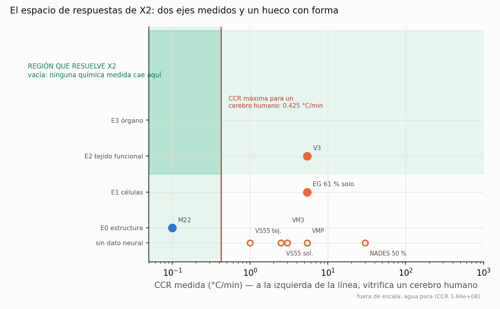

<!-- AUTO-GENERADO por red/espacio.py. NO EDITAR A MANO. -->
# StasisPath: el espacio de respuestas de X2 — catalogado, no en blanco

X2 pregunta si existe una química que **vitrifique a escala humana Y conserve la función**. Dejarlo como hueco en blanco desaprovecha lo que el marco ya sabe: cada química conocida ocupa un punto con **coordenadas medidas**, y el hueco tiene forma y tamaño.

> **Lo que este documento NO hace.** El marco ya *predice* el resultado del brazo C de P19 (DERIVACION.md da daño 0.142; los dos caminos de I1 predicen PASA). **Esa predicción no se cuenta como dato.** Es justamente lo que el experimento pone a prueba: contarla cerraría el bucle sobre sí mismo y el marco dejaría de poder equivocarse. Aquí sólo entran coordenadas **medidas**.

## 1. Catálogo: toda química del marco, con sus dos coordenadas

**Requisito de vitrificación:** CCR ≤ **0.425 °C/min** (invirtiendo C3 para un cerebro humano de 1400 g, LC = 2.31 cm). **Requisito de función:** al menos **E2**, tejido funcional, que es el nivel donde se mide la LTP.

| química | CCR °C/min | M | nivel en NEURAL | nivel en otro tejido | fuente | veredicto |
|---|---|---|---|---|---|---|
| M22 | 0.1 | 9.3 | E0 | E3 | F2,F47,F5 | vitrifica, falta función |
| VM3 | 3 | 8.9 | — | — | F37b | ninguna de las dos |
| VS55 tej. | 1 | 8.4 | — | E1 | F3 | ninguna de las dos |
| VS55 sol. | 2.5 | 8.4 | — | E1 | F3 | ninguna de las dos |
| V3 | 5.4 | 8.42 | E2 | — | F46,F71 | función, no vitrifica |
| VMP | 5.4 | 8.4 | — | E3 | F1,F3 | ninguna de las dos |
| EG 61 % solo | 5.4 | — | E1 | — | F52,F71 | ninguna de las dos |
| MEDY | — | — | E2 | — | F35 | función, no vitrifica |
| NADES 50 % | 30 | — | — | E1 | F80 | ninguna de las dos |
| agua pura | 3.84e+08 | 0 | — | — | F76 | ninguna de las dos |

> **Comprobado (tanda 52):** las CCR de M22, VS55 y VMP de esta tabla **coinciden con `parametros` en `red/stasispath.yaml`**. Estaban escritas a mano y duplicaban el dato; ahora el desfase se detectaría y se declararía aquí mismo. Importa porque `CCR_M22` tiene una **laguna abierta** (solución o tejido) y el día que se etiquete, este documento tiene que enterarse.

## 2. El hueco, medido

- **Químicas que vitrifican a escala de cerebro humano:** 1 — M22 (0.1).
- **Químicas con función demostrada en tejido neural (≥ E2):** 2 — V3 (E2), MEDY (E2).
- **Intersección: vacía.** Ninguna química medida cumple las dos.

**Por cuánto falla la mejor candidata de cada lado:**

- Por el eje de la función, la mejor es **V3**, con función neural E2 demostrada, pero su CCR (5.4) es **×12.7 la permitida**. Le falta bajar un factor 12.7.
- Por el eje de la vitrificación, la mejor es **M22** (CCR 0.1, holgura ×4.3 sobre el requisito), pero en tejido neural **sólo tiene ultraestructura demostrada (E0, F47), sin ninguna prueba de función**.

> **El hueco no es difuso: es un salto entre dos químicas conocidas.** X2 se reduce a una pregunta concreta — **¿conserva M22 la función del tejido neural?** — y eso es exactamente el **brazo C de P19**, que ya está preregistrado y con umbrales congelados. Catalogar el espacio no cierra X2, pero **demuestra que un solo experimento lo decide**.

## 3. ¿Está la región objetivo excluida por alguna ley del marco?

Esta es la prueba que cerró V15 (patrón L43): si la incertidumbre no puede alojar ninguna respuesta, el veredicto está cerrado aunque nadie haya medido.

**NO está excluida.** La única ley que podría prohibirla sería una que obligara a que toda química con CCR baja fuera letal. El marco dice lo contrario: **L20, L25 y E7 establecen que la toxicidad depende del cuádruple (composición, temperatura, tiempo, protocolo) y NO de la molaridad sola.** Por eso M22 cargado a −22 °C y V3 cargado a 10 °C son **puntos distintos** del espacio aunque su molaridad sea casi igual (9.3 vs 8.42 M, un 10 % de diferencia). ⇒ X2 **no se cierra por imposibilidad**: sigue abierta, y eso es un resultado, no una laguna.

**Qué tendría que cumplir un candidato, en una línea:** CCR ≤ 0.425 °C/min con LTP ≥ 130 % del basal en CA1 tras HFS (el umbral preregistrado de P19). M22 cumple el primero por un factor 4.3; nadie ha medido el segundo.
