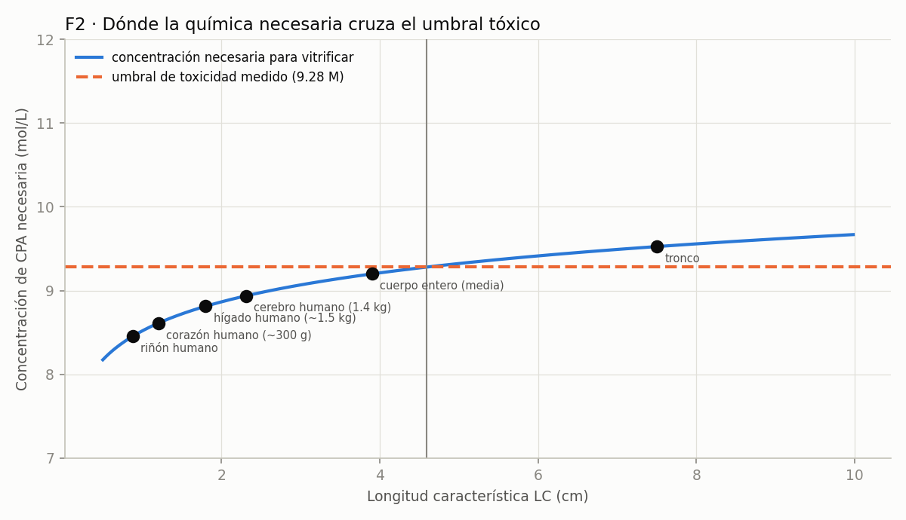

<!-- AUTO-GENERADO por red/formular.py. NO EDITAR A MANO. -->
# StasisPath: formulación interna — el marco resolviéndose a sí mismo

Cada fórmula compone leyes **ya cerradas** para producir un enunciado cuantitativo que nadie midió directamente. Se declara de qué sale, su rango de validez y si llega o no a predicción falsable. **Una fórmula apoyada en un nodo abierto se marca como condicional, no como derivada.**

| fórmula | estatus |
|---|---|
| **F1 · Masa máxima vitrificable por convección, por crioprotector** | derivada |
| **F2 · Teorema de viabilidad: ¿hay química posible para un órgano dado?** | derivada débil, con rango de clase química |
| **F3 · τ_eq por tramos, con dominio declarado** | derivada |
| **F4 · Invariante volumen × tiempo del sobreenfriamiento** | hipótesis, no derivada |
| **F5 · Protocolo de enfriamiento óptimo (no monótono)** | derivada cualitativa |

## F1 · Masa máxima vitrificable por convección, por crioprotector

*Estatus: derivada.*

**Deriva de:** C3 (enfriamiento ∝ LC⁻ⁿ, anclado en la bolsa de 3 L) + las CCR medidas.

**Fórmula:** LC\* = LC₀ · (tasa₀ / CCR)^(1/n) · y M\* = (4/3)π(3·LC\*)³ para una esfera acuosa.

| CPA | CCR °C/min | M (mol/L) | LC máx. (cm) | masa máx. (g) |
|---|---|---|---|---|
| M22 | 0.1 | 9.3 | 4.77 (4.19–6.16) | 12,271 (8.3e+03–26,442) |
| VS55 (tejido) | 2.5 | 8.4 | 0.954 (0.752–1.12) | 98.2 (48.1–160) |
| VMP | 5.4 | 8.4 | 0.649 (0.474–0.789) | 30.9 (12.1–55.5) |

**Lectura:** con la convección sola, M22 llega a decenas de kg y VMP no pasa de unos gramos. Es el número que faltaba para decir «qué órgano cabe en qué química» sin tener que simular cada caso.

## F2 · Teorema de viabilidad: ¿hay química posible para un órgano dado?

*Estatus: derivada débil, con rango de clase química.*

**Deriva de:** F1 + la relación medida CCR↔concentración (3 CPA) + el umbral de toxicidad de German (9.28 M, donde la respiración basal cae a la mitad).

**Fórmula:** log₁₀(CCR) = 15.2 + -1.74·M ⇒ para vitrificar una LC dada hace falta M ≥ (log₁₀(CCR_requerida) − a)/b. Si esa M supera el umbral tóxico, **ninguna química conocida sirve**.

| objeto | LC cm | CCR requerida °C/min | M requerida (mol/L) | veredicto |
|---|---|---|---|---|
| riñón humano | 0.88 | 2.94 | 8.46 | **viable** |
| corazón humano (~300 g) | 1.2 | 1.58 | 8.61 | **viable** |
| hígado humano (~1.5 kg) | 1.8 | 0.702 | 8.81 | **viable** |
| cerebro humano (1.4 kg) | 2.31 | 0.426 | 8.94 | **viable** |
| cuerpo entero (media) | 3.9 | 0.15 | 9.2 | **viable** |
| tronco | 7.5 | 0.0404 | 9.53 | **exige C > umbral tóxico** |

> **RESULTADO DERIVADO:** el límite está en **LC ≈ 4.59 cm**, es decir una masa de **≈ 10.9 kg**. Por encima, la concentración que haría falta cruza el umbral donde la toxicidad se dispara. 

**Lo que dice la tabla leída con cuidado:** el cerebro humano exige **8.94 M**, por debajo del umbral, con un margen de sólo **0.34 M**. El cuerpo entero (LC media) exige **9.20 M**: margen de **0.08 M**, prácticamente nulo. **El tronco es el único que lo cruza** (9.53 M) — y es justamente la pieza que C3 ya señalaba como la que falla por la vía térmica pura. **La derivación reproduce ese resultado desde otra dirección**, lo que es una comprobación cruzada, no una coincidencia buscada.

**Validación con un tercer punto, de un campo lejano (L31):** la CCR del **agua pura** es 384,000,000 °C/min (criomicroscopía electrónica). Con él, la relación se ve **curva**: −0.95 décadas/mol entre 0 y 8.4 M, pero **−1.74 entre 8.4 y 9.3 M**. ⇒ **Extrapolar con la pendiente local cerca de 9 M, como hace F2, es lo correcto**, y ahora está justificado con evidencia en vez de por suposición.

**Aviso de honestidad:** la recta CCR↔M se ajusta con **tres puntos y sólo dos concentraciones distintas** (8.4 y 9.3 M). Es la pieza más débil de toda la derivación. El resultado debe leerse como **orden de magnitud**, no como una frontera precisa, y se refuta en cuanto se mida un CPA con CCR baja a concentración baja.

**Y hay un campo vecino que dice que eso es posible (L29):** las proteínas CAHS del tardígrado forman vidrio o gel a **~0.6 mM**, cuatro órdenes de magnitud por debajo de los 8.4–9.3 M de M22 o V3. La relación CCR↔molaridad que sostiene F2 **no es una ley de la naturaleza: es una propiedad de la clase química que el campo eligió** (moléculas pequeñas). F2 sigue siendo válida **dentro de esa clase**, y ese es su rango de validez real.

## F3 · τ_eq por tramos, con dominio declarado

*Estatus: derivada.*

**Deriva de:** C2 + L2 (Q10 no constante) + L24 (mecanismo) + L27 (el hibernador es otro régimen).

**Fórmula:** τ_eq = t · Q10(T)^((T−37)/10), con **Q10 = 2.3 por encima de 15 °C** y **3.5 por debajo**; y **no definida** para hibernadores por debajo de 12 °C, donde el metabolismo deja de ser función de la temperatura.

| caso | T °C | t min | τ_eq (min a 37 °C) |
|---|---|---|---|
| DHCA humano 15 °C, 31 min | 15 | 31 | 4.96 |
| Perro flush 10 °C, 120 min | 10 | 120 | 4.08 |
| Cerdo 10 °C, 60 min | 10 | 60 | 2.04 |
| Ardilla eutérmica 37 °C, 8 min | 37 | 8 | 8 |
| Ardilla en torpor 5 °C | 5 | 1.44e+03 | **no aplica** (L27) |

**Lo que aporta:** unifica en una sola expresión lo que estaba repartido en cuatro leyes, **y declara dónde no vale**. La casilla «no aplica» es tan importante como los números: es el error que cometeríamos si aplicáramos C2 a un hibernador frío.

## F4 · Invariante volumen × tiempo del sobreenfriamiento

*Estatus: hipótesis, no derivada.*

**Deriva de:** L16 (la nucleación acumulada limita el tiempo, no la temperatura mínima) + G7 (banda de lesión por frío).

**Forma propuesta:** si la nucleación es un proceso de Poisson con tasa por unidad de volumen J(T), la probabilidad de que NO nuclee es exp(−J(T)·V·t) ⇒ **el invariante es V·t a T fija**.

**Ancla única disponible:** riñón de cerdo, 0.2 L a -2 °C durante 5 h ⇒ V·t = 1 L·h sin nuclear. Para 48 h el mismo grupo tuvo que subir a -0.5 °C.

> **PREDICCIÓN (no derivada del todo):** a −2 °C, un órgano de 1.5 L (hígado) sólo aguantaría ≈ 0.667 h antes de igualar la dosis de nucleación que el riñón acumuló en 5 h.

**Estatus honesto: NO es una derivación válida todavía.** Hay **un solo punto**: con un dato no se determina J(T) ni se comprueba que el invariante sea V·t. Se deja escrita **como hipótesis falsable** porque el experimento que la probaría es barato: sobreenfriar dos volúmenes distintos a la misma temperatura y ver si el tiempo hasta nuclear escala como 1/V.

## F5 · Protocolo de enfriamiento óptimo (no monótono)

*Estatus: derivada cualitativa.*

**Deriva de:** L14 (conflicto de velocidad) + G7 (banda 0–20 °C de lesión por frío) + G3 (Tg y perfil de recalentamiento) + F68 (bajar la velocidad entre almacenamiento y Tg reduce el estrés).

**Regla derivada, en tres tramos:**
1. **De 37 a 20 °C:** velocidad libre. No hay lesión por frío ni riesgo de hielo.
2. **De 20 a 0 °C: lo más rápido posible.** Es la banda de transición de fase de los lípidos de membrana, donde el daño crece con el *tiempo de exposición* (G7). Excepción: si la vía es hielo extracelular controlado, aquí manda la deshidratación celular y hay que ir lento (0.1–1 °C/min) — **los dos objetivos son incompatibles en esta banda y hay que elegir vía antes de entrar en ella.**
3. **De 0 °C a Tg (-123 °C):** por encima de la CCR del CPA, pero **no más rápido de lo necesario**: el exceso de velocidad sólo añade gradiente térmico.
4. **Por debajo de Tg:** lento (< 1 °C/min) y lejos de Tg en el almacenamiento, porque almacenar justo bajo Tg **duplica la CWR** que hará falta después (F2).

**Lo que aporta:** es la única de estas fórmulas que es directamente **accionable en protocolo**, y sale de componer cuatro leyes que venían de cuatro campos distintos (reproducción humana, criobiología de órganos, materiales y neurociencia).

## Qué ha conseguido esta formulación

- **Dos fórmulas nuevas y falsables** (F1, F2) que responden preguntas que antes exigían simular caso por caso.
- **Una unificación** (F3): cuatro leyes en una expresión, con su dominio de validez declarado.
- **Una regla de protocolo accionable** (F5), compuesta de cuatro campos distintos.
- **Una hipótesis honestamente marcada como no derivada** (F4): con un solo punto no hay ley, y se dice.

**Lo que NO consigue:** ninguna de estas fórmulas cierra X2. Derivar produce **predicciones**, no medidas. El marco puede ahora decir qué espera encontrar y dónde se rompería si se equivoca — que es exactamente lo que hace falta para que el experimento valga más.
