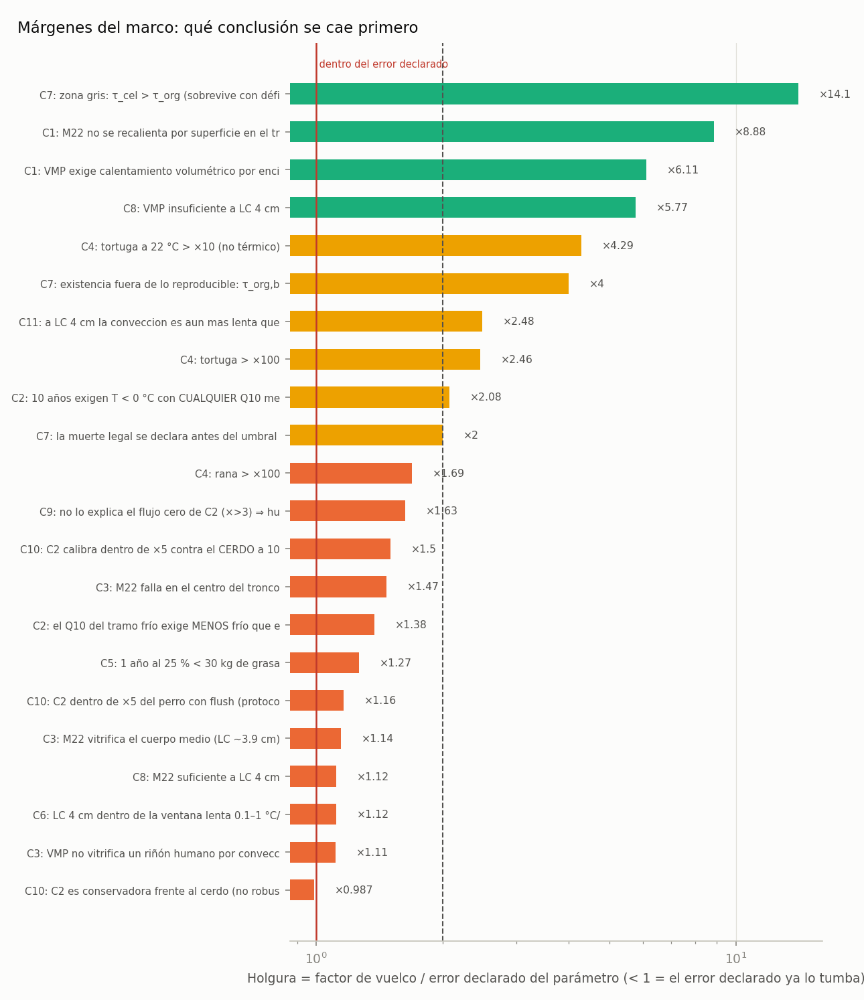

<!-- AUTO-GENERADO por red/margenes.py. NO EDITAR A MANO. -->
# StasisPath: márgenes del marco

**Qué mide:** para cada veredicto que hoy se cumple, por cuánto tendría que errar el parámetro **más sensible** para que el veredicto se diera la vuelta (los demás quedan en su valor central). Un veredicto con factor ×1.3 y otro con factor ×1000 figuran igual como «M» en el marco, pero **no valen lo mismo**: esto los separa.

El factor de vuelco por sí solo engaña: ×1.5 no es poco si el parámetro se conoce al ±10 %. Por eso se normaliza contra la **incertidumbre declarada** del propio parámetro. **Holgura = factor de vuelco / error declarado.**

- **DENTRO DEL ERROR** (holgura < 1): el rango que ya hemos declarado tumba el veredicto. Hay que medir mejor o rebajar la afirmación.
- **FRÁGIL** (1–2): sobrevive por poco.
- **ajustado** (2–5).
- **holgado** (> 5): la conclusión no depende de la precisión del parámetro.
- **estructural**: ningún parámetro lo vuelca ⇒ el veredicto es cualitativo, no numérico.

**Resumen: 12 frágiles · 6 ajustados · 4 holgados · 2 estructurales.**

| cota | veredicto | ¿clave? | parámetro más sensible | factor de vuelco | error declarado | holgura | margen |
|---|---|---|---|---|---|---|---|
| C1 | VMP exige calentamiento volumétrico por encima de 1 cm | sí | alpha | ×7.95 | ±30 % | 6.11 | holgado |
| C1 | M22 no se recalienta por superficie en el tronco (r ~15 cm) | sí | alpha | ×11.5 | ±30 % | 8.88 | holgado |
| C2 | 10 años exigen T < 0 °C con CUALQUIER Q10 medido (templado y frío) | sí | Q10 | ÷2.3 | ±10.6 % | 2.08 | ajustado |
| C2 | el Q10 del tramo frío exige MENOS frío que el templado (no-linealidad, NO significativa en la fuente) | no | Q10 | ×1.52 | ±10.6 % | 1.38 | **FRÁGIL** |
| C3 | VMP no vitrifica un riñón humano por convección | sí | exp_LC | ×1.33 | ±19.8 % | 1.11 | **FRÁGIL** |
| C3 | M22 vitrifica el cuerpo medio (LC ~3.9 cm) | no | anc_LC | ÷1.22 | ±6.82 % | 1.14 | **FRÁGIL** |
| C3 | M22 falla en el centro del tronco | no | anc_LC | ×1.57 | ±6.82 % | 1.47 | **FRÁGIL** |
| C4 | rana > ×100 | sí | Q10 | ×1.87 | ±10.6 % | 1.69 | **FRÁGIL** |
| C4 | tortuga > ×100 | sí | Q10 | ×2.72 | ±10.6 % | 2.46 | ajustado |
| C4 | tortuga a 22 °C > ×10 (no térmico) | sí | Q10 | ×4.74 | ±10.6 % | 4.29 | ajustado |
| C5 | 1 año al 25 % < 30 kg de grasa | sí | BMR | ×1.49 | ±17.6 % | 1.27 | **FRÁGIL** |
| C6 | LC 4 cm dentro de la ventana lenta 0.1–1 °C/min | sí | anc_LC | ÷1.19 | ±6.82 % | 1.12 | **FRÁGIL** |
| C6 | calor latente < 3 h | sí | — | — | — | ∞ | **estructural** |
| C7 | zona gris: τ_cel > τ_org (sobrevive con déficit) | sí | tau_org_surv | ×14.1 | ±0 % | 14.1 | holgado |
| C7 | existencia fuera de lo reproducible: τ_org,bueno < τ_exist ≤ τ_cel | sí | tau_org_exist | ×4 | ±0 % | 4 | ajustado |
| C7 | la muerte legal se declara antes del umbral del organismo | sí | tau_org_good | ÷2.5 | ±25 % | 2 | ajustado |
| C8 | VMP insuficiente a LC 4 cm | sí | anc_LC | ×6.16 | ±6.82 % | 5.77 | holgado |
| C8 | M22 suficiente a LC 4 cm | no | anc_LC | ÷1.19 | ±6.82 % | 1.12 | **FRÁGIL** |
| C9 | no lo explica el flujo cero de C2 (×>3) ⇒ hubo bajo flujo | sí | Q10 | ×1.8 | ±10.6 % | 1.63 | **FRÁGIL** |
| C11 | cruzar la banda 0-20 C enfriando lento tarda > 15 min (exposicion real) | sí | — | — | — | ∞ | **estructural** |
| C11 | a LC 4 cm la conveccion es aun mas lenta que el techo lento | sí | anc_LC | ×2.65 | ±6.82 % | 2.48 | ajustado |
| C10 | C2 calibra dentro de ×5 contra el CERDO a 10 °C | sí | Q10 | ÷1.66 | ±10.6 % | 1.5 | **FRÁGIL** |
| C10 | C2 es conservadora frente al cerdo (no robusto: en la esquina generosa se vuelve OPTIMISTA) | no | Q10 | ×1.09 | ±10.6 % | 0.987 | **DENTRO DEL ERROR** |
| C10 | C2 dentro de ×5 del perro con flush (protocolo distinto, no clave) | no | Q10 | ÷1.29 | ±10.6 % | 1.16 | **FRÁGIL** |

## Lo frágil, en orden de prioridad de medición

1. **C2** — «el Q10 del tramo frío exige MENOS frío que el templado (no-linealidad, NO significativa en la fuente)» se cae si **Q10** erra ×1.52; error ya declarado ±10.6 % ⇒ holgura 1.38.
2. **C3** — «VMP no vitrifica un riñón humano por convección» se cae si **exp_LC** erra ×1.33; error ya declarado ±19.8 % ⇒ holgura 1.11.
3. **C3** — «M22 vitrifica el cuerpo medio (LC ~3.9 cm)» se cae si **anc_LC** erra ÷1.22; error ya declarado ±6.82 % ⇒ holgura 1.14.
4. **C3** — «M22 falla en el centro del tronco» se cae si **anc_LC** erra ×1.57; error ya declarado ±6.82 % ⇒ holgura 1.47.
5. **C4** — «rana > ×100» se cae si **Q10** erra ×1.87; error ya declarado ±10.6 % ⇒ holgura 1.69.
6. **C5** — «1 año al 25 % < 30 kg de grasa» se cae si **BMR** erra ×1.49; error ya declarado ±17.6 % ⇒ holgura 1.27.
7. **C6** — «LC 4 cm dentro de la ventana lenta 0.1–1 °C/min» se cae si **anc_LC** erra ÷1.19; error ya declarado ±6.82 % ⇒ holgura 1.12.
8. **C8** — «M22 suficiente a LC 4 cm» se cae si **anc_LC** erra ÷1.19; error ya declarado ±6.82 % ⇒ holgura 1.12.
9. **C9** — «no lo explica el flujo cero de C2 (×>3) ⇒ hubo bajo flujo» se cae si **Q10** erra ×1.8; error ya declarado ±10.6 % ⇒ holgura 1.63.
10. **C10** — «C2 calibra dentro de ×5 contra el CERDO a 10 °C» se cae si **Q10** erra ÷1.66; error ya declarado ±10.6 % ⇒ holgura 1.5.
11. **C10** — «C2 es conservadora frente al cerdo (no robusto: en la esquina generosa se vuelve OPTIMISTA)» se cae si **Q10** erra ×1.09; error ya declarado ±10.6 % ⇒ holgura 0.987.
12. **C10** — «C2 dentro de ×5 del perro con flush (protocolo distinto, no clave)» se cae si **Q10** erra ÷1.29; error ya declarado ±10.6 % ⇒ holgura 1.16.
