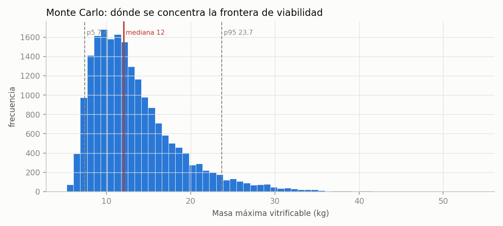

<!-- AUTO-GENERADO por red/precision.py. NO EDITAR A MANO. -->
# StasisPath: precisión — estrechar lo que la triangulación deja abierto

Cuatro métodos, elegidos porque **se pueden aplicar con los datos que ya hay**. Los que exigen datos que nadie ha publicado se declaran al final en vez de aplicarse a medias.

## 1. Número de Biot: ¿dónde vale nuestra ley?

El exponente de C3 no es universal. La ley **tasa ∝ LC⁻²** supone régimen **limitado por conducción** (Bi ≫ 1). Si Bi ≪ 1 el cuerpo es casi isotermo y la tasa la fija la convección superficial: escala como **LC⁻¹**.

Con h = 100 W/m²K (declarado en F2) y k ≈ 0.4 W/mK, la frontera Bi = 1 está en **LC = 0.4 cm**.

| sistema | LC cm | Bi | régimen |
|---|---|---|---|
| lonchas de hipocampo (350 µm) | 0.0117 | 0.0292 | convección — **LC⁻² NO vale** |
| cerebro de ratón (German) | 0.152 | 0.38 | transición |
| riñón de rata | 0.36 | 0.9 | transición |
| riñón humano | 0.88 | 2.2 | conducción — **LC⁻² vale** |
| bolsa de 3 L (ancla de C3) | 2.2 | 5.5 | conducción — **LC⁻² vale** |
| cerebro humano | 2.31 | 5.77 | conducción — **LC⁻² vale** |
| cuerpo entero | 3.9 | 9.75 | conducción — **LC⁻² vale** |
| tronco | 7.5 | 18.8 | conducción — **LC⁻² vale** |

> **Buena noticia:** todas las extrapolaciones del marco a órganos humanos (LC 0.88–7.5 cm) caen en el régimen de **conducción**, donde LC⁻² es correcto. F1, F2, C3 y C6 quedan validadas en su rango de uso.

> ⚠ **CORRECCIÓN de un error propio:** en el módulo de escalado calculé la penalización de conducción del cerebro de ratón (LC 0.152 cm) al humano (2.31 cm) aplicando LC⁻² a todo el trayecto, y dio **×231**. Pero ese trayecto **cruza la frontera de régimen**: respetándola son **×87.8**. **Sobreestimé la dificultad en ×2.63.** El déficit para repetir el protocolo de German en un cerebro humano no cambia (se calcula con la tasa humana, no escalando desde el ratón), pero la frase «el cerebro humano es ×231 peor en conducción» era incorrecta.

## 2. Monte Carlo: distribución en vez de esquinas

Las esquinas dan un rango; Monte Carlo da **dónde se concentra**. 20,000 muestras con distribución triangular dentro del rango declarado de cada parámetro (moda en el valor central: respeta lo declarado sin suponer normalidad).

**Masa máxima vitrificable (la frontera de F2):**

| percentil | masa |
|---|---|
| percentil 5 | 7.4 kg |
| percentil 25 | 9.57 kg |
| **mediana** | **12 kg** |
| percentil 75 | 15.5 kg |
| percentil 95 | 23.7 kg |

> El rango por esquinas era amplio; la mediana está en **12 kg** y el 50 % central entre **9.57 y 15.5 kg**. La distribución está **sesgada a la derecha**: el valor típico es menor que la media, así que reportar la media sería optimista.

## 3. Sensibilidad: qué resolvería la contradicción de I1

La triangulación encontró que Arrhenius predice 0.142 y las anclas de Fahy exigen ≤ 0.07. En vez de elegir a ojo, se calcula **qué tendría que ser cierto** para que no hubiera choque.

| magnitud | valor | nota |
|---|---|---|
| Ea/R usado (de ovocitos, F55) | 2.95e+03 K | da daño 0.142 |
| Ea/R necesario para llegar a 0.07 | 4.52e+03 K | ×1.53 el actual |
| Daño medido a 9.28 M y 10 °C | 0.536 | F72, no discutido |

> **Para que ambos caminos encajen, la energía de activación del daño tendría que ser ×1.53 la medida en ovocitos** (de 2.95e+03 a 4.52e+03 K, es decir de ~24.5 a ~37.6 kJ/mol). Eso **no es descabellado**: 24.5 kJ/mol es bajo para daño proteico, y el valor sale de un sistema (ovocito) y un rango de temperatura (23–37 °C) muy distintos. ⇒ **La hipótesis más probable es que la extrapolación de Arrhenius subestima la energía de activación, no que Fahy esté equivocado.** Predicción concreta que P19 puede comprobar.

## 4. Nucleación como proceso de Poisson: de una observación a una probabilidad

Una sola observación de «no nucleó» no da un número, pero **sí da una cota** si se modela como Poisson: P(no nuclear) = exp(−J·V·t). Del riñón de cerdo (0.2 L, 5 h a −2 °C sin nuclear) se obtiene, con un 95 % de confianza, **J ≤ 3 por L·h**.

| sistema | V (L) | t con 95 % de éxito (h) | t con 50 % de éxito (h) |
|---|---|---|---|
| riñón de cerdo | 0.2 | 0.0855 | 1.16 |
| hígado humano | 1.5 | 0.0114 | 0.154 |
| cuerpo entero | 70 | 0.000244 | 0.0033 |

> Así I5 deja de ser «≤ 0.67 h» y pasa a ser **una curva de probabilidad frente al tiempo**, que es lo que un protocolo clínico necesita. **Salvedad importante:** esto vale sólo en régimen **isobárico**; el sistema isocórico suprime la nucleación y va por otra ley (ver I5).

## Métodos que aún no se pueden aplicar, y qué dato les falta

| método | para qué | qué dato falta |
|---|---|---|
| Kissinger / Ozawa / Avrami | cinética de cristalización desde calorimetría | **datos de DSC de los NADES** (I2) |
| Kaplan-Meier / regresión de Cox | supervivencia frente a tiempo de isquemia | tiempos hasta fallo en una cohorte (I4) |
| Elementos finitos con geometría real | campo térmico en un órgano, no en una esfera | malla de un órgano humano + propiedades del CPA |
| Inferencia bayesiana completa | posterior de cada parámetro en vez de rango | réplicas independientes; hoy la mayoría son n = 1 |
