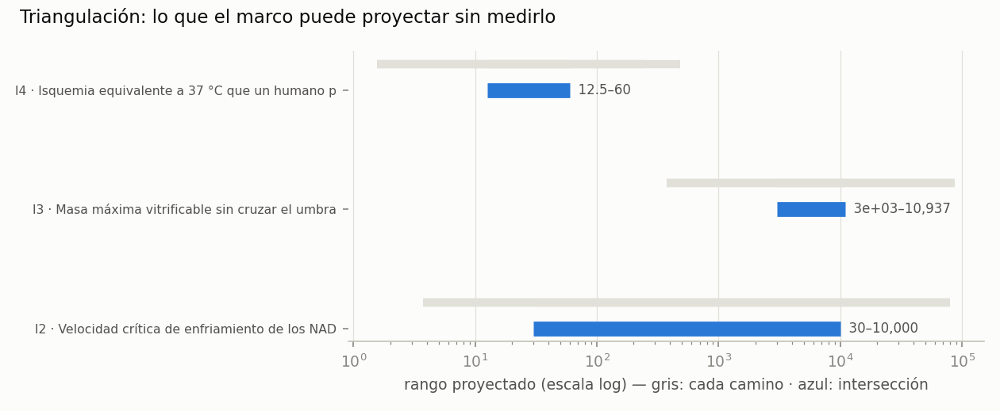

<!-- AUTO-GENERADO por red/triangular.py. NO EDITAR A MANO. -->
# StasisPath: triangulación de incógnitas

Para cada dato que **no tenemos**, se recorren todos los caminos independientes de la red que lo acotan y se toma la **intersección**. No da el número exacto: da el **rango proyectado**, que después se afina midiendo.

**Lo más útil no es la intersección, es la contradicción.** Si dos caminos independientes dan rangos incompatibles, una de las leyes que los alimenta está mal — y eso es un resultado, no un fallo.

| id | incógnita | rango proyectado | anchura | nota |
|---|---|---|---|---|
| I1 | Daño relativo (1 − respiración/control) al cargar 9. | **contradicción** | — | Arrhenius desde ovocitos × punto medido de German vs Anclas de Fahy: M22 es tolerable a −22 °C en loncha renal |
| I2 | Velocidad crítica de enfriamiento de los NADES | 30 – 10,000 °C/min | ×333 | 3 caminos |
| I3 | Masa máxima vitrificable sin cruzar el umbral tóxico | 3e+03 – 10,937 g | ×3.65 | 2 caminos |
| I4 | Isquemia equivalente a 37 °C que un humano podría to | 12.5 – 60 min | ×4.8 | 2 caminos |
| I5 | Horas de sobreenfriamiento a −2 °C para 1.5 L antes  | −∞ – 0.667 h | abierto | 2 caminos |

## I1 · Daño del brazo frío de P19 (M22 9.3 M a −22 °C)

**Daño relativo (1 − respiración/control) al cargar 9.3 M a −22 °C**

| camino | ¿independiente? |  | mín | máx | de qué sale |
|---|---|---|---|---|---|
| Arrhenius desde ovocitos × punto medido de German | sí | = | 0.142 | 0.142 | F72 (9.28 M a 10 °C → 0.536) escalado por Ea/R = 2952 K de F55 |
| Anclas de Fahy: M22 es tolerable a −22 °C en loncha renal | sí | ≤ |  | 0.07 | F65/F39 + banda sin daño K⁺/Na⁺ ≥ 93 % (G4b) |
| Calibración daño↔LTP: a daño 0.220 la LTP SÍ se conservó | sí | ≤ |  | 0.22 | F72: German midió en el MISMO brazo daño respiratorio 0.220 (8.42 M) y LTP 138.1 % (control 157.7, n.s.) |
| Cota inferior: no puede ser mejor que el control sin CPA | sí | ≥ | 0 |  | definición |

> ⚠ **CONTRADICCIÓN: la intersección es vacía.** Los caminos «Arrhenius desde ovocitos × punto medido de German» y «Anclas de Fahy: M22 es tolerable a −22 °C en loncha renal» son incompatibles. **Eso no es un fallo del método: es el resultado.** Una de las leyes que los alimenta está mal, y la incógnita no puede proyectarse hasta resolverlo.

**PERO la contradicción NO afecta al veredicto de P19, y eso se puede demostrar.** German midió en el **mismo brazo** daño respiratorio **0.220** (a 8.42 M) y LTP **138.1 %**, que **pasa** nuestro umbral preregistrado de 130 %. ⇒ Hay un nivel de daño con **LTP demostradamente conservada: 0.220**. Los dos caminos que chocan predicen **0.142 y ≤0.07**, y **ambos quedan por debajo de 0.220**. **La contradicción es sobre CUÁNTO daño habrá, no sobre si P19 pasa: los dos caminos predicen PASA.**

**Y sigue siendo el mejor argumento para ejecutarlo.** Los dos caminos no son opinables: el de Arrhenius extrapola desde 23–37 °C hasta −22 °C, una extrapolación grande y **sin el término osmótico de L20**; el de Fahy es una medida real de M22 a −22 °C, pero **en loncha renal, no neural**. ⇒ El experimento no sólo mide un número: **discrimina entre dos leyes del propio marco**. Si sale ≈0.14, la extrapolación de Arrhenius vale y el resultado de Fahy no transfiere del riñón al cerebro. Si sale ≤0.07, la toxicidad a baja temperatura cae más rápido de lo que predice Arrhenius, y **L20 tenía razón: el daño dominante en frío es osmótico, no químico**.

## I2 · CCR de los disolventes eutécticos naturales (NADES)

**Velocidad crítica de enfriamiento de los NADES**

| camino | ¿independiente? |  | mín | máx | de qué sale |
|---|---|---|---|---|---|
| Vitrifican por inmersión directa en N₂ líquido | sí | ≤ |  | 10,000 | F80: si vitrifican al sumergir una muestra pequeña, su CCR no supera la tasa de inmersión (~10⁴ °C/min) |
| No son agua pura: su CCR está por debajo de la del agua | sí | ≤ |  | 384,000,000 | F76 (agua pura: 3.84 × 10⁸ °C/min) |
| **MEDIDO (F80, tanda 46): cristalizan en DSC enfriando a 30 °C/min** | sí | ≥ | 30 |  | F80 Tabla 2: Tc onset −26.6 a −32.3 °C al 50 % p/v ⇒ CCR > 30 °C/min |

> **RANGO PROYECTADO: 30 – 10,000 °C/min** (3 caminos independientes, factor ×333 de anchura).

**Cómo afinarlo a un número:** YA NO HACE FALTA: la calorimetría estaba publicada en F80 y se leyó en la tanda 46. **CCR > 30 °C/min ⇒ la predicción I2 (0.3 °C/min) queda REFUTADA por su propio criterio (refutada si > 0.426).**

## I3 · Masa máxima de tejido humano vitrificable con la química actual

**Masa máxima vitrificable sin cruzar el umbral tóxico**

| camino | ¿independiente? |  | mín | máx | de qué sale |
|---|---|---|---|---|---|
| F2: donde la molaridad exigida cruza el umbral tóxico | sí | ≤ |  | 10,937 | C3 + recta CCR↔M + umbral 9.28 M de F72 |
| Demostrado físicamente: 3 L de M22 vitrificados | sí | ≥ | 3e+03 |  | F2 (vidrio físico a escala de litros, sin biología) |
| Demostrado con función: riñón de conejo de 13.9 g trasplantado | **no** | ≥ | 13.9 |  | F50 (dieléctrico, función clínica normal) |

> **RANGO PROYECTADO: 3e+03 – 10,937 g** (2 caminos independientes, factor ×3.65 de anchura).

**Cómo afinarlo a un número:** midiendo la CCR de un CPA a concentración baja. Si existe, el límite sube; si no, se confirma.

## I4 · τ_eq humano alcanzable con reperfusión óptima

**Isquemia equivalente a 37 °C que un humano podría tolerar con la mejor reperfusión**

| camino | ¿independiente? |  | mín | máx | de qué sale |
|---|---|---|---|---|---|
| Invariancia entre especies: el perro aguanta 17 min | sí | ≥ | 12.5 |  | F25/F25b + T1 del módulo de escalado (τ_eq invariante, error ×1.9) |
| Existencia en otro mamífero: gata, 1 h sólo cerebro | sí | ≤ |  | 60 | F38 — cota superior: nadie ha superado esto en organismo |
| Límite celular: BrainEx recupera células a 4 h | **no** | ≤ |  | 240 | F23 — techo absoluto; por encima ni la célula vuelve |

> **RANGO PROYECTADO: 12.5 – 60 min** (2 caminos independientes, factor ×4.8 de anchura).

**Cómo afinarlo a un número:** un ensayo de reperfusión optimizada en cerdo, que es el modelo más cercano y ya se usa (F42).

## I5 · Duración de sobreenfriamiento de un hígado humano a −2 °C

**Horas de sobreenfriamiento a −2 °C para 1.5 L antes de nuclear**

| camino | ¿independiente? |  | mín | máx | de qué sale |
|---|---|---|---|---|---|
| Tasa de Poisson AJUSTADA con el hígado de rata (2 puntos, −6 °C) | sí | ≤ |  | 0.815 | F85: 100 % a 72 h y 58 % a 96 h ⇒ J(−6 °C) ≈ 0.57 /L·h; aquí se da el tiempo con 50 % de éxito |
| Invariante V·t desde el riñón de cerdo (isobárico) | sí | ≤ |  | 0.667 | F20 (0.2 L × 5 h a −2 °C) suponiendo nucleación tipo Poisson (F4 de FORMULACION) |
| Medido a −2 °C en hígado de cerdo isocórico | sí | ≥ | 24 |  | F22 (1.5 L, 24–48 h sin congelarse, en sistema isocórico) |

> **Régimen aparte — «Medido a −2 °C en hígado de cerdo isocórico» (isocórico: el volumen constante genera presión al nuclear y **suprime la nucleación**).** No entra en la intersección: no contradice a los demás, describe **otro sistema físico**. Acota ≥ 24 h.

> **RANGO PROYECTADO: −∞ – 0.667 h** (2 caminos independientes, sin acotar por un lado).

**Cómo afinarlo a un número:** sobreenfriar dos volúmenes distintos a la misma temperatura y ver si el tiempo escala como 1/V. **Experimento barato y decisivo para L16.** El contraste isobárico/isocórico da además una medida directa de cuánto suprime la nucleación el confinamiento a volumen constante.

